# Costmap插件系统详细设计

## 概述

Costmap插件系统是RTAB-Map ROS项目中用于扩展导航栈功能的重要组件。该系统基于ROS navigation包的costmap_2d框架，允许添加自定义的代价地图层，为路径规划提供环境信息。RTAB-Map通过这个系统集成了静态地图层和体素层，增强了导航系统的环境感知能力。

## 系统架构详细分析

### 核心架构组件

```mermaid
graph TB
    subgraph "Navigation Stack"
        GlobalPlanner[全局路径规划器]
        LocalPlanner[局部路径规划器]
        CostmapROS[Costmap ROS接口]
    end
    
    subgraph "Layered Costmap Framework"
        LayeredCostmap[分层代价地图]
        CostmapLayer[代价地图层基类]
        
        subgraph "Standard Layers"
            StaticLayer_Standard[标准静态层]
            ObstacleLayer[障碍物层]
            InflationLayer[膨胀层]
        end
        
        subgraph "RTAB-Map Plugin Layers"
            RTABStaticLayer[RTAB-Map静态层]
            RTABVoxelLayer[RTAB-Map体素层]
        end
    end
    
    subgraph "Data Sources"
        MapServer[地图服务器]
        RTABMapData[RTAB-Map地图数据]
        LaserScanner[激光扫描器]
        PointCloudSensor[点云传感器]
        OccupancyGrid[占用栅格地图]
    end
    
    subgraph "Plugin Infrastructure"
        PluginLibLoader[pluginlib加载器]
        PluginRegistry[插件注册表]
        CostmapPluginXML[costmap_plugins.xml]
    end
    
    CostmapROS --> LayeredCostmap
    LayeredCostmap --> CostmapLayer
    
    CostmapLayer <|-- StaticLayer_Standard
    CostmapLayer <|-- ObstacleLayer
    CostmapLayer <|-- InflationLayer
    CostmapLayer <|-- RTABStaticLayer
    CostmapLayer <|-- RTABVoxelLayer
    
    PluginLibLoader --> RTABStaticLayer
    PluginLibLoader --> RTABVoxelLayer
    PluginRegistry --> PluginLibLoader
    CostmapPluginXML --> PluginRegistry
    
    MapServer --> RTABStaticLayer
    RTABMapData --> RTABStaticLayer
    LaserScanner --> RTABVoxelLayer
    PointCloudSensor --> RTABVoxelLayer
    OccupancyGrid --> RTABStaticLayer
    
    LayeredCostmap --> GlobalPlanner
    LayeredCostmap --> LocalPlanner
```

### 插件类层次结构

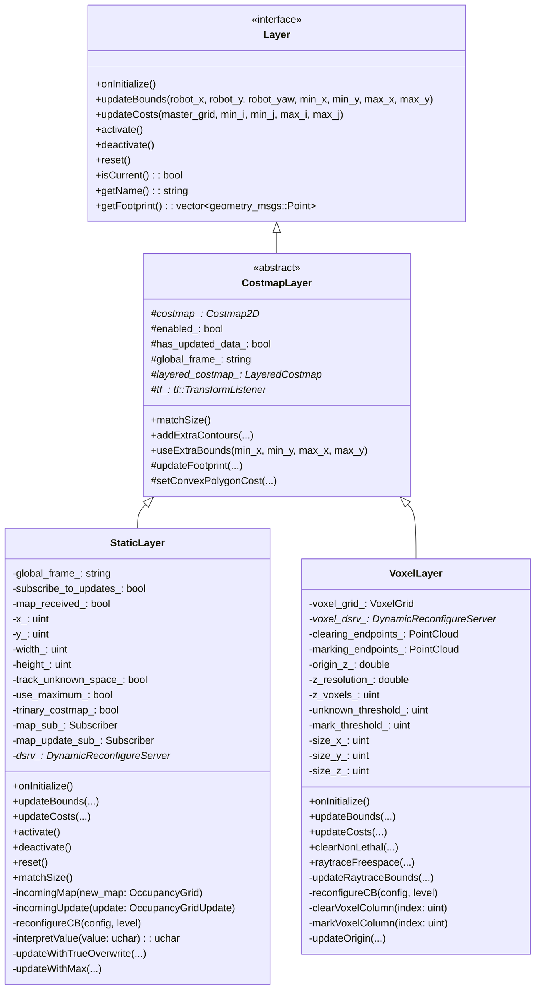

## 插件注册与加载机制

### 1. 插件注册流程

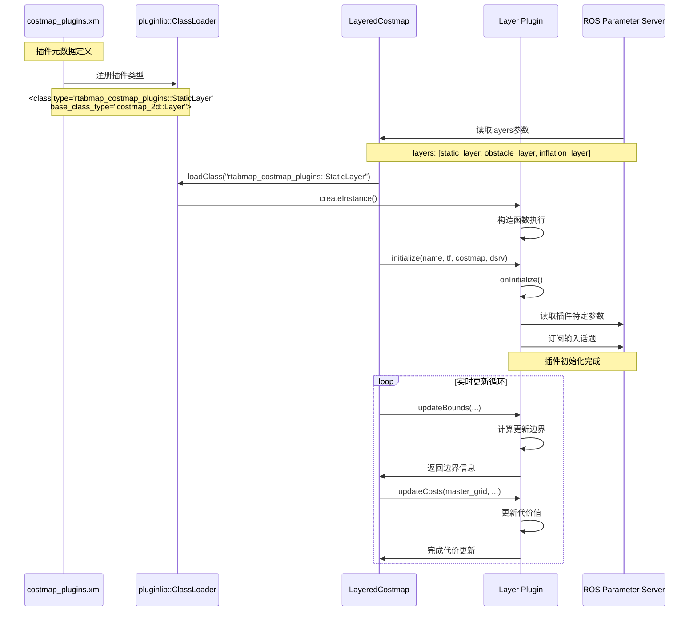

### 2. 插件配置管理

```mermaid
graph LR
    subgraph "配置文件层次"
        GlobalParams[全局参数<br/>costmap_common_params.yaml]
        LocalParams[局部参数<br/>local_costmap_params.yaml]
        GlobalSpecific[全局特定参数<br/>global_costmap_params.yaml]
        PluginParams[插件参数<br/>plugin_specific_params.yaml]
    end
    
    subgraph "参数命名空间"
        GlobalNS[/global_costmap]
        LocalNS[/local_costmap]
        PluginNS[/costmap/static_layer]
        LayerNS[/costmap/voxel_layer]
    end
    
    subgraph "运行时配置"
        DynamicReconfig[动态重配置]
        ParamServer[参数服务器]
        ROSLaunch[ROS Launch]
    end
    
    GlobalParams --> GlobalNS
    LocalParams --> LocalNS
    GlobalSpecific --> GlobalNS
    PluginParams --> PluginNS
    PluginParams --> LayerNS
    
    GlobalNS --> ParamServer
    LocalNS --> ParamServer
    PluginNS --> ParamServer
    LayerNS --> ParamServer
    
    DynamicReconfig --> ParamServer
    ROSLaunch --> ParamServer
```

## RTAB-Map静态层详细设计

### 1. 静态层架构

```mermaid
graph TB
    subgraph "数据输入接口"
        MapTopic[/map话题]
        MapUpdateTopic[/map_updates话题]
        RTABMapGrid[RTAB-Map栅格地图]
        MapServer[map_server节点]
    end
    
    subgraph "StaticLayer内部处理"
        MapSubscriber[地图订阅器]
        UpdateSubscriber[更新订阅器]
        
        subgraph "数据处理模块"
            ValueInterpreter[数值解释器]
            GridResampler[栅格重采样器]
            BoundsCalculator[边界计算器]
            CostUpdater[代价更新器]
        end
        
        subgraph "配置管理"
            DynamicReconfig[动态重配置]
            ParameterCache[参数缓存]
            StateManager[状态管理器]
        end
    end
    
    subgraph "输出接口"
        MasterCostmap[主代价地图]
        BoundingBox[更新边界框]
        DiagnosticInfo[诊断信息]
    end
    
    MapTopic --> MapSubscriber
    MapUpdateTopic --> UpdateSubscriber
    RTABMapGrid --> MapSubscriber
    MapServer --> MapTopic
    
    MapSubscriber --> ValueInterpreter
    UpdateSubscriber --> ValueInterpreter
    ValueInterpreter --> GridResampler
    GridResampler --> BoundsCalculator
    BoundsCalculator --> CostUpdater
    
    DynamicReconfig --> ParameterCache
    ParameterCache --> StateManager
    StateManager --> CostUpdater
    
    CostUpdater --> MasterCostmap
    BoundsCalculator --> BoundingBox
    StateManager --> DiagnosticInfo
```

### 2. 地图数据处理流程

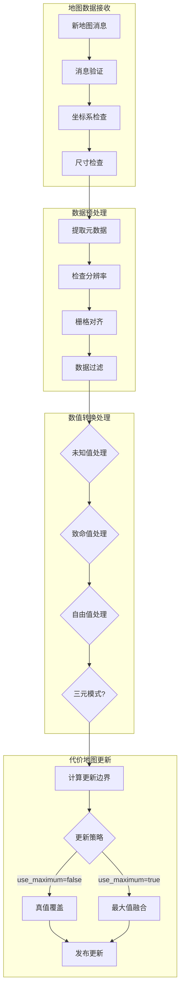

## RTAB-Map体素层详细设计

### 1. 体素层架构

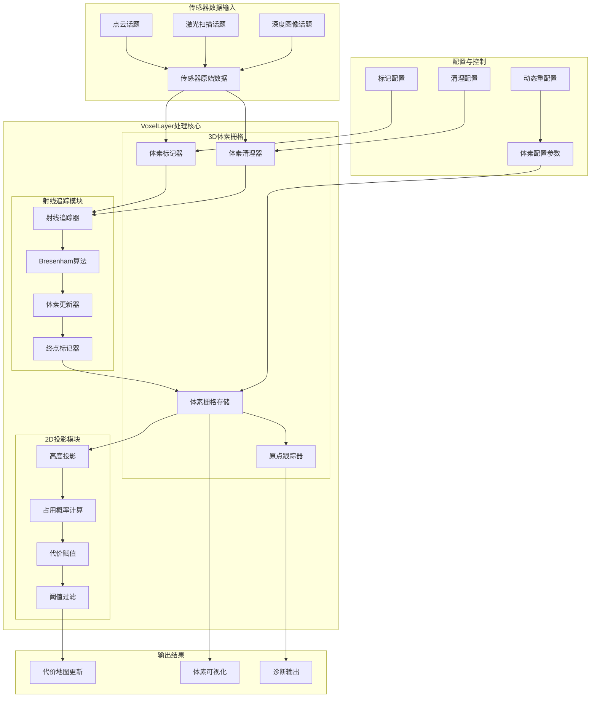

### 2. 体素栅格处理算法

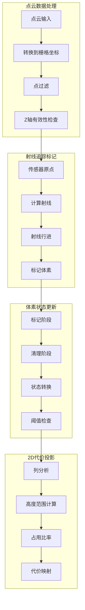

## 代价地图更新与融合机制

### 1. 分层融合架构

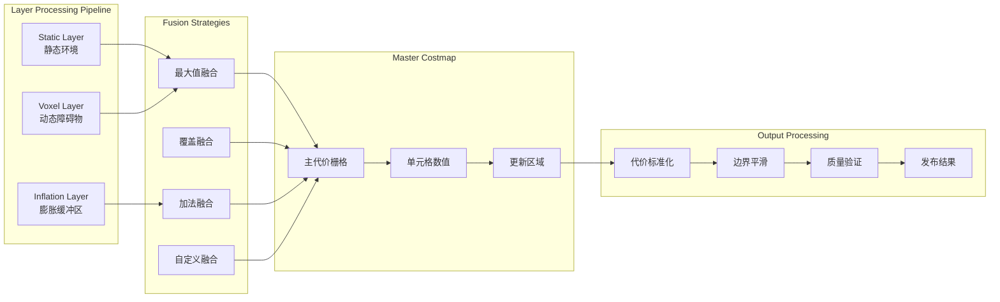

### 2. 代价值更新流程

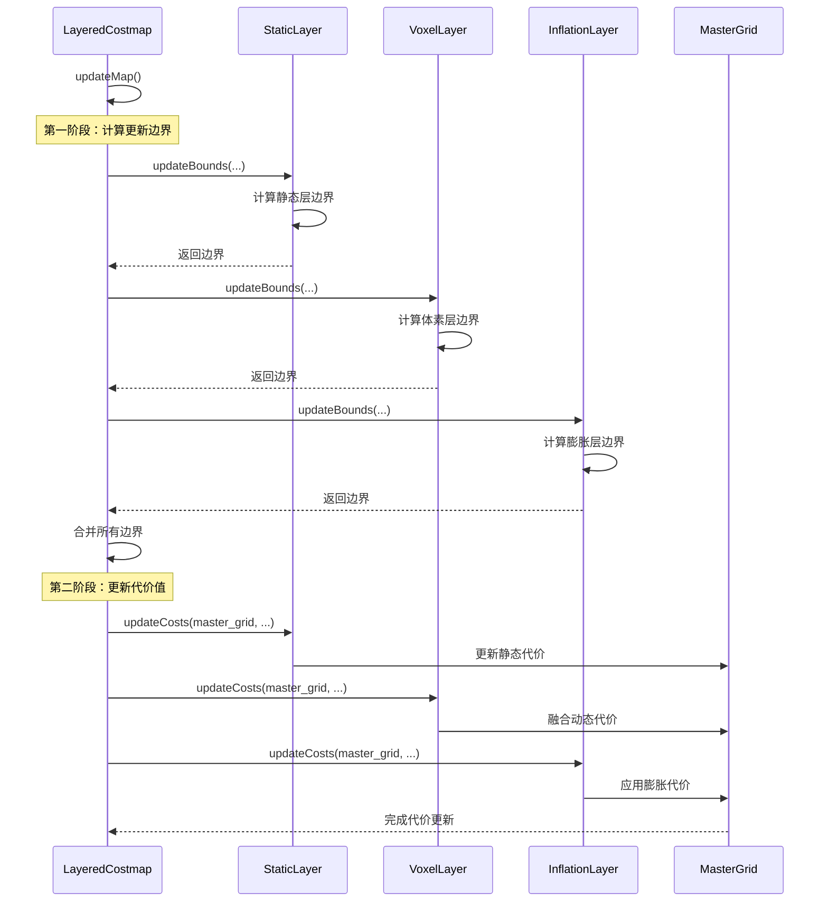

## 性能优化技术

### 1. 空间索引优化

```mermaid
graph TB
    subgraph "传统线性搜索"
        LinearSearch[线性遍历]
        FullGridScan[全栅格扫描]
        O_n_complexity[O(n)复杂度]
    end
    
    subgraph "空间分区优化"
        QuadTree[四叉树分区]
        HashGrid[哈希栅格]
        SpatialHash[空间哈希]
    end
    
    subgraph "增量更新优化"
        DirtyRegion[脏区域标记]
        BoundedUpdate[边界更新]
        LazyEvaluation[延迟求值]
    end
    
    subgraph "内存访问优化"
        CacheLocality[缓存局部性]
        MemoryPool[内存池]
        SIMD[SIMD并行]
    end
    
    LinearSearch --> QuadTree
    FullGridScan --> HashGrid
    O_n_complexity --> SpatialHash
    
    QuadTree --> DirtyRegion
    HashGrid --> BoundedUpdate
    SpatialHash --> LazyEvaluation
    
    DirtyRegion --> CacheLocality
    BoundedUpdate --> MemoryPool
    LazyEvaluation --> SIMD
```

### 2. 计算优化策略

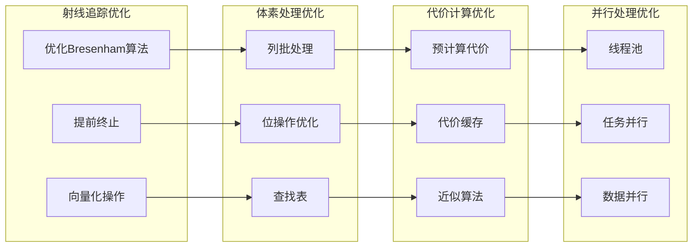

## 调试与监控工具

### 1. 可视化调试工具

```mermaid
graph TB
    subgraph "RViz可视化插件"
        CostmapDisplay[代价地图显示]
        LayerVisualization[分层可视化]
        VoxelGridDisplay[体素栅格显示]
        InflationVisualization[膨胀可视化]
    end
    
    subgraph "调试话题"
        DebugGrid[/costmap/debug_grid]
        LayerInfo[/costmap/layer_info]
        UpdateStats[/costmap/update_stats]
        PerformanceMetrics[/costmap/performance]
    end
    
    subgraph "诊断工具"
        DiagnosticAggregator[诊断聚合器]
        ParameterMonitor[参数监控]
        PerformanceProfiler[性能分析器]
        MemoryProfiler[内存分析器]
    end
    
    subgraph "调试接口"
        ServiceInterface[服务接口]
        TopicInspector[话题检查器]
        ParameterDumper[参数转储器]
        StateSnapshot[状态快照]
    end
    
    CostmapDisplay --> DebugGrid
    LayerVisualization --> LayerInfo
    VoxelGridDisplay --> UpdateStats
    InflationVisualization --> PerformanceMetrics
    
    DebugGrid --> DiagnosticAggregator
    LayerInfo --> ParameterMonitor
    UpdateStats --> PerformanceProfiler
    PerformanceMetrics --> MemoryProfiler
    
    DiagnosticAggregator --> ServiceInterface
    ParameterMonitor --> TopicInspector
    PerformanceProfiler --> ParameterDumper
    MemoryProfiler --> StateSnapshot
```

### 2. 性能监控指标

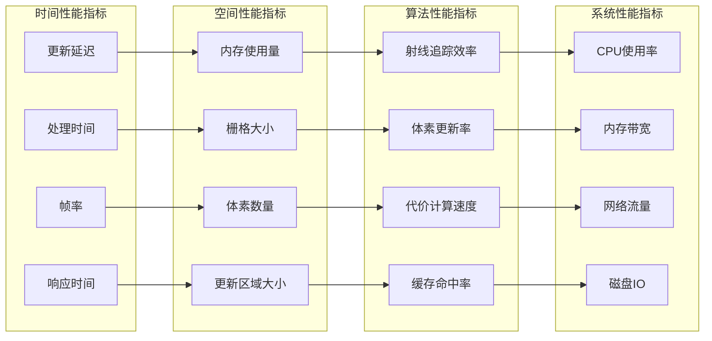

## 扩展开发指南

### 1. 自定义插件开发流程

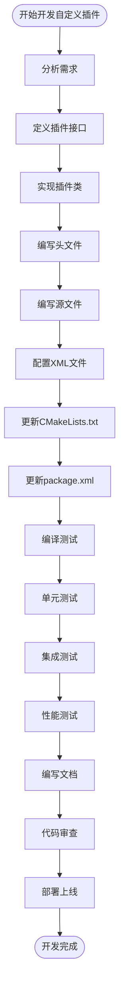

### 2. 最佳实践建议

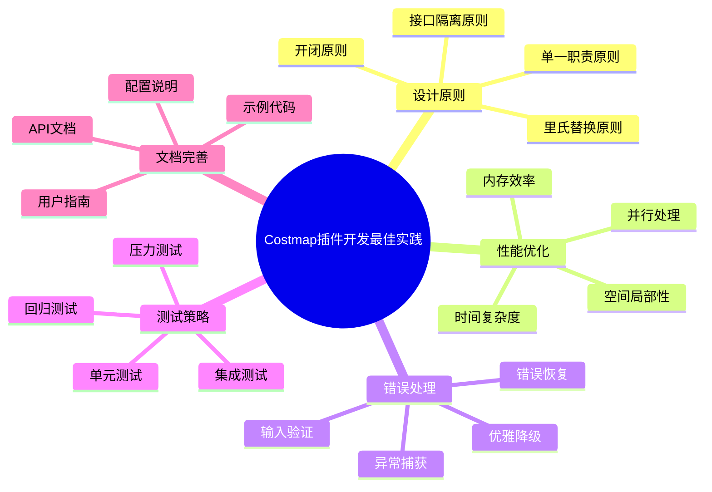

## 总结

RTAB-Map ROS的Costmap插件系统通过以下关键特性实现了强大的导航功能扩展：

1. **分层架构**: 清晰的分层设计支持多种数据源融合
2. **高效算法**: 优化的体素处理和射线追踪算法
3. **灵活配置**: 丰富的参数配置支持多种使用场景
4. **实时性能**: 增量更新和空间索引确保实时性能
5. **可扩展性**: 标准化的插件接口便于功能扩展
6. **调试支持**: 完善的可视化和监控工具

这种设计使得RTAB-Map能够为机器人导航系统提供精确、实时的环境信息，支持复杂环境下的安全路径规划和导航控制。