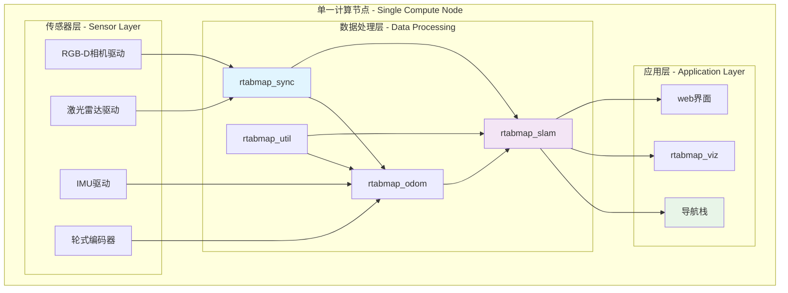
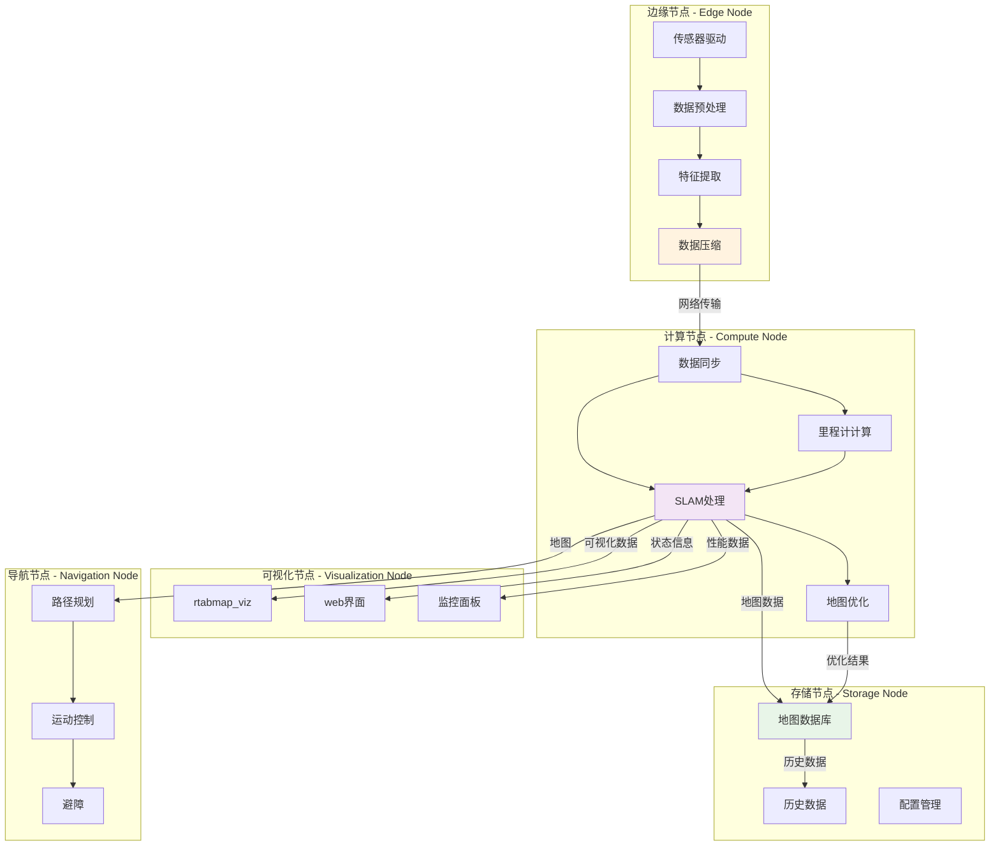
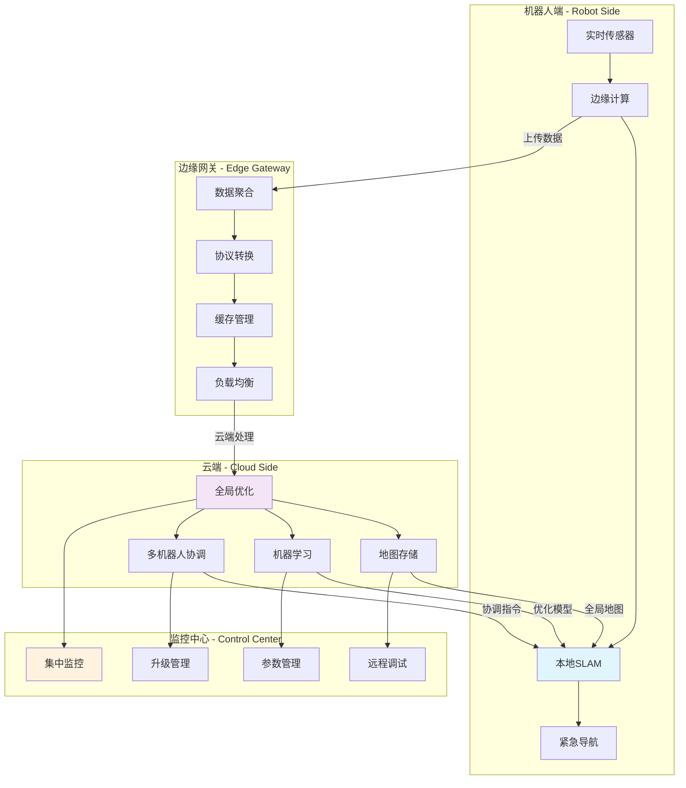

# RTAB-Map部署和配置指南

## 概述

本文档提供RTAB-Map ROS系统的部署模式、配置选项和最佳实践指南，涵盖从单机部署到分布式集群的各种场景。

## 部署架构模式

### 1. 单机部署模式

适用于计算资源充足的单一机器人系统：



**配置示例:**
```xml
<!-- 单机部署启动文件 -->
<launch>
    <!-- 传感器驱动 -->
    <include file="$(find realsense2_camera)/launch/rs_camera.launch"/>
    <include file="$(find velodyne_pointcloud)/launch/VLP16_points.launch"/>
    
    <!-- RTAB-Map核心 -->
    <include file="$(find rtabmap_launch)/launch/rtabmap.launch">
        <arg name="database_path" value="~/.ros/rtabmap_single.db"/>
        <arg name="localization" value="false"/>
        <arg name="rtabmap_viz" value="true"/>
        
        <!-- 单机优化参数 -->
        <arg name="queue_size" value="30"/>
        <arg name="sync_queue_size" value="10"/>
        <arg name="approx_sync" value="false"/>
    </include>
    
    <!-- 导航栈 -->
    <include file="$(find robot_navigation)/launch/navigation.launch"/>
</launch>
```

### 2. 分布式部署模式

将计算负载分散到多个节点：



### 3. 云边协同部署

结合边缘计算和云计算的混合架构：



## 系统配置

### 1. 硬件要求

#### 最低配置
```yaml
CPU: Intel i5 / AMD Ryzen 5 (4核心)
内存: 8GB RAM
存储: 100GB SSD
GPU: 集成显卡 (可选CUDA支持)
网络: 100Mbps以太网
```

#### 推荐配置
```yaml
CPU: Intel i7 / AMD Ryzen 7 (8核心)
内存: 16GB RAM
存储: 500GB NVMe SSD
GPU: NVIDIA GTX 1060 / RTX 3060 (CUDA支持)
网络: 1Gbps以太网
```

#### 高性能配置
```yaml
CPU: Intel i9 / AMD Ryzen 9 (16核心)
内存: 32GB RAM
存储: 1TB NVMe SSD + 数据存储
GPU: NVIDIA RTX 3080 / A4000 (CUDA + TensorRT)
网络: 10Gbps以太网
```

### 2. 软件环境配置

#### 操作系统支持
```bash
# Ubuntu 18.04 (ROS Melodic)
sudo apt update
sudo apt install ros-melodic-desktop-full
sudo apt install ros-melodic-rtabmap-ros

# Ubuntu 20.04 (ROS Noetic)
sudo apt update
sudo apt install ros-noetic-desktop-full
sudo apt install ros-noetic-rtabmap-ros

# Ubuntu 22.04 (ROS Humble)
sudo apt update
sudo apt install ros-humble-desktop
sudo apt install ros-humble-rtabmap-ros
```

#### Docker部署
```dockerfile
# RTAB-Map Docker配置
FROM osrf/ros:noetic-desktop-full

# 安装依赖
RUN apt-get update && apt-get install -y \
    ros-noetic-rtabmap-ros \
    ros-noetic-navigation \
    ros-noetic-robot-localization \
    python3-pip \
    && rm -rf /var/lib/apt/lists/*

# 安装Python依赖
RUN pip3 install \
    numpy \
    opencv-python \
    matplotlib

# 工作目录
WORKDIR /workspace

# 启动脚本
COPY entrypoint.sh /entrypoint.sh
RUN chmod +x /entrypoint.sh

ENTRYPOINT ["/entrypoint.sh"]
CMD ["bash"]
```

### 3. 网络配置

#### ROS网络设置
```bash
# 设置ROS主节点
export ROS_MASTER_URI=http://192.168.1.100:11311
export ROS_IP=192.168.1.101

# 多机通信配置
echo "192.168.1.100 robot-master" >> /etc/hosts
echo "192.168.1.101 robot-compute" >> /etc/hosts
echo "192.168.1.102 robot-viz" >> /etc/hosts
```

#### 网络优化
```yaml
# 网络传输优化
tcp_nodelay: true
tcp_keepalive: true
tcpros_timeout: 30

# 消息缓冲设置
queue_size: 10
max_queue_size: 1000
message_timeout: 1.0
```

## 性能调优配置

### 1. CPU优化

```bash
# CPU频率管理
sudo cpupower frequency-set -g performance

# CPU亲和性设置
taskset -c 0-3 rosrun rtabmap_slam rtabmap
taskset -c 4-7 rosrun rtabmap_odom rgbd_odometry

# 实时优先级
chrt -f 99 rosrun rtabmap_slam rtabmap
```

### 2. 内存优化

```yaml
# 内存管理参数
mem_reduce_graph: true
mem_incremental_memory: true
mem_stm_size: 30
mem_ltm_size: 0
mem_rehearsal_similarity: 0.6

# 缓存设置
cache_cleanup: true
time_thr: 0
detection_rate: 1.0
max_features: 1000
```

### 3. GPU加速配置

```yaml
# CUDA加速 (如果支持)
use_gpu: true
gpu_device_id: 0
cuda_cores: 2048

# OpenCL加速
use_opencl: true
opencl_device: 0
```

## 传感器集成配置

### 1. RGB-D相机配置

#### Intel RealSense
```xml
<launch>
    <include file="$(find realsense2_camera)/launch/rs_camera.launch">
        <arg name="color_width" value="640"/>
        <arg name="color_height" value="480"/>
        <arg name="depth_width" value="640"/>
        <arg name="depth_height" value="480"/>
        <arg name="color_fps" value="30"/>
        <arg name="depth_fps" value="30"/>
        <arg name="enable_pointcloud" value="true"/>
        <arg name="align_depth" value="true"/>
        <arg name="filters" value="pointcloud"/>
    </include>
</launch>
```

#### Azure Kinect
```xml
<launch>
    <include file="$(find azure_kinect_ros_driver)/launch/driver.launch">
        <arg name="color_resolution" value="720P"/>
        <arg name="depth_mode" value="NFOV_2X2BINNED"/>
        <arg name="fps" value="30"/>
        <arg name="point_cloud" value="true"/>
        <arg name="rgb_point_cloud" value="true"/>
    </include>
</launch>
```

### 2. 激光雷达配置

#### Velodyne LiDAR
```xml
<launch>
    <include file="$(find velodyne_pointcloud)/launch/VLP16_points.launch">
        <arg name="port" value="2368"/>
        <arg name="max_range" value="100.0"/>
        <arg name="min_range" value="0.4"/>
        <arg name="view_direction" value="0.0"/>
        <arg name="view_width" value="6.28"/>
    </include>
</launch>
```

#### Livox LiDAR
```xml
<launch>
    <include file="$(find livox_ros_driver)/launch/livox_lidar.launch">
        <arg name="bd_list" value="0TFDG3B006L2Z11"/>
        <arg name="xfer_format" value="1"/>
        <arg name="multi_topic" value="0"/>
        <arg name="data_src" value="0"/>
        <arg name="publish_freq" value="10.0"/>
    </include>
</launch>
```

### 3. IMU集成配置

```xml
<launch>
    <node pkg="imu_filter_madgwick" type="imu_filter_node" name="imu_filter">
        <param name="use_mag" value="false"/>
        <param name="publish_tf" value="false"/>
        <param name="world_frame" value="enu"/>
        <remap from="/imu/data_raw" to="/imu/data"/>
        <remap from="/imu/data" to="/imu/data_filtered"/>
    </node>
    
    <!-- IMU到TF变换 -->
    <node pkg="rtabmap_util" type="imu_to_tf" name="imu_to_tf">
        <remap from="/imu/data" to="/imu/data_filtered"/>
        <param name="fixed_frame_id" value="odom"/>
        <param name="base_frame_id" value="base_link"/>
    </node>
</launch>
```

## 环境特定配置

### 1. 室内环境配置

```yaml
# 室内环境优化参数
# 特征检测
feature_type: 6                    # GFTT特征
max_features: 1000                 # 较多特征点
feature_detector: 6                # GFTT检测器

# 闭环检测
loop_thr: 0.11                     # 较低阈值
vis_min_inliers: 12                # 较少内点要求
vis_inlier_distance: 0.1           # 较大内点距离

# 建图参数
grid_cell_size: 0.025              # 较小栅格
grid_max_ground_angle: 45          # 地面角度
grid_min_cluster_size: 5           # 较小聚类
```

### 2. 室外环境配置

```yaml
# 室外环境优化参数
# 特征检测
feature_type: 1                    # SURF特征
max_features: 600                  # 适中特征点数
feature_detector: 1                # SURF检测器

# 闭环检测
loop_thr: 0.15                     # 较高阈值
vis_min_inliers: 20                # 较多内点要求
vis_inlier_distance: 0.05          # 较小内点距离

# 建图参数
grid_cell_size: 0.1                # 较大栅格
grid_max_ground_angle: 30          # 严格地面约束
grid_min_cluster_size: 20          # 较大聚类
```

### 3. 动态环境配置

```yaml
# 动态环境优化参数
# 内存管理
mem_reduce_graph: true             # 减少图复杂度
mem_incremental_memory: true       # 增量内存
mem_stm_size: 10                   # 较小短期记忆
mem_ltm_size: 100                  # 有限长期记忆

# 特征跟踪
vis_estimation_type: 1             # PnP估计
vis_max_depth: 8.0                 # 限制深度范围
vis_min_depth: 0.3                 # 最小深度

# 动态对象过滤
detect_dynamic_objects: true       # 启用动态对象检测
dynamic_objects_threshold: 0.3     # 动态阈值
```

## 监控和调试配置

### 1. 性能监控设置

```yaml
# 诊断配置
diagnostic_updater: true           # 启用诊断
diagnostic_tolerance: 5.0          # 诊断容差

# 统计信息
publish_stats: true                # 发布统计
stats_cache_size: 100             # 统计缓存

# 性能分析
enable_profiling: true             # 性能分析
profiling_path: "/tmp/rtabmap_perf" # 分析输出路径
```

### 2. 日志配置

```xml
<!-- 日志配置文件 -->
<launch>
    <!-- 设置日志级别 -->
    <env name="ROSCONSOLE_CONFIG_FILE" value="$(find rtabmap_launch)/config/rosconsole.config"/>
    
    <!-- 日志输出设置 -->
    <param name="/rtabmap/log_level" value="INFO"/>
    <param name="/rtabmap/log_to_file" value="true"/>
    <param name="/rtabmap/log_file_path" value="/var/log/rtabmap.log"/>
</launch>
```

### 3. 远程监控配置

```python
#!/usr/bin/env python3
# 远程监控脚本
import rospy
import paramiko
from rtabmap_msgs.msg import Info

class RemoteMonitor:
    def __init__(self):
        self.ssh_client = paramiko.SSHClient()
        self.ssh_client.set_missing_host_key_policy(paramiko.AutoAddPolicy())
        
        # 连接远程机器人
        self.ssh_client.connect('192.168.1.100', username='robot', password='robot123')
        
        # 订阅状态信息
        rospy.Subscriber('/rtabmap/info', Info, self.info_callback)
        
    def info_callback(self, msg):
        # 监控关键指标
        self.monitor_memory_usage(msg)
        self.monitor_loop_closure(msg)
        self.monitor_processing_time(msg)
        
    def send_alert(self, message):
        # 发送告警
        pass
```

## 安全和备份配置

### 1. 数据备份策略

```bash
#!/bin/bash
# 自动备份脚本
BACKUP_DIR="/backup/rtabmap"
DATE=$(date +%Y%m%d_%H%M%S)

# 创建备份目录
mkdir -p $BACKUP_DIR/$DATE

# 备份数据库
cp ~/.ros/rtabmap.db $BACKUP_DIR/$DATE/

# 备份配置文件
cp -r ~/.ros/rtabmap_config $BACKUP_DIR/$DATE/

# 压缩备份
tar -czf $BACKUP_DIR/rtabmap_backup_$DATE.tar.gz $BACKUP_DIR/$DATE

# 清理旧备份 (保留30天)
find $BACKUP_DIR -name "*.tar.gz" -mtime +30 -delete

echo "Backup completed: $BACKUP_DIR/rtabmap_backup_$DATE.tar.gz"
```

### 2. 安全配置

```yaml
# 网络安全设置
use_ssl: true
ssl_cert_path: "/etc/ssl/rtabmap/cert.pem"
ssl_key_path: "/etc/ssl/rtabmap/key.pem"

# 访问控制
allow_hosts: ["192.168.1.0/24"]
deny_hosts: ["0.0.0.0/0"]

# 认证设置
require_auth: true
auth_method: "token"
token_file: "/etc/rtabmap/auth_token"
```

## 故障恢复配置

### 1. 自动重启机制

```bash
#!/bin/bash
# 看门狗脚本
RTABMAP_PID=$(pgrep rtabmap)

if [ -z "$RTABMAP_PID" ]; then
    echo "RTAB-Map process not found, restarting..."
    roslaunch rtabmap_launch rtabmap.launch &
    
    # 等待启动
    sleep 10
    
    # 恢复地图数据
    rosservice call /rtabmap/load_database "path: '~/.ros/rtabmap_backup.db'"
fi
```

### 2. 降级运行模式

```yaml
# 降级配置
fallback_mode: true                # 启用降级模式
fallback_odom_only: true          # 仅里程计模式
fallback_reduce_features: 0.5     # 减少特征数量
fallback_disable_loop: true       # 禁用闭环检测
```

## 最佳实践总结

### 1. 部署建议

- **硬件选择**: 根据应用场景选择合适的硬件配置
- **网络设计**: 确保稳定的网络连接和足够的带宽
- **存储规划**: 合理规划数据存储和备份策略
- **监控体系**: 建立完善的监控和告警机制

### 2. 配置优化

- **参数调优**: 根据环境特点优化算法参数
- **资源分配**: 合理分配CPU、内存和网络资源
- **缓存策略**: 优化数据缓存和内存管理
- **并行处理**: 充分利用多核CPU和GPU加速

### 3. 运维管理

- **版本控制**: 统一管理软件版本和配置文件
- **自动化部署**: 使用脚本和工具自动化部署流程
- **故障处理**: 建立故障检测和自动恢复机制
- **性能监控**: 持续监控系统性能和资源使用

### 4. 安全保障

- **数据安全**: 定期备份重要数据和配置
- **网络安全**: 配置防火墙和访问控制
- **系统安全**: 及时更新系统和软件补丁
- **故障恢复**: 制定详细的故障恢复预案