# rtabmap_msgs 模块详细文档

## 模块概述

`rtabmap_msgs` 模块定义了RTAB-Map ROS系统中所有自定义的消息和服务类型。这些消息类型是系统各模块间通信的基础，涵盖了传感器数据、地图信息、服务请求等多个方面。

## 消息类型架构

### 1. 消息分类体系

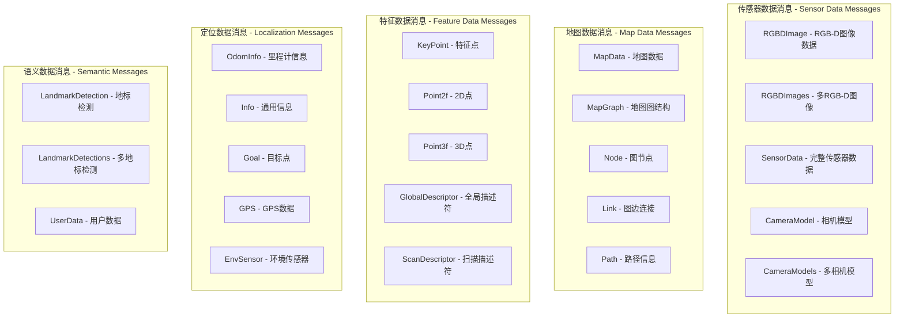

### 2. 消息依赖关系

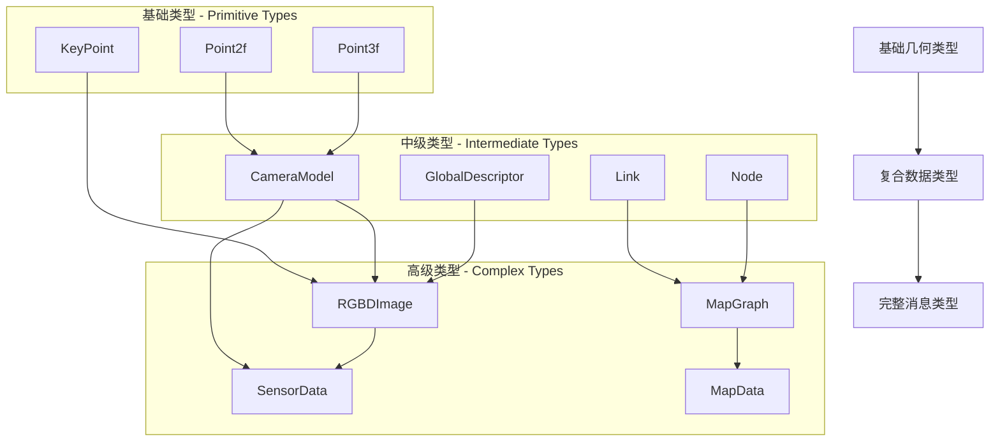

## 核心消息类型详解

### 1. RGBDImage 消息

RGB-D图像数据的标准格式：

```cpp
# rtabmap_msgs/RGBDImage.msg
Header header
sensor_msgs/Image rgb
sensor_msgs/Image depth  
sensor_msgs/CameraInfo rgb_camera_info
sensor_msgs/CameraInfo depth_camera_info
rtabmap_msgs/KeyPoint[] key_points
rtabmap_msgs/Point3f[] points
rtabmap_msgs/GlobalDescriptor[] global_descriptors
```

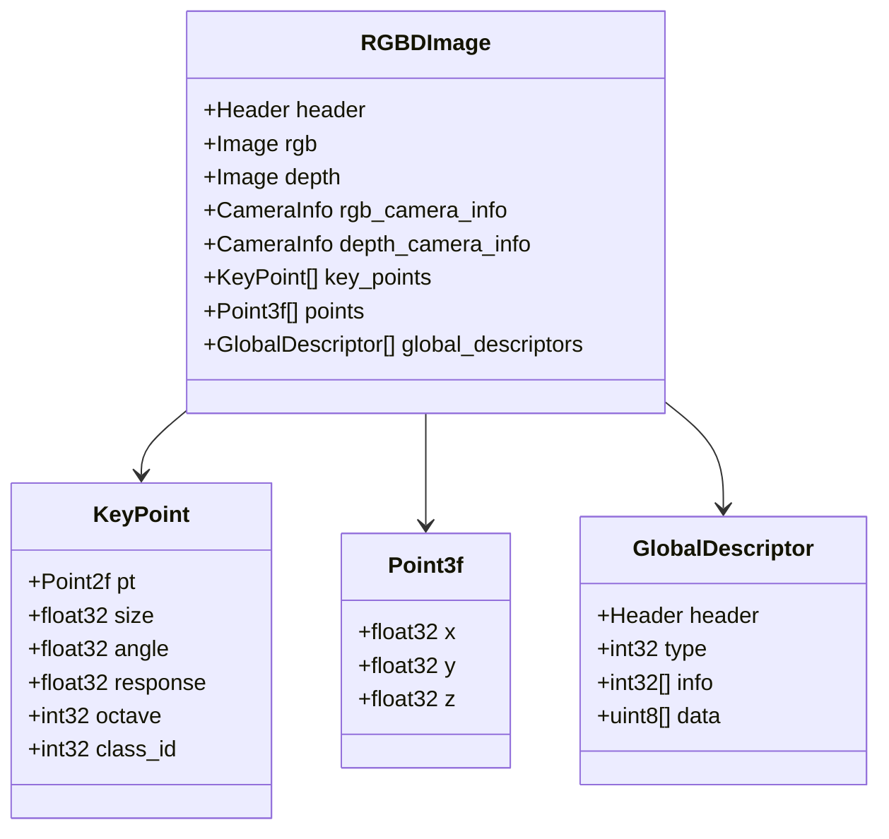

### 2. SensorData 消息

完整的传感器数据包：

```cpp
# rtabmap_msgs/SensorData.msg
Header header
sensor_msgs/Image left
sensor_msgs/Image right
sensor_msgs/CameraInfo left_camera_info
sensor_msgs/CameraInfo right_camera_info
nav_msgs/Odometry odom
sensor_msgs/PointCloud2 laser_scan
rtabmap_msgs/UserData user_data
rtabmap_msgs/EnvSensor[] env_sensors
```

### 3. MapData 消息

地图数据的完整表示：

```cpp
# rtabmap_msgs/MapData.msg
Header header
rtabmap_msgs/MapGraph graph
rtabmap_msgs/Node[] nodes
rtabmap_msgs/Link[] links
```

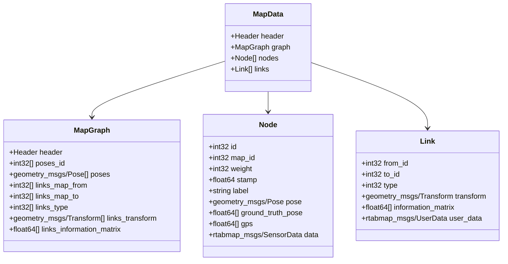

## 服务类型定义

### 1. 地图管理服务

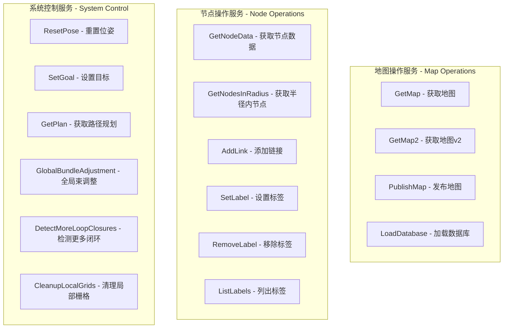

### 2. 关键服务定义

#### GetMap 服务
```cpp
# rtabmap_msgs/GetMap.srv
bool global
bool optimized
bool graph_only
---
rtabmap_msgs/MapData data
```

#### SetGoal 服务  
```cpp
# rtabmap_msgs/SetGoal.srv
string label
int32 node_id
geometry_msgs/PoseStamped node_pose
---
int32 path_ids[]
float32 path_costs[]
float32 planning_time
```

#### GetNodeData 服务
```cpp
# rtabmap_msgs/GetNodeData.srv
int32[] ids
bool images
bool scan
bool grid
bool user_data
---
rtabmap_msgs/NodeData[] data
```

## 特殊数据类型

### 1. 环境传感器数据

```cpp
# rtabmap_msgs/EnvSensor.msg
Header header
int32 type      # 传感器类型
float64 value   # 传感器数值
```

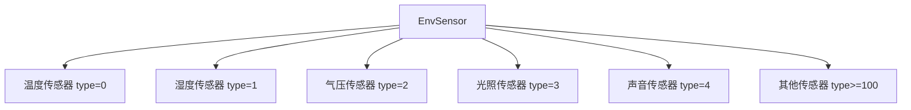

### 2. GPS数据格式

```cpp
# rtabmap_msgs/GPS.msg
float64 stamp
float64 longitude   # 经度
float64 latitude    # 纬度
float64 altitude    # 海拔
float64 error       # 误差
float64 bearing     # 方向角
```

### 3. 地标检测消息

```cpp
# rtabmap_msgs/LandmarkDetection.msg
Header header
string label            # 地标标签
int32 id               # 地标ID
float32 size           # 地标大小
geometry_msgs/PoseWithCovarianceStamped pose
```

## 数据编码和压缩

### 1. 图像压缩策略

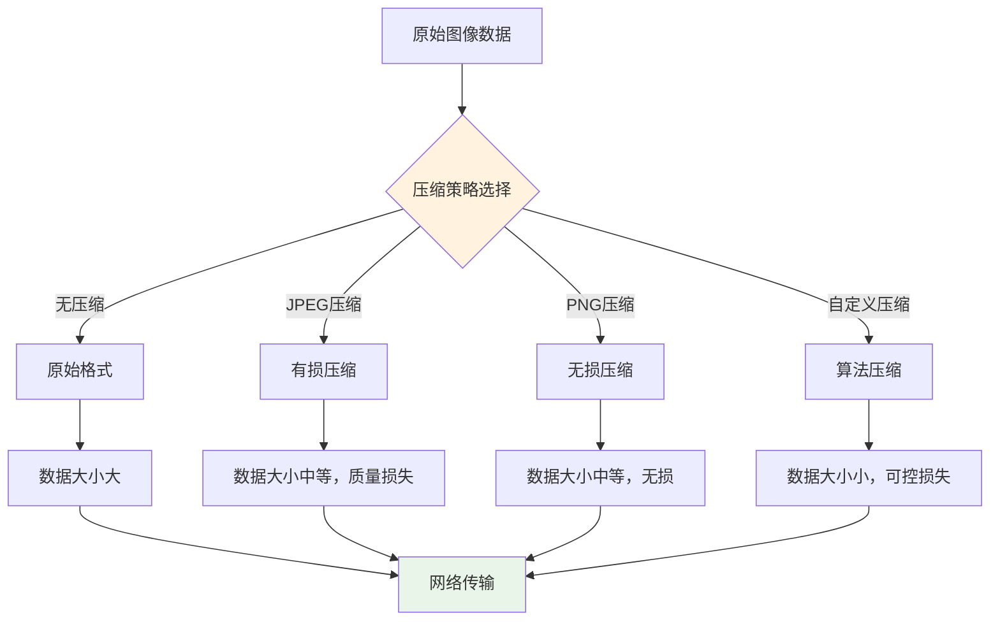

### 2. 描述符压缩

```cpp
// 全局描述符压缩格式
message GlobalDescriptor {
    Header header
    int32 type          // 描述符类型
    int32[] info        // 元信息（维度、数据类型等）
    uint8[] data        // 压缩后的描述符数据
}
```

## 消息使用模式

### 1. 发布-订阅模式

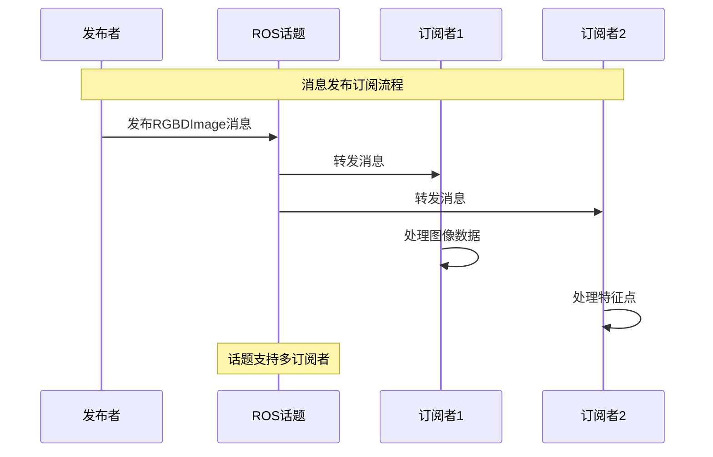

### 2. 服务调用模式

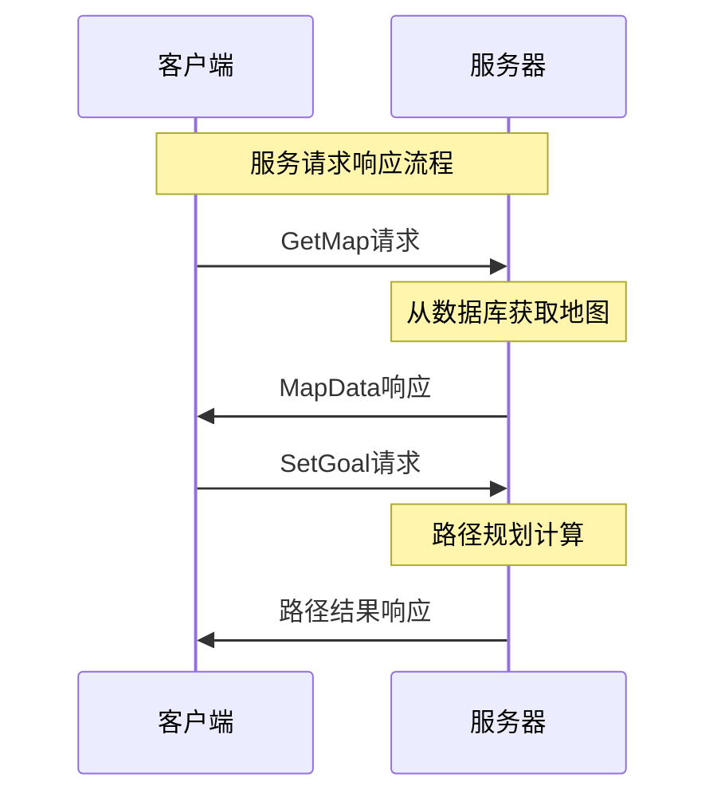

## 版本兼容性

### 1. 消息版本演进

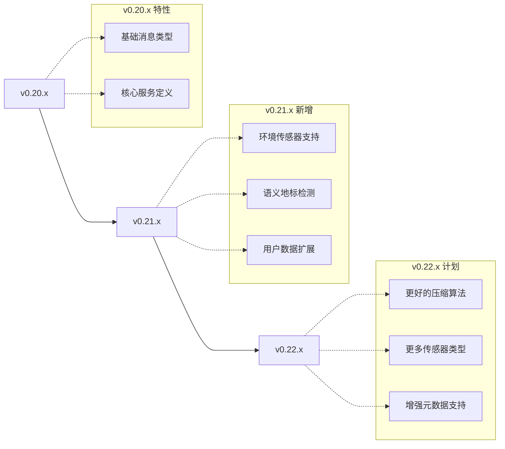

### 2. 向后兼容性策略

- **字段添加**: 新版本只能在消息末尾添加新字段
- **默认值**: 新字段必须有合理的默认值
- **废弃标记**: 废弃字段保留但标记为deprecated
- **版本检查**: 运行时检查消息版本兼容性

## 性能优化

### 1. 消息大小优化

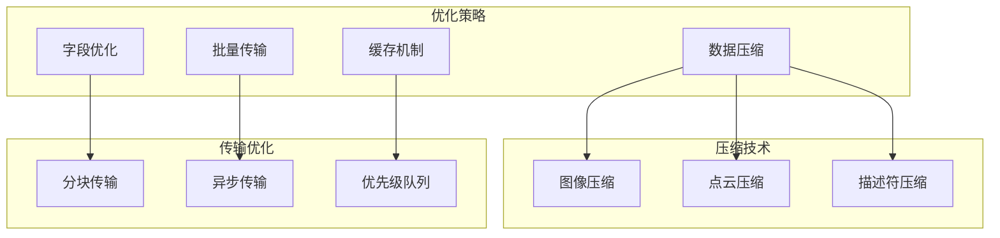

### 2. 序列化性能

- **二进制格式**: 使用高效的二进制序列化
- **零拷贝**: 避免不必要的内存拷贝
- **内存池**: 重用内存分配
- **批量处理**: 批量序列化多个消息

## 测试和验证

### 1. 消息验证工具

```bash
# 消息格式验证
rosmsg show rtabmap_msgs/RGBDImage

# 消息依赖检查
rosmsg deps rtabmap_msgs/MapData

# 消息大小分析
rostopic bw /rtabmap/mapData

# 消息频率监控
rostopic hz /rtabmap/rgbd_image
```

### 2. 自动化测试

```cpp
// 消息完整性测试
TEST(RtabmapMsgsTest, RGBDImageSerialization) {
    rtabmap_msgs::RGBDImage msg;
    // 填充测试数据
    fillTestData(msg);
    
    // 序列化
    std::vector<uint8_t> buffer;
    serialize(msg, buffer);
    
    // 反序列化
    rtabmap_msgs::RGBDImage decoded_msg;
    deserialize(buffer, decoded_msg);
    
    // 验证数据一致性
    EXPECT_EQ(msg.header.stamp, decoded_msg.header.stamp);
    EXPECT_EQ(msg.key_points.size(), decoded_msg.key_points.size());
}
```

## 最佳实践

### 1. 消息设计原则

- **最小化原则**: 只包含必要的字段
- **扩展性**: 考虑未来扩展需求
- **类型安全**: 使用强类型定义
- **文档完整**: 详细的字段说明
- **版本管理**: 合理的版本演进策略

### 2. 使用建议

```cpp
// 推荐的消息使用方式
class SensorDataProcessor {
private:
    ros::Subscriber rgbd_sub_;
    ros::Publisher processed_pub_;
    
public:
    void rgbdCallback(const rtabmap_msgs::RGBDImage::ConstPtr& msg) {
        // 避免不必要的拷贝
        processRGBDImage(*msg);
        
        // 复用消息对象
        rtabmap_msgs::RGBDImage output_msg = *msg;
        output_msg.header.stamp = ros::Time::now();
        
        processed_pub_.publish(output_msg);
    }
};
```

### 3. 错误处理

```cpp
// 消息有效性检查
bool validateRGBDImage(const rtabmap_msgs::RGBDImage& msg) {
    if (msg.rgb.data.empty() || msg.depth.data.empty()) {
        ROS_ERROR("Empty image data");
        return false;
    }
    
    if (msg.rgb.width != msg.depth.width || 
        msg.rgb.height != msg.depth.height) {
        ROS_ERROR("RGB and depth dimensions mismatch");
        return false;
    }
    
    return true;
}
```

## 开发工具

### 1. 消息生成工具

```bash
# 生成C++头文件
catkin_make --pkg rtabmap_msgs

# 生成Python绑定
python setup.py build_ext --inplace

# 生成文档
rosdoc_lite rtabmap_msgs
```

### 2. 调试工具

```bash
# 查看消息内容
rostopic echo /rtabmap/mapData

# 记录消息到文件
rosbag record -O map_data.bag /rtabmap/mapData

# 回放消息
rosbag play map_data.bag
```

## 相关资源

- **ROS消息规范**: ROS Wiki上的消息设计指南
- **序列化性能**: Protocol Buffers和MessagePack比较
- **版本管理**: 语义版本控制最佳实践
- **测试框架**: ROS消息测试工具和方法