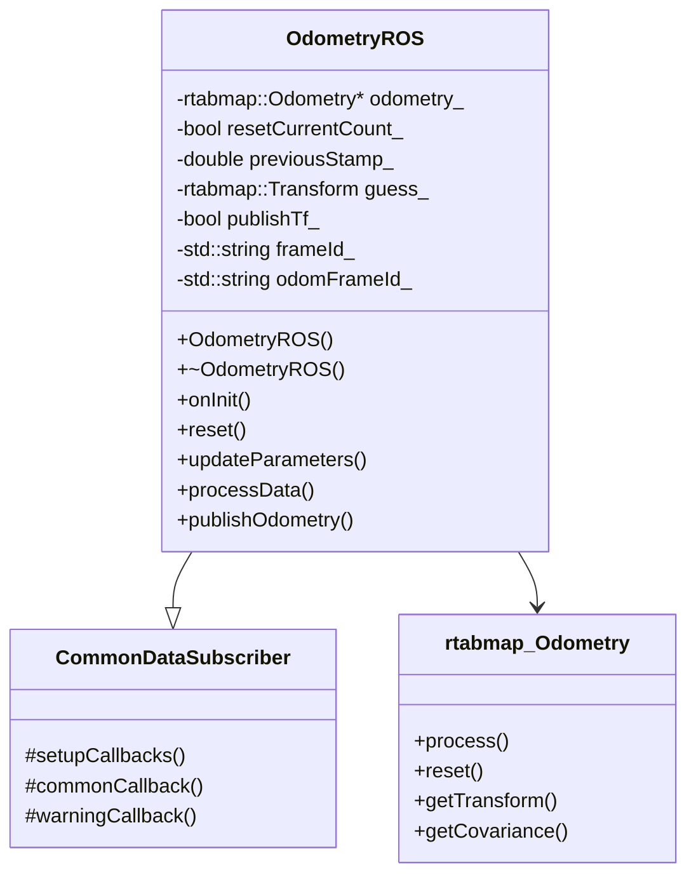
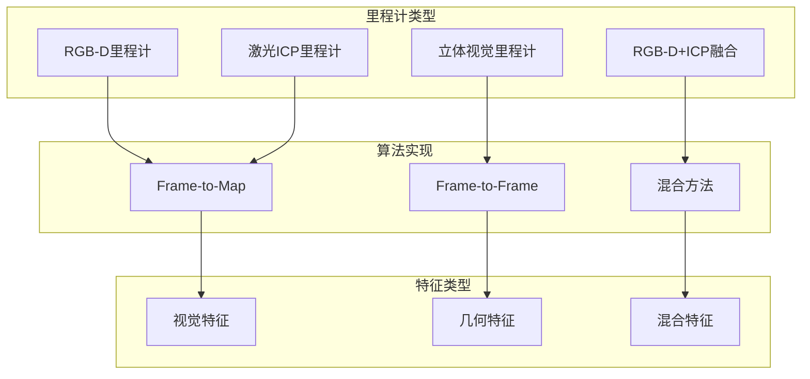
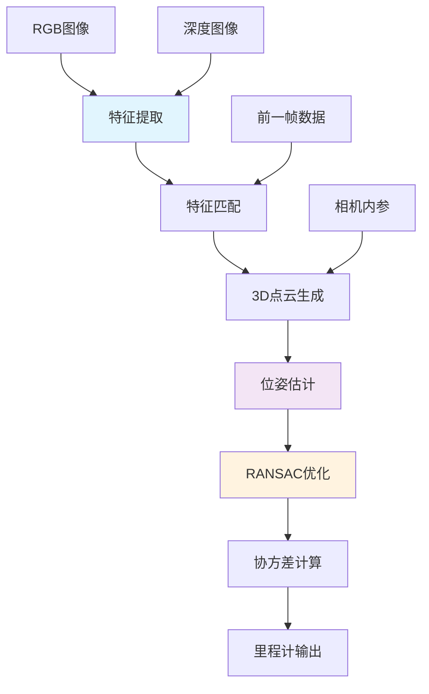
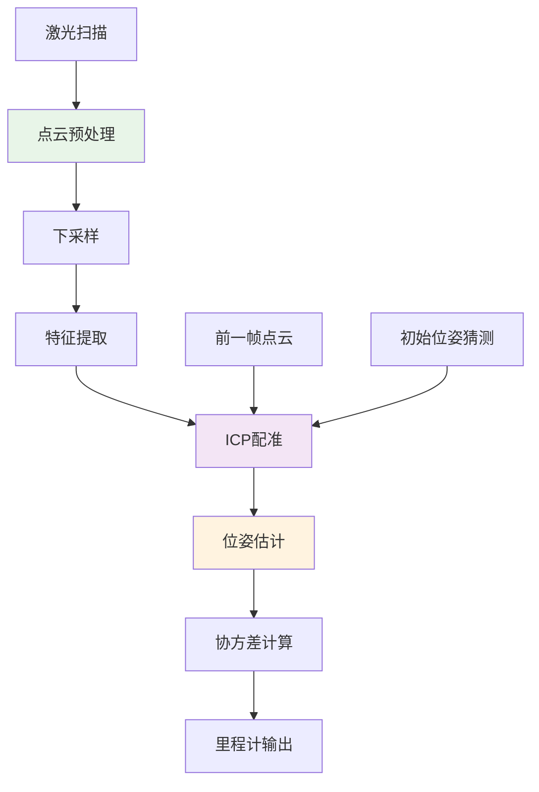
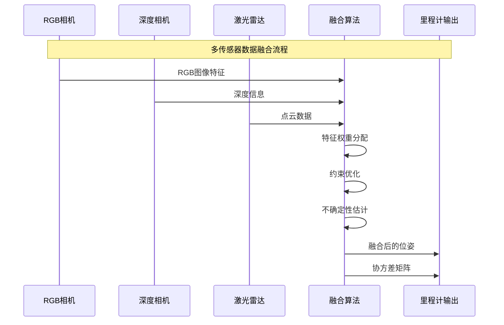
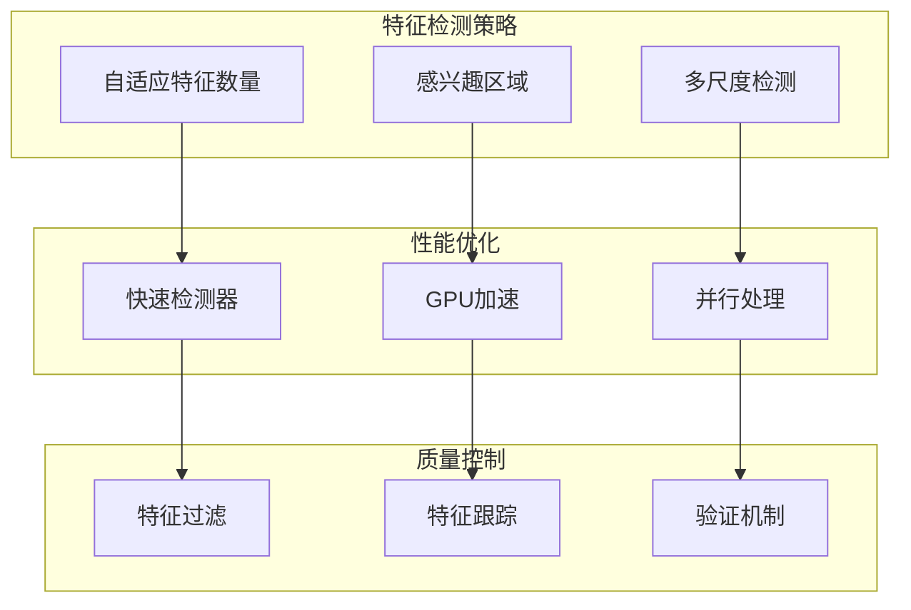
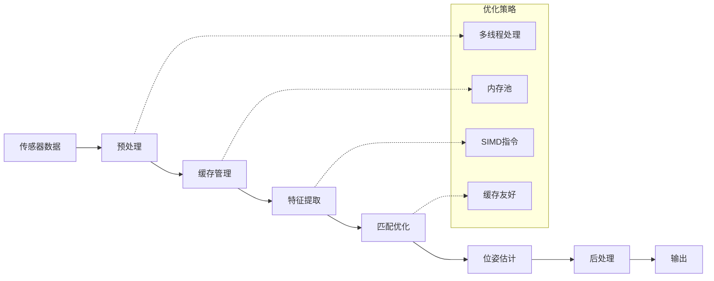
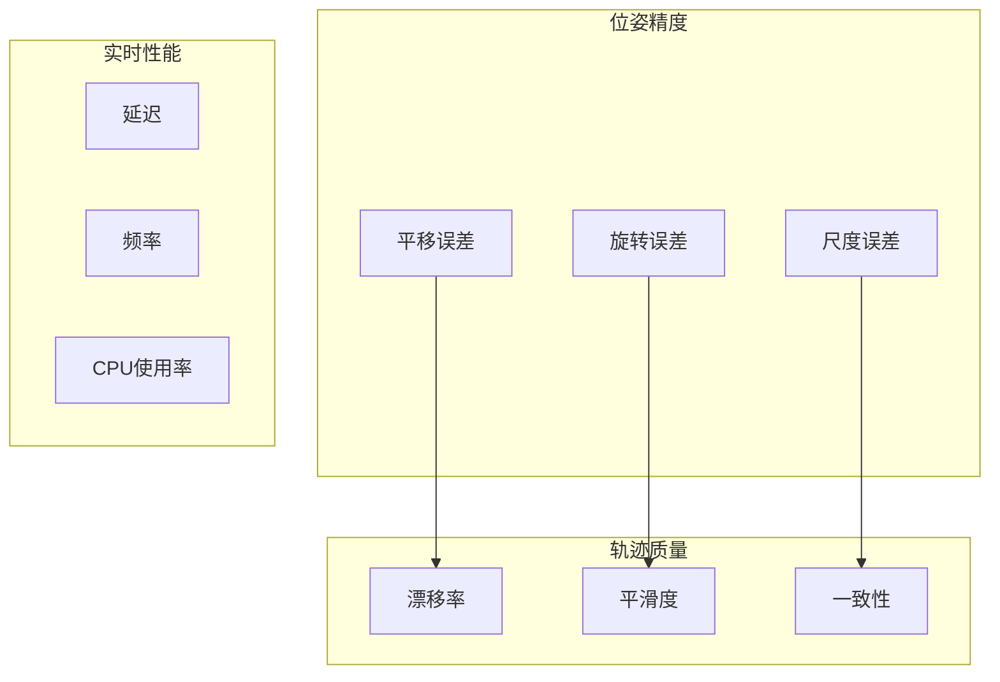
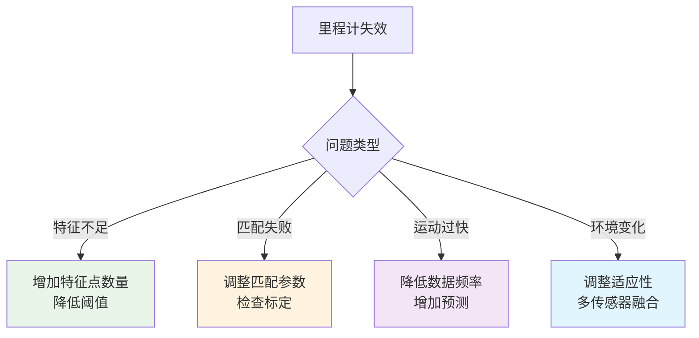
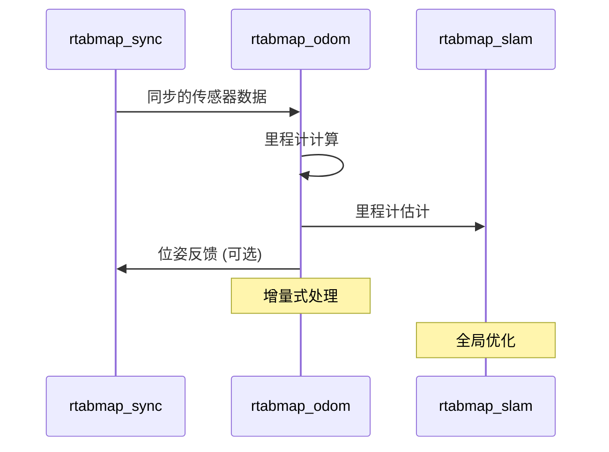

# rtabmap_odom 模块详细文档

## 模块概述

`rtabmap_odom` 模块负责计算机器人的里程计信息，是SLAM系统的重要组成部分。该模块通过视觉、激光雷达或多传感器融合的方式估计机器人的运动轨迹，为SLAM提供初始位姿估计。

## 核心组件

### 1. OdometryROS 类架构



### 2. 里程计类型



## 里程计算法流程

### 1. RGB-D里程计



### 2. 激光ICP里程计



### 3. 多传感器融合



## 主要节点类型

### 1. RGBDOdometryNode

专门处理RGB-D数据的里程计节点：

```yaml
# 订阅话题
rgb/image:          sensor_msgs/Image
depth/image:        sensor_msgs/Image  
rgb/camera_info:    sensor_msgs/CameraInfo

# 发布话题
odom:               nav_msgs/Odometry
tf:                 tf2_msgs/TFMessage (可选)
```

### 2. StereoOdometryNode

处理立体视觉数据：

```yaml
# 订阅话题
left/image_rect:        sensor_msgs/Image
right/image_rect:       sensor_msgs/Image
left/camera_info:       sensor_msgs/CameraInfo
right/camera_info:      sensor_msgs/CameraInfo

# 发布话题
odom:                   nav_msgs/Odometry
```

### 3. ICPOdometryNode

基于激光雷达的ICP里程计：

```yaml
# 订阅话题
scan:               sensor_msgs/LaserScan
scan_cloud:         sensor_msgs/PointCloud2

# 发布话题
odom:               nav_msgs/Odometry
```

## 配置参数

### 核心参数

```yaml
# 基本设置
frame_id: "base_link"                       # 机器人基坐标系
odom_frame_id: "odom"                       # 里程计坐标系
publish_tf: true                            # 是否发布TF变换
wait_for_transform: 0.1                     # TF等待时间(s)

# 里程计类型
odom_strategy: 0                            # 0=Frame-to-Map, 1=Frame-to-Frame
odom_reset_counters: false                  # 重置计数器

# 质量控制
odom_sensor_sync: false                     # 传感器同步
odom_guess_smoothing: 0.0                   # 猜测平滑因子
odom_expected_rate: 0                       # 期望频率(Hz, 0为自动)
```

### RGB-D里程计参数

```yaml
# 特征检测
odom_feature_type: 6                        # 特征类型 (GFTT=6, ORB=3, SURF=1)
odom_max_features: 1000                     # 最大特征点数
odom_min_inliers: 20                        # 最小内点数
odom_inlier_distance: 0.02                  # 内点距离阈值(m)

# 位姿估计
odom_pnp_reprojection_error: 2.0           # PnP重投影误差阈值
odom_pnp_flags: 0                          # PnP求解标志
odom_pnp_refine_iterations: 1              # PnP精化迭代次数

# 深度处理
odom_fill_info_data: true                  # 填充信息数据
odom_max_depth: 0.0                        # 最大深度(m, 0为无限)
odom_min_depth: 0.0                        # 最小深度(m)
```

### ICP里程计参数

```yaml
# ICP设置
icp_max_translation: 0.2                   # 最大平移(m)
icp_max_rotation: 0.78                     # 最大旋转(rad)
icp_voxel_size: 0.05                       # 体素大小(m)
icp_max_correspondence_distance: 0.1       # 最大对应距离(m)

# 点云处理
icp_downsampling_step: 1                   # 下采样步长
icp_max_iterations: 30                     # 最大迭代次数
icp_epsilon: 0.000001                     # 收敛阈值
icp_point_to_plane: true                   # 点到平面ICP
```

### 立体视觉参数

```yaml
# 立体匹配
stereo_max_disparity: 128.0               # 最大视差
stereo_min_disparity: 0.0                 # 最小视差
stereo_max_depth: 0.0                     # 最大深度(m)
stereo_min_depth: 0.0                     # 最小深度(m)

# 特征匹配
stereo_flow_epsilon: 0.02                 # 光流收敛阈值
stereo_flow_max_level: 3                  # 光流金字塔层数
```

## 性能优化

### 1. 特征提取优化



### 2. 数据流优化



## 质量评估

### 1. 精度指标



### 2. 协方差估计

```yaml
# 协方差模型
odom_covariance_type: 0                    # 协方差类型
# 0: 基于内点数量
# 1: 基于重投影误差
# 2: 基于运动预测

# 协方差参数
odom_variance_from_inliers_count: false   # 从内点数计算方差
odom_variance_lin: 0.01                   # 线性方差
odom_variance_ang: 0.01                   # 角度方差
```

## 故障诊断

### 1. 常见问题



### 2. 诊断工具

```yaml
# 调试输出
odom_publish_null_when_lost: true         # 丢失时发布空值
odom_tf_angular_variance: 1.0             # TF角度方差
odom_tf_linear_variance: 1.0              # TF线性方差

# 统计信息
odom_info_data: true                      # 发布详细信息
odom_holonomic: false                     # 全向运动模型
```

## 高级功能

### 1. 传感器融合

```cpp
// 多传感器融合示例
class MultiSensorOdometry : public OdometryROS {
private:
    std::vector<rtabmap::Odometry*> odometries_;
    std::vector<double> weights_;
    
public:
    virtual rtabmap::Transform process(
        const rtabmap::SensorData & data,
        rtabmap::OdometryInfo * info = 0);
    
    void fuseEstimates(
        const std::vector<rtabmap::Transform>& estimates,
        const std::vector<cv::Mat>& covariances,
        rtabmap::Transform& result,
        cv::Mat& resultCovariance);
};
```

### 2. 自适应参数调整

```cpp
// 自适应参数调整
class AdaptiveOdometry : public OdometryROS {
private:
    PerformanceMonitor monitor_;
    ParameterController controller_;
    
public:
    void updateParameters() override {
        auto performance = monitor_.getPerformance();
        controller_.adjustParameters(performance);
    }
};
```

## 与其他模块的集成

### 1. 与rtabmap_sync的交互



### 2. 与rtabmap_slam的协作

- **位姿初值**: 为SLAM提供初始位姿估计
- **约束信息**: 提供运动约束和不确定性
- **失效恢复**: SLAM可以修正里程计累积误差
- **闭环检测**: 辅助闭环检测的位姿验证

## 测试和验证

### 1. 精度测试

```bash
# 运行里程计节点
roslaunch rtabmap_odom rgbd_odometry.launch

# 记录轨迹数据
rostopic echo /rtabmap/odom > trajectory.txt

# 与真值比较
python evaluate_trajectory.py --ground_truth gt.txt --estimate trajectory.txt
```

### 2. 性能基准

- **处理频率**: > 30Hz (RGB-D), > 10Hz (点云)
- **延迟**: < 50ms
- **CPU使用率**: < 50%
- **内存使用**: < 1GB

## 扩展开发

### 1. 自定义里程计算法

```cpp
// 实现自定义里程计
class CustomOdometry : public rtabmap::Odometry {
public:
    virtual rtabmap::Transform computeTransform(
        rtabmap::SensorData & data,
        const rtabmap::Transform & guess = rtabmap::Transform(),
        rtabmap::OdometryInfo * info = 0);
};
```

### 2. 传感器适配器

```cpp
// 新传感器适配
class CustomSensorOdometry : public OdometryROS {
protected:
    virtual void setupCallbacks() override;
    virtual void customSensorCallback(
        const custom_msgs::SensorData::ConstPtr& msg);
};
```

## 相关资源

- **参考论文**: Visual-Inertial Odometry相关文献
- **开源库**: OpenCV, PCL, g2o
- **测试数据集**: TUM RGB-D, KITTI
- **标定工具**: camera_calibration, lidar_camera_calibration