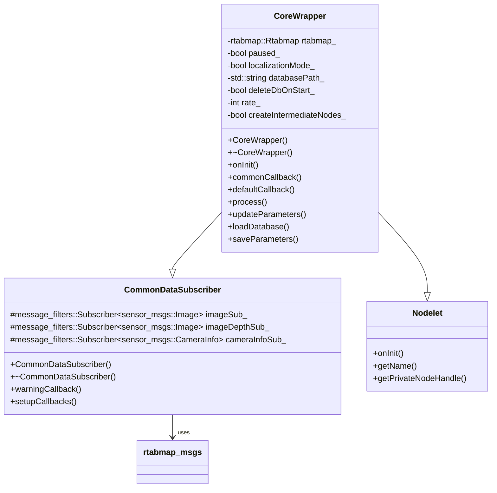
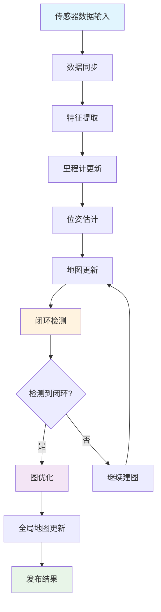
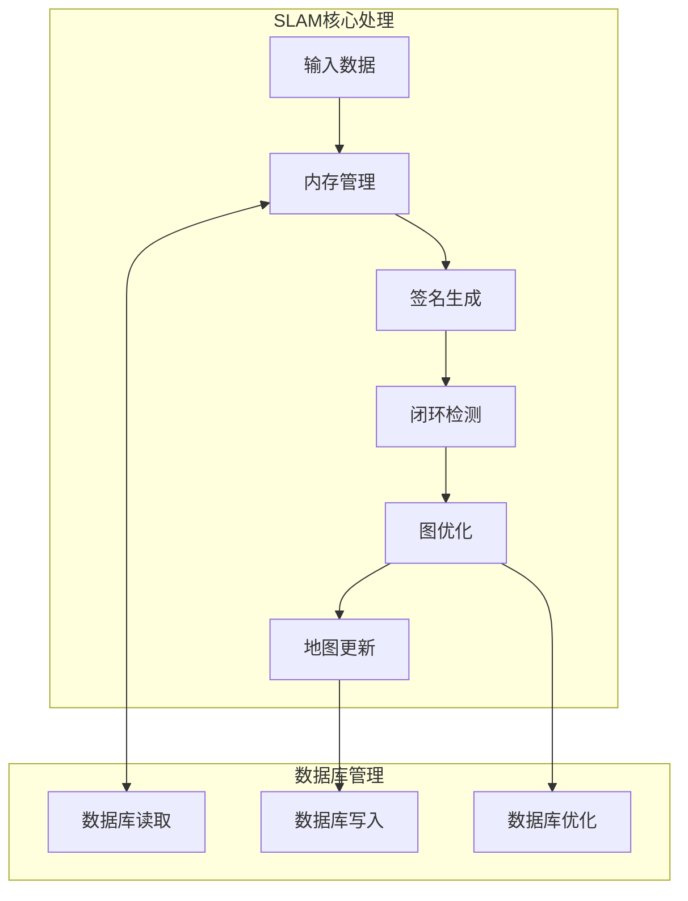
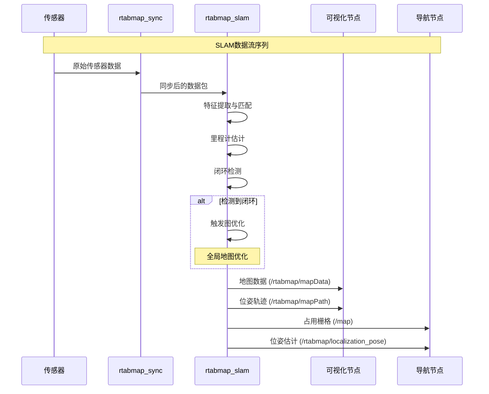
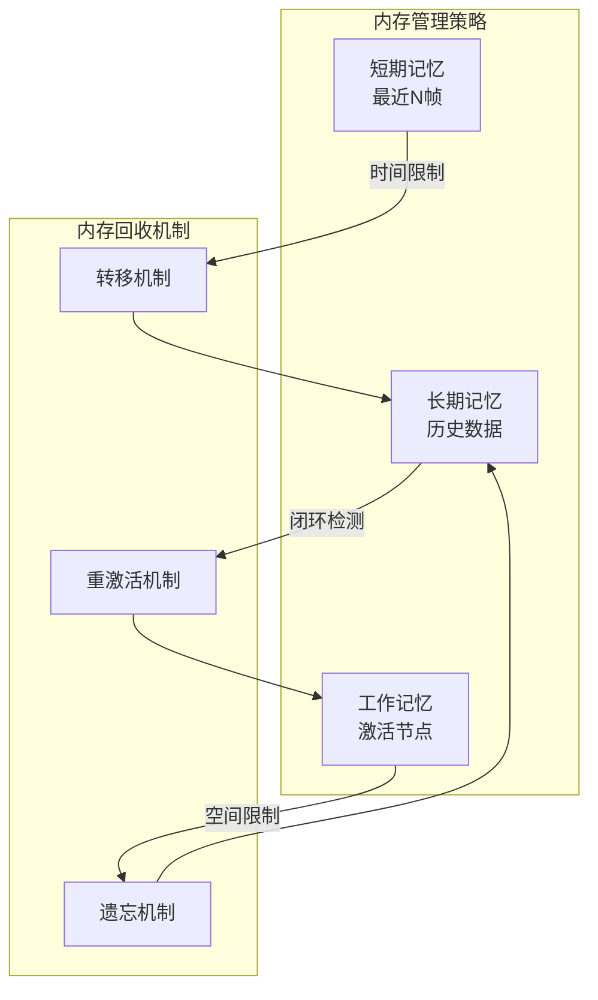
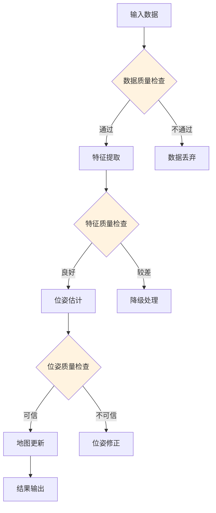

# rtabmap_slam 模块详细文档

## 模块概述

`rtabmap_slam` 是RTAB-Map ROS项目的核心模块，实现了完整的SLAM (Simultaneous Localization and Mapping) 功能。该模块负责处理传感器数据，进行实时建图、定位、闭环检测和图优化。

## 核心组件

### 1. CoreWrapper 类

`CoreWrapper` 是SLAM模块的主要封装类，继承自 `CommonDataSubscriber` 和 `nodelet::Nodelet`。



### 2. 数据处理流程



## 主要功能模块

### 1. SLAM核心算法



### 2. 消息发布订阅



## 关键话题和服务

### 订阅话题

| 话题名称 | 消息类型 | 描述 |
|---------|---------|------|
| `/rtabmap/rgb/image` | `sensor_msgs/Image` | RGB图像 |
| `/rtabmap/depth/image` | `sensor_msgs/Image` | 深度图像 |
| `/rtabmap/rgb/camera_info` | `sensor_msgs/CameraInfo` | 相机内参 |
| `/rtabmap/odom` | `nav_msgs/Odometry` | 里程计信息 |
| `/rtabmap/scan` | `sensor_msgs/LaserScan` | 激光扫描 |
| `/rtabmap/scan_cloud` | `sensor_msgs/PointCloud2` | 3D点云 |

### 发布话题

| 话题名称 | 消息类型 | 描述 |
|---------|---------|------|
| `/rtabmap/mapData` | `rtabmap_msgs/MapData` | 完整地图数据 |
| `/rtabmap/mapPath` | `nav_msgs/Path` | 机器人轨迹路径 |
| `/rtabmap/localization_pose` | `geometry_msgs/PoseWithCovarianceStamped` | 定位位姿 |
| `/rtabmap/grid_map` | `nav_msgs/OccupancyGrid` | 2D占用栅格地图 |
| `/rtabmap/cloud_map` | `sensor_msgs/PointCloud2` | 3D点云地图 |

### 提供服务

| 服务名称 | 服务类型 | 描述 |
|---------|---------|------|
| `/rtabmap/reset` | `std_srvs/Empty` | 重置SLAM系统 |
| `/rtabmap/pause` | `std_srvs/Empty` | 暂停SLAM处理 |
| `/rtabmap/resume` | `std_srvs/Empty` | 恢复SLAM处理 |
| `/rtabmap/trigger_new_map` | `std_srvs/Empty` | 创建新地图 |
| `/rtabmap/get_map` | `rtabmap_msgs/GetMap` | 获取当前地图 |
| `/rtabmap/publish_map` | `rtabmap_msgs/PublishMap` | 发布地图数据 |
| `/rtabmap/set_mode_mapping` | `std_srvs/Empty` | 设置为建图模式 |
| `/rtabmap/set_mode_localization` | `std_srvs/Empty` | 设置为定位模式 |

## 配置参数

### 核心参数

```yaml
# 基本配置
database_path: "~/.ros/rtabmap.db"           # 数据库路径
delete_db_on_start: false                    # 启动时是否删除数据库
rate: 1.0                                    # 处理频率(Hz)

# SLAM模式
localization: false                          # 是否为定位模式
reset_odom_to_pose: true                     # 重置里程计到当前位姿

# 内存管理
mem_reduce_graph: false                      # 是否减少图节点
mem_incremental_memory: true                 # 增量内存模式
mem_stm_size: 10                            # 短期记忆大小
mem_ltm_size: 0                             # 长期记忆大小(0为无限)

# 闭环检测
loop_thr: 0.11                              # 闭环检测阈值
loop_ratio: 0.0                             # 闭环比率阈值

# 图优化
graph_optimizer: 1                           # 图优化器类型(0=TORO,1=g2o,2=GTSAM)
optimizer_iterations: 20                     # 优化迭代次数
optimization_max_error: 4.0                 # 最大优化误差

# 可视化
publish_tf: true                            # 是否发布TF变换
publish_likelihood: true                    # 是否发布似然度
publish_pdf: true                           # 是否发布概率密度函数
```

### 高级参数

```yaml
# 特征提取
feature_type: 6                             # 特征类型(SURF=1,SIFT=2,ORB=3,FAST=4,BRIEF=5,GFTT=6)
max_features: 400                           # 最大特征点数量
feature_detector: 6                         # 特征检测器类型

# 匹配参数
vis_min_inliers: 20                         # 视觉里程计最小内点数
vis_inlier_distance: 0.1                   # 内点距离阈值
vis_estimation_type: 1                      # 估计类型(0=3D-3D,1=PnP,2=2D-2D)

# 建图参数
grid_cell_size: 0.05                       # 栅格单元大小(m)
grid_max_ground_angle: 45                  # 最大地面角度(度)
grid_min_cluster_size: 10                  # 最小聚类大小
grid_max_obstacles_height: 0.0             # 最大障碍物高度(m,0为无限)

# 数据库管理
db_save_depth_data: true                    # 保存深度数据
db_save_2d_map: true                        # 保存2D地图
db_save_3d_map: true                        # 保存3D地图
```

## 性能调优

### 1. 内存优化



### 2. 计算优化

- **多线程处理**: 特征提取、匹配、优化并行执行
- **增量处理**: 仅处理新增数据，避免重复计算
- **自适应参数**: 根据系统负载动态调整参数
- **缓存机制**: 缓存常用的计算结果

### 3. 质量控制



## 调试和监控

### 1. 诊断信息

```yaml
# 发布诊断话题
diagnostic_updater: true                    # 启用诊断更新器
diagnostic_tolerance: 5.0                  # 诊断容差

# 统计信息
publish_stats: true                         # 发布统计信息
stats_cache_size: 10                       # 统计缓存大小
```

### 2. 日志配置

```yaml
# 日志级别
log_level: 2                               # 0=DEBUG, 1=INFO, 2=WARN, 3=ERROR, 4=FATAL
log_to_file: false                         # 是否输出到文件
log_to_console: true                       # 是否输出到控制台
```

### 3. 性能监控

- **处理时间**: 监控各阶段处理耗时
- **内存使用**: 跟踪内存占用情况
- **闭环统计**: 记录闭环检测成功率
- **图大小**: 监控图节点和边的数量

## 故障排除

### 常见问题

1. **内存不足**: 调整内存管理参数，减少缓存大小
2. **处理速度慢**: 降低输入数据频率，优化特征参数
3. **定位精度差**: 检查传感器标定，调整闭环检测参数
4. **地图不一致**: 验证时间同步，检查坐标系配置

### 性能指标

- **实时因子**: 处理时间/实际时间 < 1.0
- **内存使用**: < 系统总内存的50%
- **闭环检测率**: > 80%的真正闭环被检测到
- **定位精度**: < 0.1m的平均位姿误差

## 扩展和定制

### 1. 自定义特征检测器

```cpp
// 实现自定义特征检测器
class CustomFeatureDetector : public rtabmap::Feature2D {
public:
    virtual std::vector<cv::KeyPoint> generateKeypoints(
        const cv::Mat & image,
        const cv::Mat & mask = cv::Mat());
    
    virtual cv::Mat generateDescriptors(
        const cv::Mat & image,
        std::vector<cv::KeyPoint> & keypoints);
};
```

### 2. 自定义闭环检测器

```cpp
// 实现自定义闭环检测器
class CustomLoopClosureDetector : public rtabmap::LoopClosureDetector {
public:
    virtual std::vector<int> detectLoopClosures(
        int signatureId,
        const rtabmap::Signature * signature,
        const std::multimap<int, int> & words,
        float & loopThr);
};
```

## 相关模块

- **rtabmap_odom**: 提供里程计输入
- **rtabmap_sync**: 提供同步的传感器数据
- **rtabmap_util**: 提供辅助工具
- **rtabmap_viz**: 提供可视化功能
- **rtabmap_msgs**: 定义通信消息