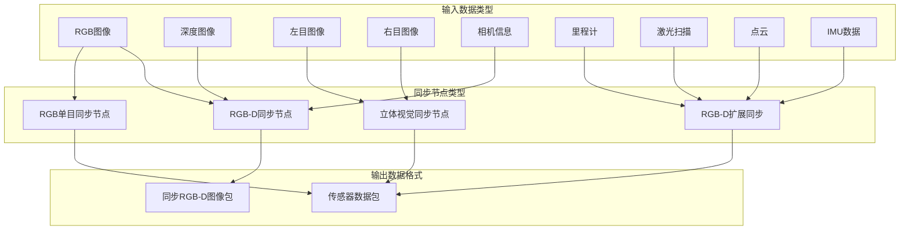
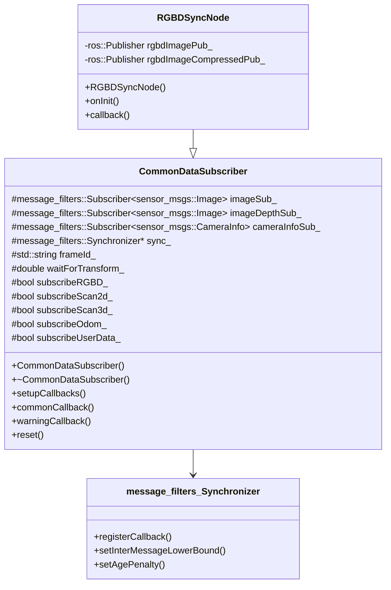
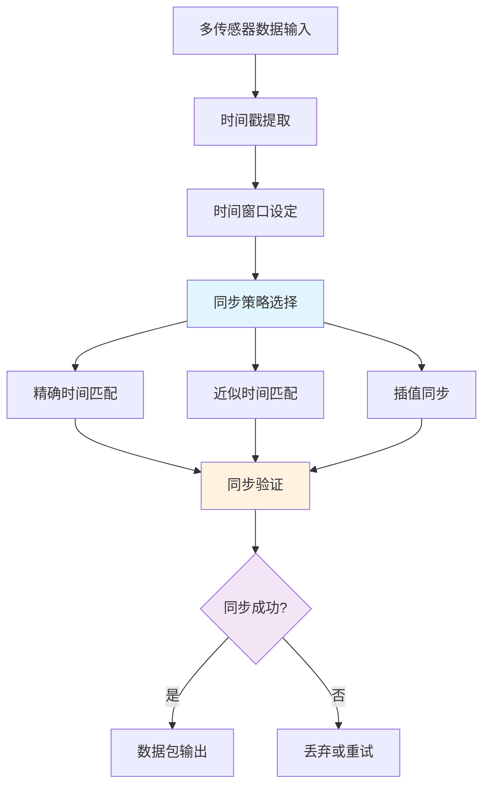
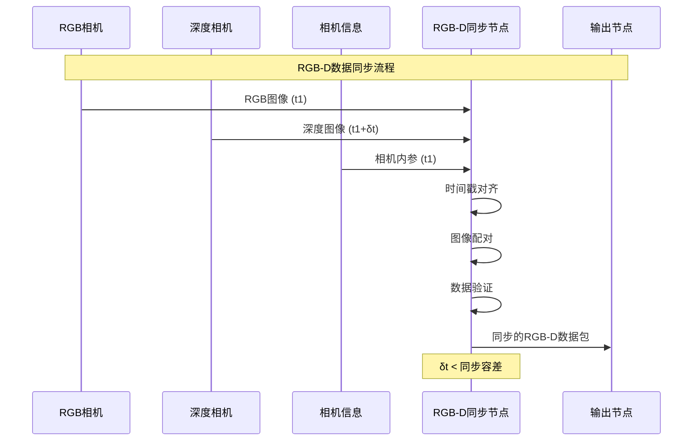
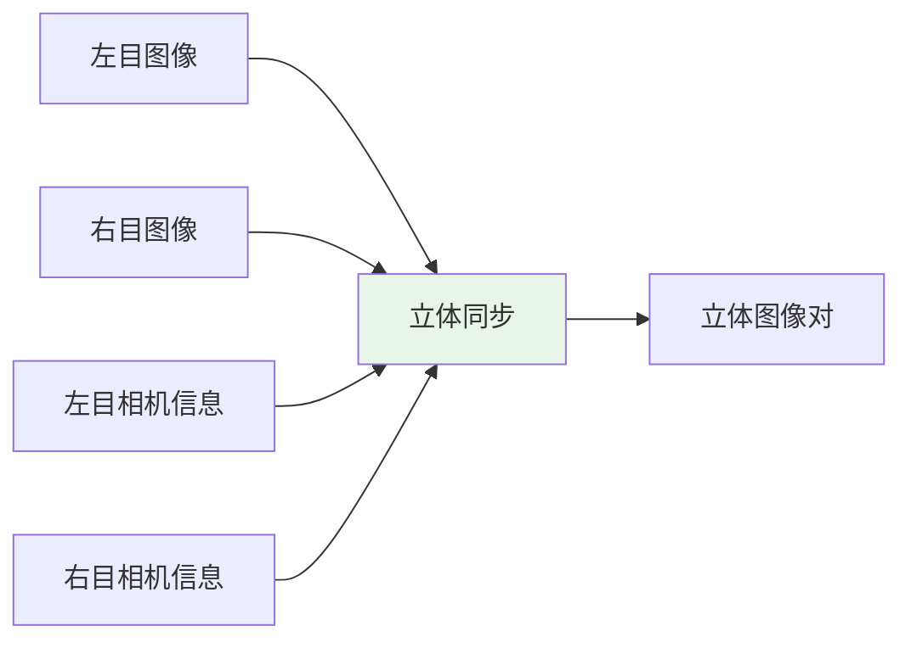
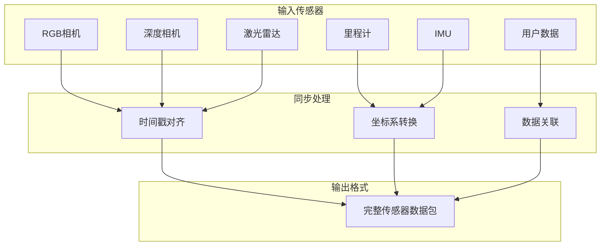
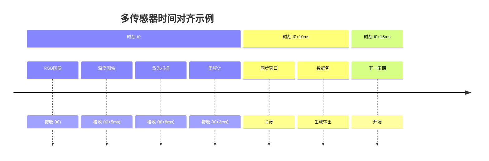
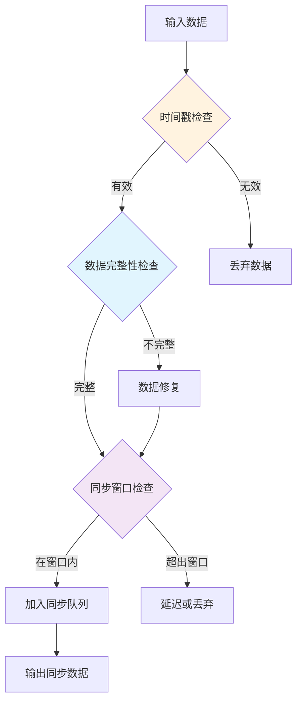
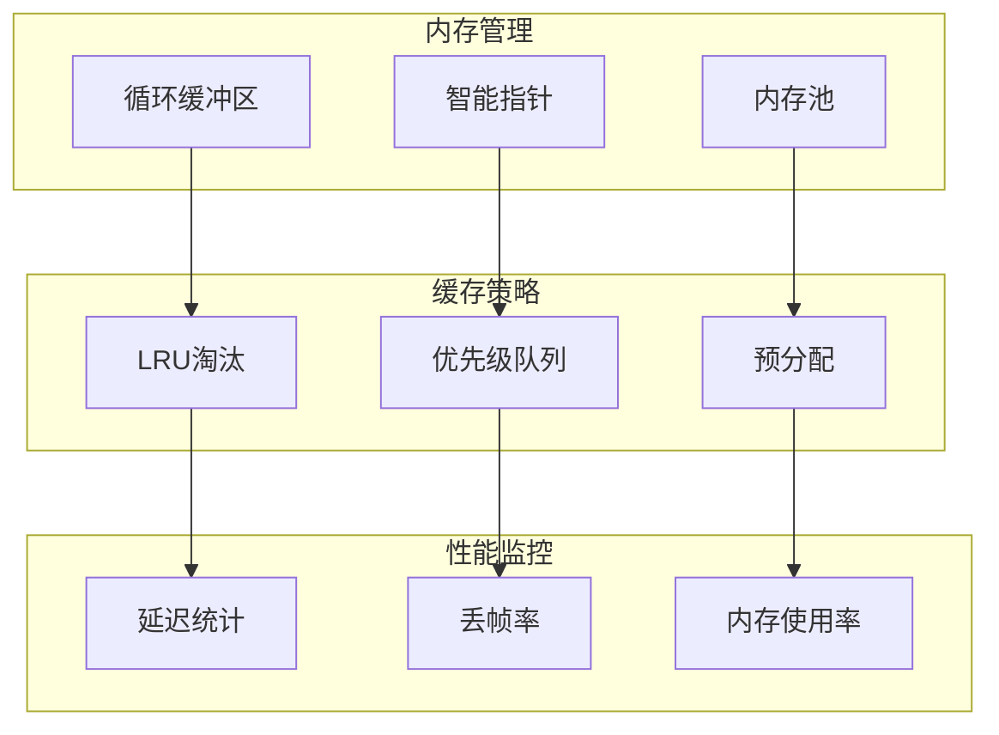
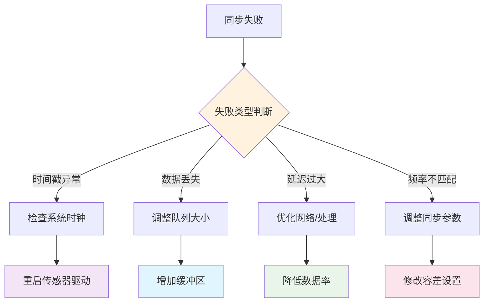

# rtabmap_sync 模块详细文档

## 模块概述

`rtabmap_sync` 模块负责多传感器数据的时间同步和空间对齐，是RTAB-Map系统的数据预处理核心。该模块确保来自不同传感器的数据能够准确地时间对齐，为后续的里程计计算和SLAM处理提供高质量的输入。

## 核心架构

### 1. 同步节点类型



### 2. CommonDataSubscriber 基类



## 时间同步机制

### 1. 同步策略



### 2. 同步参数配置

```yaml
# 基本同步参数
approx_sync: true                          # 近似时间同步
queue_size: 10                             # 消息队列大小
sync_queue_size: 5                         # 同步队列大小

# 时间容差
approx_sync_max_interval: 0.01            # 最大时间间隔(s)
wait_for_transform: 0.2                   # TF等待时间(s)

# 数据丢弃策略
drop_frame_when_full: false               # 队列满时丢弃帧
max_update_rate: 0.0                      # 最大更新频率(Hz)
```

## 主要同步节点

### 1. RGBDSyncNode

专门用于RGB-D相机数据同步：



**话题配置:**
```yaml
# 输入话题
rgb/image_rect_color:     sensor_msgs/Image
depth_registered/image:   sensor_msgs/Image
rgb/camera_info:          sensor_msgs/CameraInfo

# 输出话题
rgbd_image:               rtabmap_msgs/RGBDImage
rgbd_image/compressed:    rtabmap_msgs/RGBDImage (压缩)
```

### 2. StereoSyncNode

立体视觉数据同步：



**话题配置:**
```yaml
# 输入话题
left/image_rect:          sensor_msgs/Image
right/image_rect:         sensor_msgs/Image
left/camera_info:         sensor_msgs/CameraInfo
right/camera_info:        sensor_msgs/CameraInfo

# 输出话题
rgbd_image:               rtabmap_msgs/RGBDImage
```

### 3. RGBDXSyncNode (扩展同步)

支持更多传感器类型的同步：



## 数据结构

### 1. RGBDImage 消息格式

```cpp
// rtabmap_msgs/RGBDImage.msg
Header header
sensor_msgs/Image rgb
sensor_msgs/Image depth
sensor_msgs/CameraInfo rgb_camera_info
sensor_msgs/CameraInfo depth_camera_info
rtabmap_msgs/KeyPoint[] key_points
rtabmap_msgs/Point3f[] points
rtabmap_msgs/GlobalDescriptor[] global_descriptors
```

### 2. SensorData 消息格式

```cpp
// rtabmap_msgs/SensorData.msg
Header header
sensor_msgs/Image left
sensor_msgs/Image right
sensor_msgs/CameraInfo left_camera_info
sensor_msgs/CameraInfo right_camera_info
nav_msgs/Odometry odom
sensor_msgs/PointCloud2 laser_scan
rtabmap_msgs/UserData user_data
rtabmap_msgs/EnvSensor[] env_sensors
```

## 高级同步功能

### 1. 多传感器时间对齐



### 2. 数据质量检查



## 性能优化

### 1. 缓存管理



### 2. 并行处理

```yaml
# 并行处理配置
parallel_type: 1                          # 并行类型
# 0: 单线程
# 1: 多线程同步
# 2: 异步处理

thread_pool_size: 4                       # 线程池大小
max_parallel_callbacks: 2                 # 最大并行回调数
```

## 配置参数详解

### 1. 基础配置

```yaml
# 订阅话题配置
subscribe_rgbd: false                     # 是否订阅RGBD话题
subscribe_rgb: true                       # 是否订阅RGB话题
subscribe_depth: true                     # 是否订阅深度话题
subscribe_stereo: false                   # 是否订阅立体话题
subscribe_scan: false                     # 是否订阅激光扫描
subscribe_scan_cloud: false               # 是否订阅点云
subscribe_odom_info: false                # 是否订阅里程计信息
subscribe_user_data: false                # 是否订阅用户数据

# 发布话题配置
publish_tf: false                         # 是否发布TF
tf_delay: 0.05                           # TF发布延迟(s)
tf_tolerance: 0.1                        # TF容差(s)
```

### 2. 同步算法配置

```yaml
# message_filters同步器参数
sync_type: 0                             # 同步器类型
# 0: ExactTime
# 1: ApproximateTime

# ApproximateTime参数
sync_max_interval: 0.01                  # 最大时间间隔
sync_age_penalty: 1.0                    # 年龄惩罚因子
sync_inter_message_bound: 0.0            # 消息间边界

# 自定义同步参数
custom_sync_enabled: false               # 启用自定义同步
custom_sync_tolerance: 0.005             # 自定义同步容差
```

### 3. 数据处理配置

```yaml
# 图像处理
compressed_rate: 1.0                     # 压缩率
decimation: 1                            # 抽取比例
gen_depth: false                         # 生成深度图
gen_depth_fill_holes_size: 0             # 深度填充孔洞大小

# 点云处理
scan_cloud_max_points: 0                 # 点云最大点数(0为无限)
scan_normal_k: 0                         # 法向量计算K值
scan_downsample_step: 1                  # 点云下采样步长
```

## 故障处理

### 1. 时间同步失败



### 2. 常见问题解决

| 问题 | 原因 | 解决方案 |
|------|------|----------|
| 数据不同步 | 时间戳不准确 | 检查时钟同步，调整容差 |
| 丢帧严重 | 处理速度慢 | 增加队列大小，优化算法 |
| 内存泄漏 | 缓存管理问题 | 检查智能指针使用 |
| CPU占用高 | 处理逻辑复杂 | 启用多线程，优化算法 |

## 调试工具

### 1. 同步状态监控

```bash
# 监控同步状态
rostopic echo /rtabmap/sync_status

# 查看消息频率
rostopic hz /rgbd_image

# 检查时间戳
rostopic echo /rgbd_image | grep stamp
```

### 2. 性能分析

```yaml
# 启用性能分析
performance_profiling: true              # 性能分析
profiling_output_path: "/tmp/sync_perf"  # 输出路径
profiling_sample_rate: 100               # 采样率

# 统计信息
statistics_enabled: true                 # 启用统计
statistics_publish_rate: 1.0            # 统计发布频率
```

## 扩展开发

### 1. 自定义同步器

```cpp
// 实现自定义同步器
template<typename M0, typename M1, typename M2>
class CustomSynchronizer {
private:
    boost::function<void(const boost::shared_ptr<M0>&,
                        const boost::shared_ptr<M1>&,
                        const boost::shared_ptr<M2>&)> callback_;
    
public:
    void registerCallback(const boost::function<void(const boost::shared_ptr<M0>&,
                                                   const boost::shared_ptr<M1>&,
                                                   const boost::shared_ptr<M2>&)>& callback) {
        callback_ = callback;
    }
    
    void process(const boost::shared_ptr<M0>& m0,
                const boost::shared_ptr<M1>& m1,
                const boost::shared_ptr<M2>& m2);
};
```

### 2. 传感器适配器

```cpp
// 新传感器类型适配
class CustomSensorSync : public CommonDataSubscriber {
private:
    message_filters::Subscriber<custom_msgs::SensorData> customSub_;
    
protected:
    virtual void setupCallbacks() override;
    virtual void customCallback(
        const custom_msgs::SensorData::ConstPtr& msg);
};
```

### 3. 时间戳插值

```cpp
// 时间戳插值算法
class TimestampInterpolator {
public:
    geometry_msgs::Transform interpolate(
        const geometry_msgs::Transform& t1, ros::Time time1,
        const geometry_msgs::Transform& t2, ros::Time time2,
        ros::Time target_time);
    
    sensor_msgs::Image interpolateImage(
        const sensor_msgs::Image& img1, ros::Time time1,
        const sensor_msgs::Image& img2, ros::Time time2,
        ros::Time target_time);
};
```

## 最佳实践

### 1. 传感器配置

- **时钟同步**: 确保所有传感器使用统一时钟源
- **发布频率**: 匹配传感器发布频率
- **网络延迟**: 最小化网络传输延迟
- **数据格式**: 使用压缩格式减少带宽

### 2. 系统调优

- **实时内核**: 使用实时Linux内核
- **CPU亲和性**: 绑定进程到特定CPU核心
- **内存锁定**: 锁定关键内存页面
- **优先级设置**: 设置适当的进程优先级

### 3. 监控和维护

- **性能监控**: 定期检查同步性能指标
- **日志分析**: 分析错误和警告日志
- **资源使用**: 监控CPU和内存使用情况
- **数据质量**: 验证同步数据的质量

## 相关模块

- **rtabmap_odom**: 消费同步后的数据进行里程计计算
- **rtabmap_slam**: 使用同步数据进行SLAM处理
- **rtabmap_util**: 提供数据转换和处理工具
- **rtabmap_msgs**: 定义同步数据的消息格式