# rtabmap_util 模块详细文档

## 模块概述

`rtabmap_util` 模块提供了一系列实用工具和辅助节点，用于数据预处理、格式转换、地图管理等功能。这些工具节点是RTAB-Map系统的重要补充，帮助系统更好地处理各种类型的传感器数据和应用场景。

## 工具节点架构

### 1. 节点分类体系

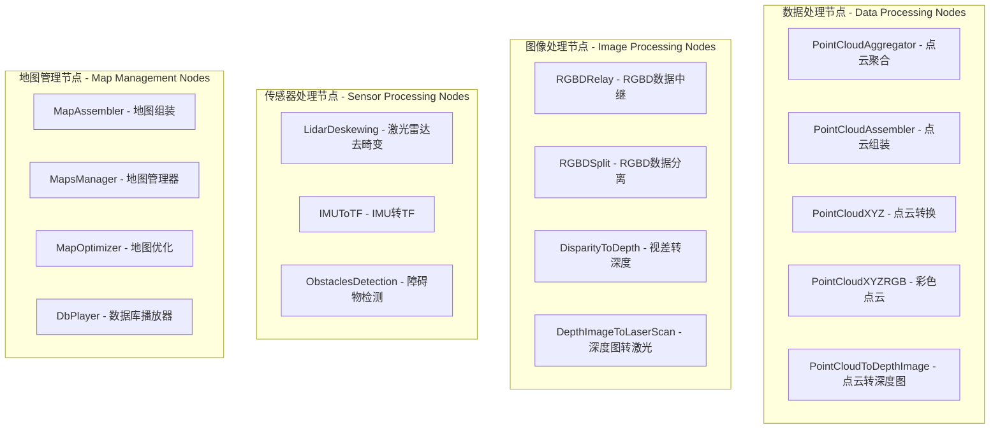

### 2. 数据流架构

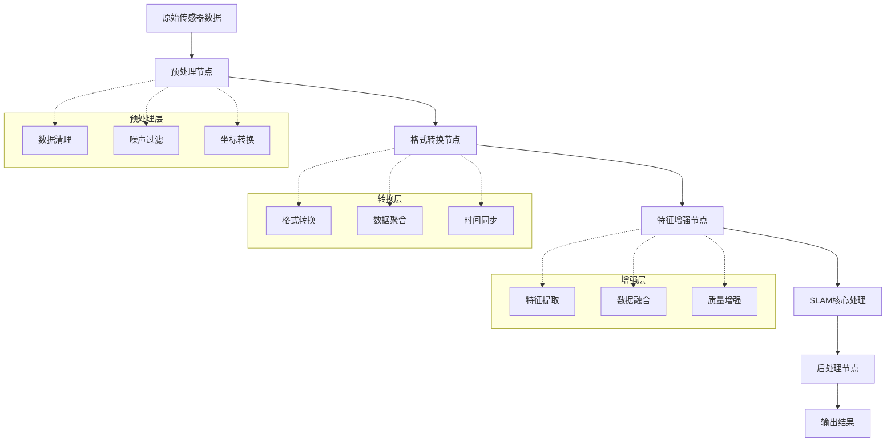

## 核心工具节点

### 1. PointCloudAggregator (点云聚合器)

将多帧点云数据聚合成高密度点云：

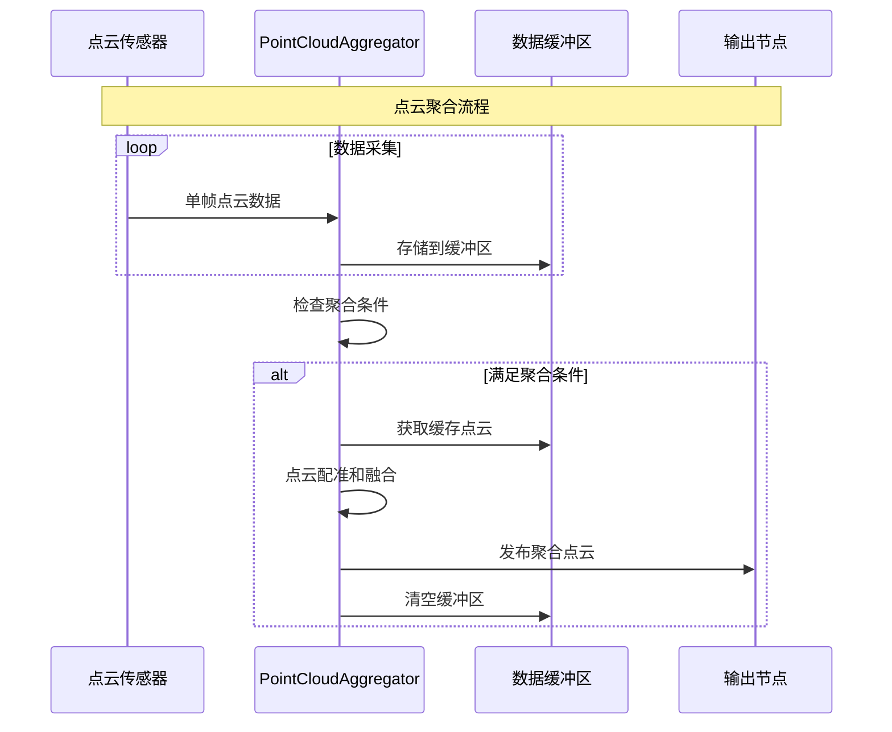

**配置参数:**
```yaml
# 聚合策略
assembling_time: 1.0           # 聚合时间窗口(s)
max_clouds: 0                  # 最大点云数量(0为无限)
fixed_frame: "odom"           # 固定坐标系

# 质量控制
voxel_size: 0.01              # 体素滤波大小(m)
noise_radius: 0.1             # 噪声过滤半径(m)
noise_min_neighbors: 5        # 最小邻居点数
```

### 2. PointCloudAssembler (点云组装器)

基于里程计信息组装3D地图：

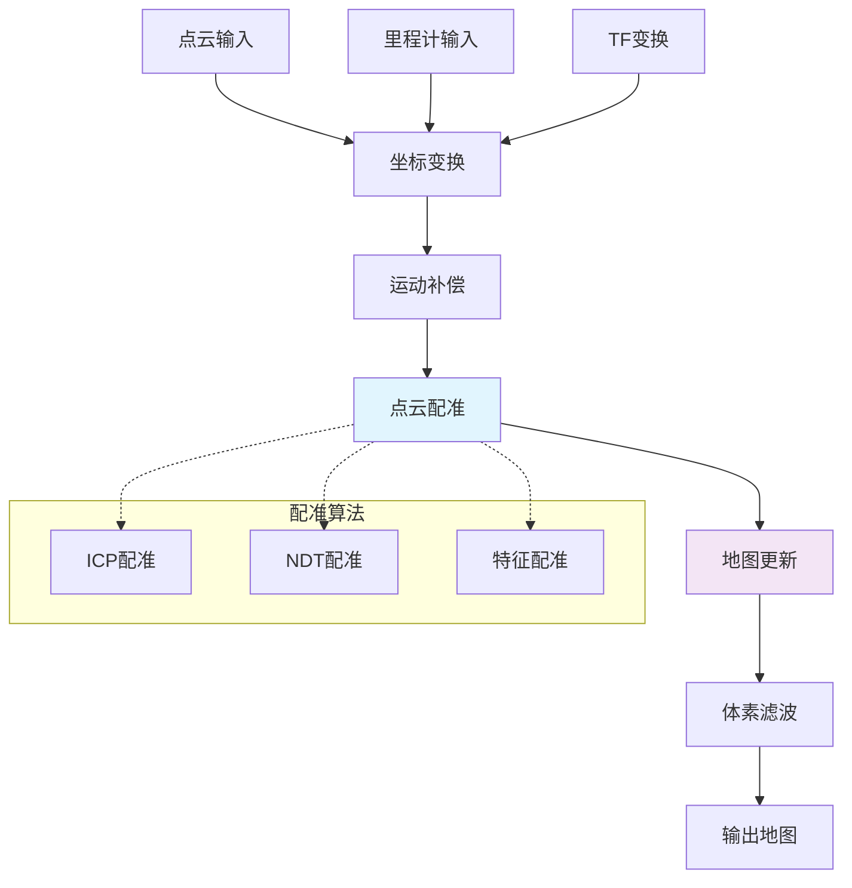

### 3. LidarDeskewing (激光雷达去畸变)

补偿激光雷达扫描过程中的运动畸变：

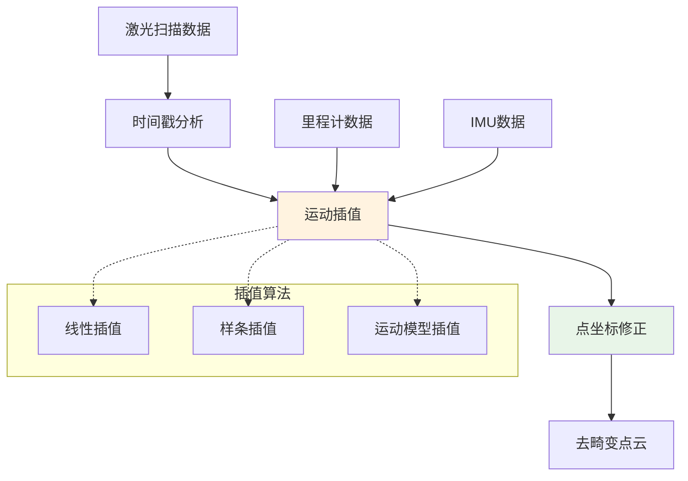

**去畸变算法:**
```cpp
// 运动去畸变核心算法
geometry_msgs::Point deskewPoint(
    const geometry_msgs::Point& point,
    double point_time,
    const nav_msgs::Odometry& start_odom,
    const nav_msgs::Odometry& end_odom) {
    
    // 计算时间比例
    double ratio = point_time / scan_duration;
    
    // 插值计算该时刻的位姿
    geometry_msgs::Pose interpolated_pose = 
        interpolatePose(start_odom.pose.pose, end_odom.pose.pose, ratio);
    
    // 将点从扫描时刻坐标系转换到起始时刻
    return transformPoint(point, interpolated_pose.inverse());
}
```

### 4. RGBDRelay (RGBD数据中继)

RGB-D数据的智能中继和处理：

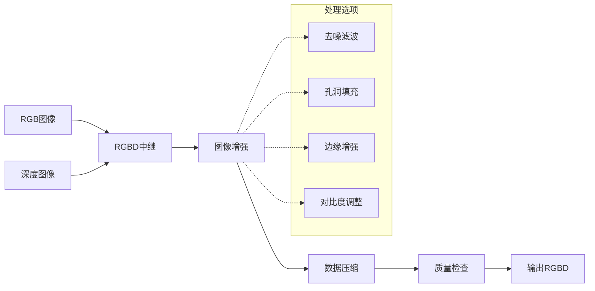

### 5. MapsManager (地图管理器)

多地图管理和切换：

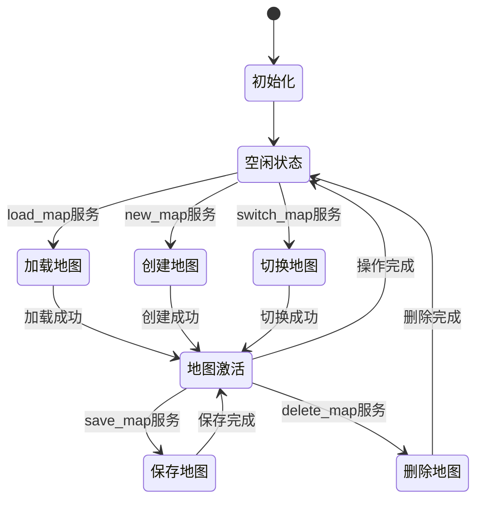

## 配置参数体系

### 1. 通用参数

```yaml
# 输入输出配置
input_topic: "/input"          # 输入话题
output_topic: "/output"        # 输出话题
queue_size: 1                  # 队列大小
wait_for_transform: 0.1        # 等待TF时间

# 坐标系配置
frame_id: "base_link"          # 目标坐标系
fixed_frame: "odom"           # 固定坐标系

# 性能参数
max_rate: 0.0                 # 最大处理频率(Hz, 0为无限)
use_threads: true             # 使用多线程
```

### 2. 点云处理参数

```yaml
# 体素滤波
voxel_size: 0.05              # 体素大小(m)
leaf_size: 0.01               # 叶子节点大小

# 统计滤波
mean_k: 50                    # 统计邻居数
std_dev_mul_thresh: 1.0       # 标准差倍数阈值

# 半径滤波
radius_search: 0.1            # 搜索半径(m)
min_neighbors_in_radius: 5    # 最小邻居数

# ICP参数
icp_max_iterations: 100       # 最大迭代次数
icp_max_correspondence_distance: 0.05  # 最大对应距离
icp_transformation_epsilon: 1e-6       # 变换收敛阈值
```

### 3. 图像处理参数

```yaml
# 图像缩放
decimation: 1                 # 图像抽取比例
resize_factor: 1.0            # 缩放因子

# 深度处理
depth_max: 5.0               # 最大深度(m)
depth_min: 0.1               # 最小深度(m)
fill_holes_size: 0           # 填充孔洞大小(0为不填充)

# 压缩参数
compress_images: false        # 是否压缩图像
compression_format: "jpg"     # 压缩格式
```

## 高级功能

### 1. 障碍物检测

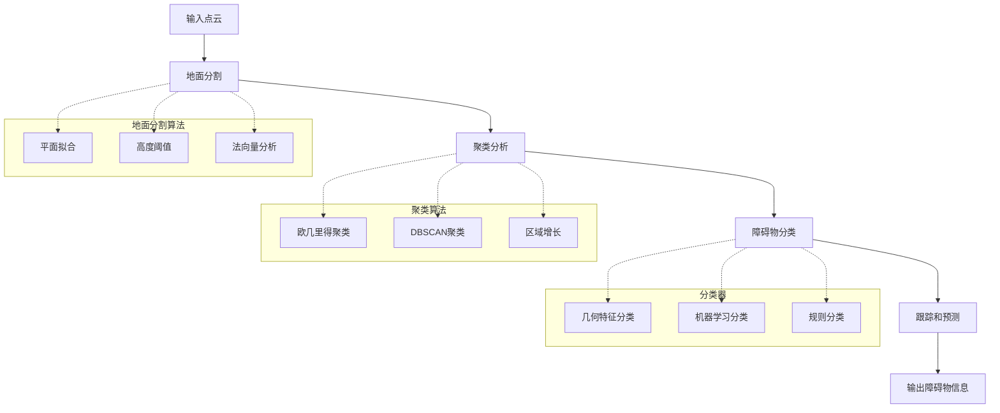

### 2. 数据库播放器

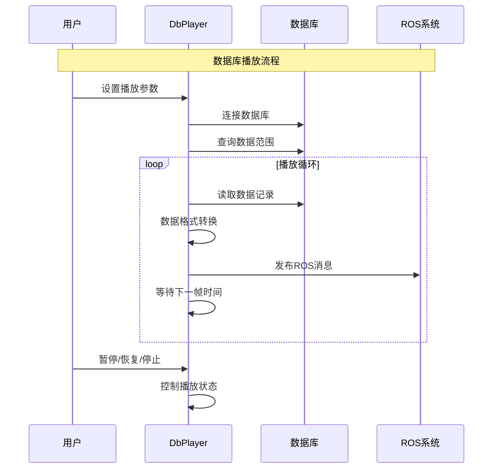

### 3. 地图优化器

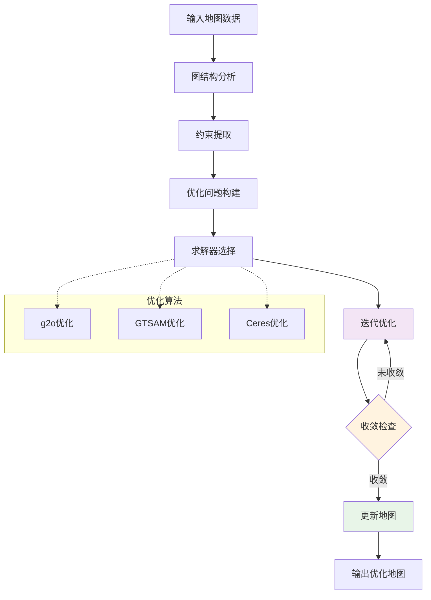

## 性能优化策略

### 1. 多线程处理

```cpp
// 多线程处理示例
class ThreadedPointCloudProcessor {
private:
    std::queue<sensor_msgs::PointCloud2> input_queue_;
    std::queue<sensor_msgs::PointCloud2> output_queue_;
    std::vector<std::thread> worker_threads_;
    std::mutex queue_mutex_;
    
public:
    void startWorkers(int num_threads) {
        for (int i = 0; i < num_threads; ++i) {
            worker_threads_.emplace_back(&ThreadedPointCloudProcessor::workerFunction, this);
        }
    }
    
    void workerFunction() {
        while (ros::ok()) {
            sensor_msgs::PointCloud2 cloud;
            {
                std::lock_guard<std::mutex> lock(queue_mutex_);
                if (input_queue_.empty()) continue;
                cloud = input_queue_.front();
                input_queue_.pop();
            }
            
            // 处理点云
            auto processed = processPointCloud(cloud);
            
            {
                std::lock_guard<std::mutex> lock(queue_mutex_);
                output_queue_.push(processed);
            }
        }
    }
};
```

### 2. 内存优化

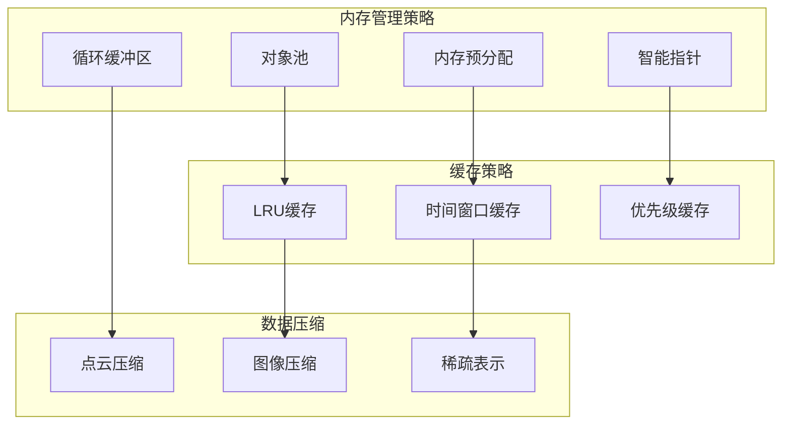

## 使用示例

### 1. 点云聚合配置

```xml
<!-- 点云聚合器配置 -->
<launch>
    <node pkg="rtabmap_util" type="point_cloud_aggregator" name="cloud_aggregator">
        <remap from="cloud" to="/velodyne_points"/>
        <remap from="cloud_out" to="/assembled_cloud"/>
        
        <param name="assembling_time" value="1.0"/>
        <param name="max_clouds" value="10"/>
        <param name="voxel_size" value="0.02"/>
        <param name="fixed_frame" value="odom"/>
    </node>
</launch>
```

### 2. 激光去畸变配置

```xml
<!-- 激光去畸变配置 -->
<launch>
    <node pkg="rtabmap_util" type="lidar_deskewing" name="lidar_deskewing">
        <remap from="input_cloud" to="/velodyne_points"/>
        <remap from="output_cloud" to="/deskewed_points"/>
        <remap from="odom" to="/odom"/>
        
        <param name="wait_for_transform" value="0.1"/>
        <param name="deskewing_method" value="1"/>  <!-- 0=linear, 1=spline -->
    </node>
</launch>
```

### 3. 地图管理器配置

```xml
<!-- 地图管理器配置 -->
<launch>
    <node pkg="rtabmap_util" type="maps_manager" name="maps_manager">
        <param name="maps_path" value="$(env HOME)/.ros/rtabmap_maps/"/>
        <param name="auto_save" value="true"/>
        <param name="save_interval" value="60.0"/>
        
        <!-- 提供的服务 -->
        <!-- /maps_manager/load_map -->
        <!-- /maps_manager/save_map -->
        <!-- /maps_manager/new_map -->
        <!-- /maps_manager/list_maps -->
    </node>
</launch>
```

## 调试和监控

### 1. 性能监控

```yaml
# 启用性能监控
enable_profiling: true
profiling_output: "/tmp/rtabmap_util_perf.log"

# 统计信息
publish_stats: true
stats_topic: "/rtabmap_util/stats"
stats_rate: 1.0  # Hz
```

### 2. 调试工具

```bash
# 查看节点状态
rosrun rtabmap_util point_cloud_aggregator _debug:=true

# 监控处理性能
rostopic echo /rtabmap_util/stats

# 可视化处理结果
rosrun rviz rviz -d rtabmap_util_debug.rviz
```

### 3. 日志分析

```cpp
// 性能日志记录
class PerformanceLogger {
private:
    std::map<std::string, double> timings_;
    std::ofstream log_file_;
    
public:
    void logTiming(const std::string& operation, double duration) {
        timings_[operation] = duration;
        log_file_ << ros::Time::now() << "," << operation << "," << duration << std::endl;
    }
    
    void publishStats() {
        rtabmap_util::Stats stats_msg;
        for (const auto& timing : timings_) {
            stats_msg.operation_names.push_back(timing.first);
            stats_msg.operation_times.push_back(timing.second);
        }
        stats_pub_.publish(stats_msg);
    }
};
```

## 故障排除

### 1. 常见问题

| 问题 | 可能原因 | 解决方案 |
|------|----------|----------|
| 点云聚合失败 | TF变换问题 | 检查坐标系配置和TF树 |
| 内存使用过高 | 缓存设置不当 | 调整缓存大小和清理策略 |
| 处理延迟大 | CPU负载过高 | 启用多线程，降低处理频率 |
| 去畸变效果差 | 里程计精度低 | 改善里程计或使用IMU辅助 |

### 2. 故障恢复

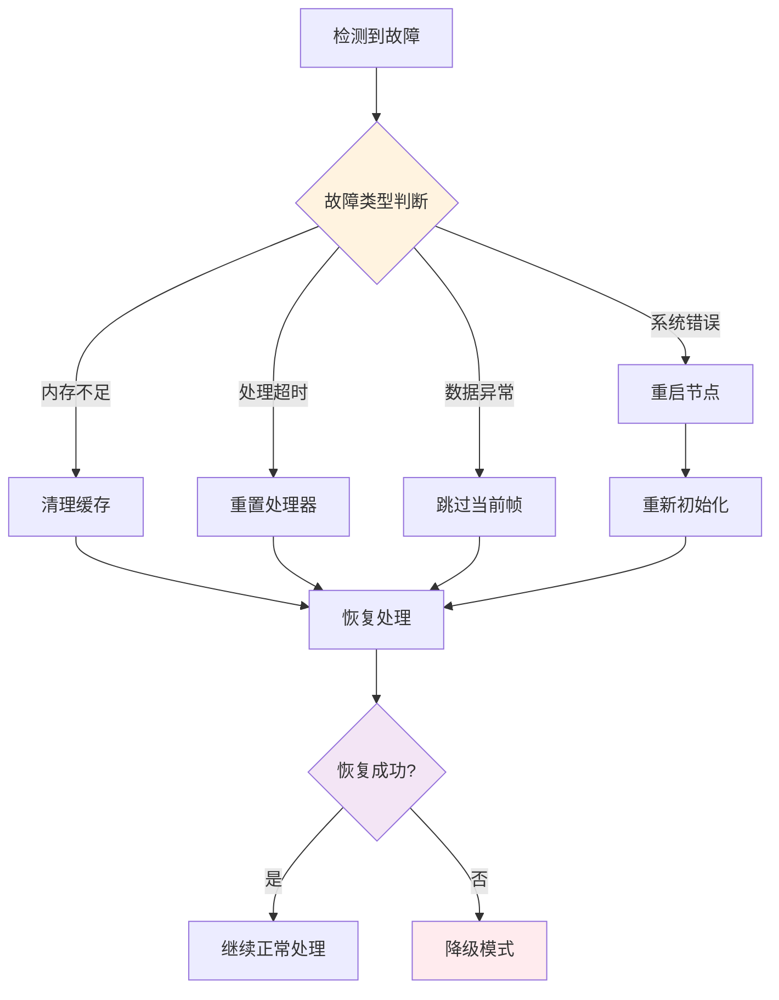

## 扩展开发

### 1. 自定义工具节点

```cpp
// 自定义工具节点基类
class CustomUtilNode : public nodelet::Nodelet {
private:
    ros::NodeHandle nh_;
    ros::NodeHandle private_nh_;
    
protected:
    virtual void onInit() override {
        nh_ = getNodeHandle();
        private_nh_ = getPrivateNodeHandle();
        
        // 初始化参数
        loadParameters();
        
        // 设置订阅和发布
        setupCallbacks();
    }
    
    virtual void loadParameters() = 0;
    virtual void setupCallbacks() = 0;
    virtual void processData() = 0;
};
```

### 2. 插件接口

```cpp
// 处理插件接口
class ProcessorPlugin {
public:
    virtual ~ProcessorPlugin() = default;
    virtual bool initialize(const ros::NodeHandle& nh) = 0;
    virtual bool process(const sensor_msgs::PointCloud2& input,
                        sensor_msgs::PointCloud2& output) = 0;
    virtual std::string getName() const = 0;
};
```

## 最佳实践

### 1. 配置建议

- **参数调优**: 根据传感器特性调整处理参数
- **性能监控**: 定期检查处理性能和资源使用
- **错误处理**: 实现robust的错误处理和恢复机制
- **模块化设计**: 将复杂功能分解为简单的工具节点

### 2. 部署建议

- **资源分配**: 合理分配CPU和内存资源
- **网络优化**: 优化节点间的数据传输
- **调试支持**: 提供充分的调试和监控功能
- **文档维护**: 保持配置文档的更新

## 相关模块

- **rtabmap_sync**: 使用util工具进行数据预处理
- **rtabmap_odom**: 利用处理后的数据计算里程计
- **rtabmap_slam**: 使用地图管理和优化工具
- **rtabmap_conversions**: 提供数据格式转换功能