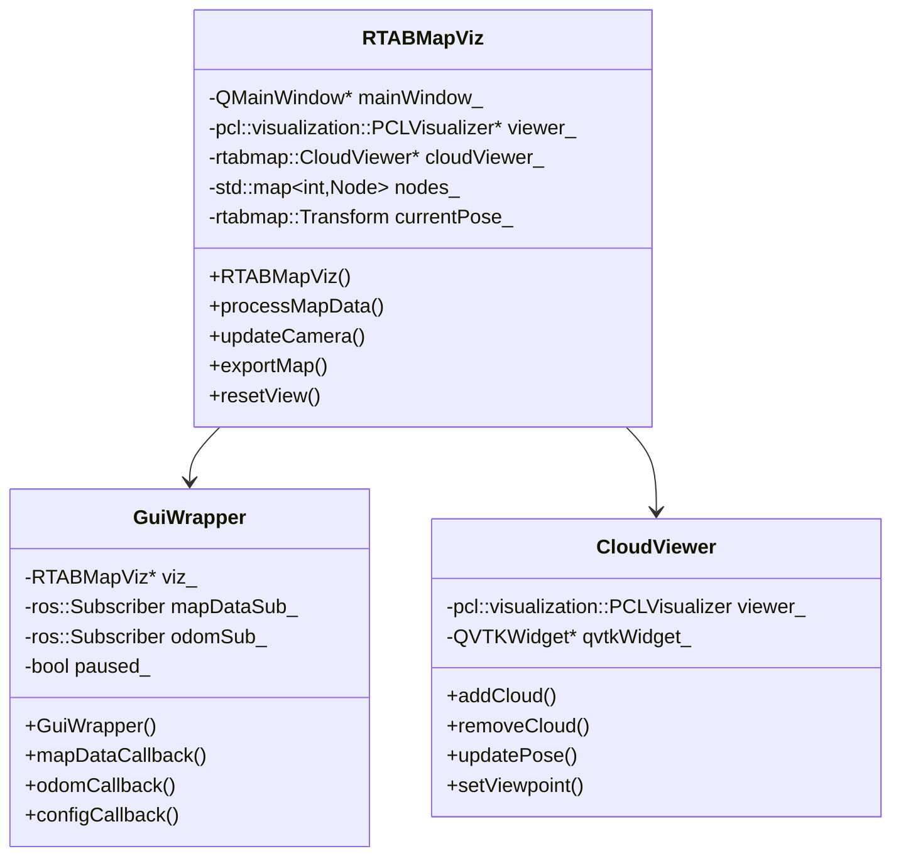
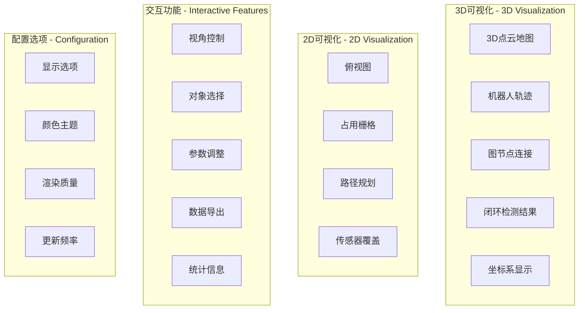
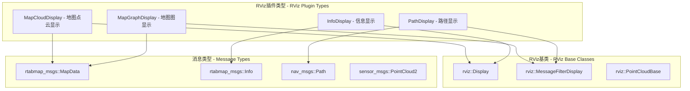
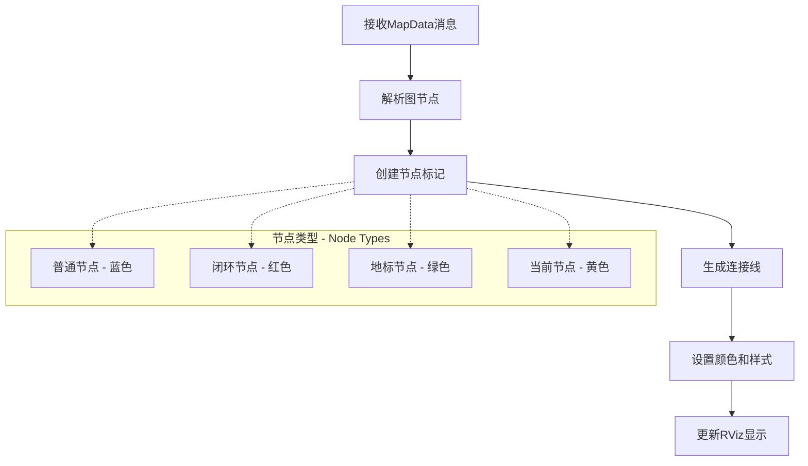
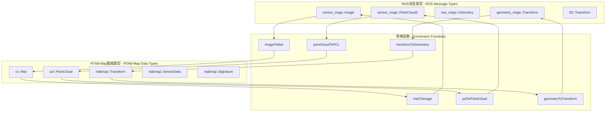
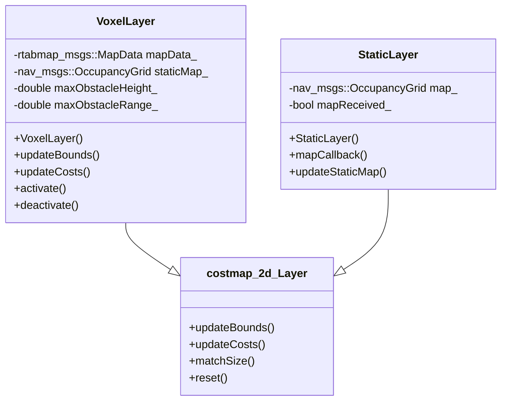
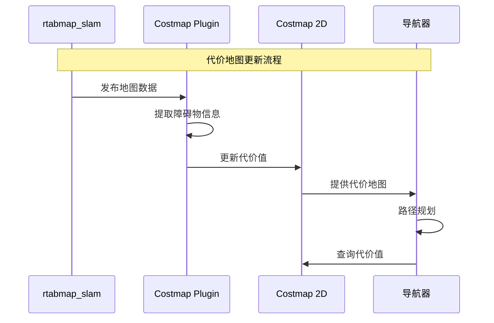
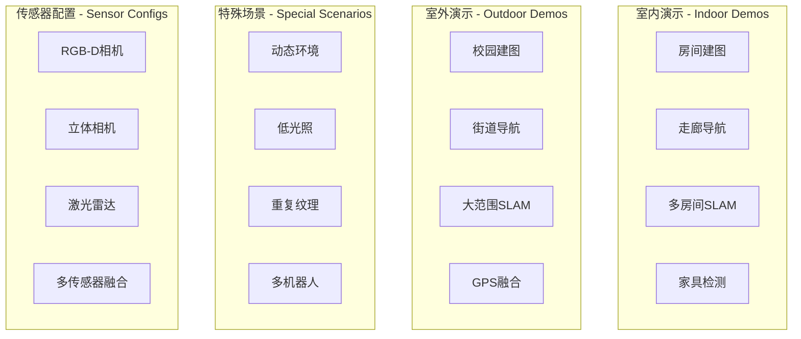
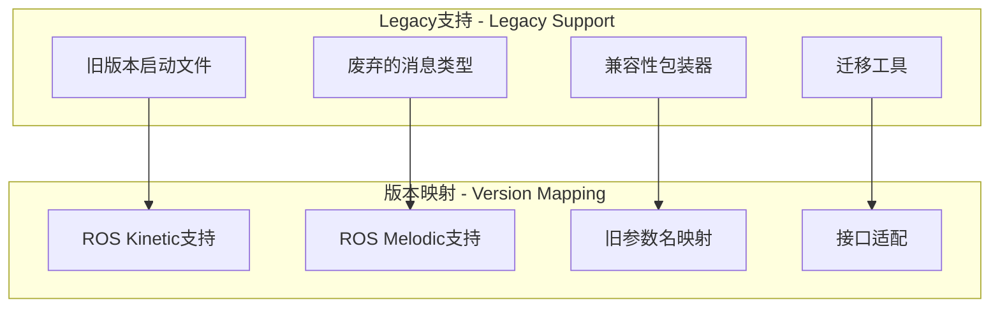
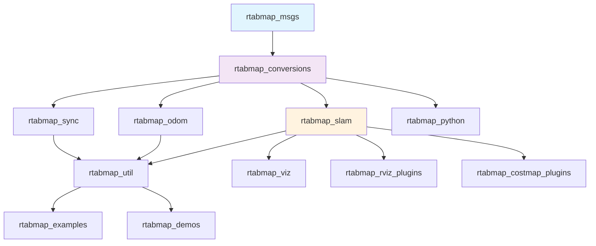

# 支持模块详细文档

本文档涵盖RTAB-Map ROS项目中的其他支持模块，包括可视化、RViz插件、转换工具等。

## rtabmap_viz 模块

### 模块概述

`rtabmap_viz` 提供RTAB-Map的专用3D可视化界面，基于Qt和PCL Visualizer构建，提供比RViz更专业的SLAM可视化功能。

### 核心组件架构



### 可视化功能特性



### 配置参数

```yaml
# 可视化设置
gui_cfg: "~/.ros/rtabmap_gui.ini"     # GUI配置文件
cache_cleanup: true                    # 缓存清理
time_thr: 0                           # 时间阈值(s)
detection_rate: 1.0                   # 检测频率(Hz)

# 3D显示选项
show_clouds: true                     # 显示点云
show_graph: true                      # 显示图结构
show_labels: false                    # 显示标签
show_landmarks: true                  # 显示地标

# 2D显示选项
show_grid: true                       # 显示栅格
grid_cell_size: 0.05                 # 栅格大小(m)
grid_size: 0                         # 栅格范围(0为自动)

# 性能设置
max_clouds_displayed: 100             # 最大显示点云数
cloud_decimation: 4                   # 点云抽取比例
cloud_max_depth: 4.0                 # 点云最大深度(m)
```

## rtabmap_rviz_plugins 模块

### 插件架构



### 主要插件功能

#### 1. MapCloudDisplay 插件

```cpp
// 地图点云显示插件
class MapCloudDisplay : public rviz::MessageFilterDisplay<rtabmap_msgs::MapData> {
private:
    rviz::PointCloudBase* cloud_display_;
    rviz::BoolProperty* download_map_;
    rviz::IntProperty* node_filtering_radius_;
    rviz::StringProperty* topic_name_;
    
public:
    virtual void processMessage(const rtabmap_msgs::MapData::ConstPtr& msg);
    virtual void updateNodeFiltering();
    virtual void downloadMap();
};
```

#### 2. MapGraphDisplay 插件

显示SLAM图结构和连接关系：



### 插件配置

```xml
<!-- RViz插件配置文件 -->
<library path="lib/librtabmap_rviz_plugins">
    <class name="rtabmap_rviz_plugins/MapCloudDisplay"
           type="rtabmap_rviz_plugins::MapCloudDisplay"
           base_class_type="rviz::Display">
        <description>Displays point clouds from RTAB-Map map data.</description>
    </class>
    
    <class name="rtabmap_rviz_plugins/MapGraphDisplay"
           type="rtabmap_rviz_plugins::MapGraphDisplay"
           base_class_type="rviz::Display">
        <description>Displays graph structure from RTAB-Map.</description>
    </class>
    
    <class name="rtabmap_rviz_plugins/InfoDisplay"
           type="rtabmap_rviz_plugins::InfoDisplay"
           base_class_type="rviz::Display">
        <description>Displays RTAB-Map statistics and information.</description>
    </class>
</library>
```

## rtabmap_conversions 模块

### 数据转换架构



### 核心转换函数

```cpp
namespace rtabmap_conversions {

// 图像转换
cv::Mat imageToMat(const sensor_msgs::Image& image);
sensor_msgs::Image matToImage(const cv::Mat& mat, const std::string& encoding);

// 点云转换
pcl::PointCloud<pcl::PointXYZ>::Ptr pointCloudToPCL(
    const sensor_msgs::PointCloud2& cloud);
sensor_msgs::PointCloud2 pclToPointCloud(
    const pcl::PointCloud<pcl::PointXYZ>& cloud,
    const std::string& frame_id);

// 位姿转换
rtabmap::Transform transformFromGeometry(const geometry_msgs::Transform& transform);
geometry_msgs::Transform transformToGeometry(const rtabmap::Transform& transform);

// 传感器数据转换
rtabmap::SensorData sensorDataFromROS(const rtabmap_msgs::SensorData& msg);
rtabmap_msgs::SensorData sensorDataToROS(const rtabmap::SensorData& data);

} // namespace rtabmap_conversions
```

## rtabmap_costmap_plugins 模块

### 代价地图插件架构



### 代价地图集成



## rtabmap_python 模块

### Python接口

```python
# RTAB-Map Python包装
import rtabmap_python as rtabmap

class PythonInterface:
    def __init__(self):
        self.rtabmap = rtabmap.Rtabmap()
        self.detector = rtabmap.Feature2D.create(rtabmap.Feature2D.kFeatureOrb)
        
    def process_rgbd(self, rgb_image, depth_image, camera_info):
        # 创建传感器数据
        data = rtabmap.SensorData(
            rtabmap.CameraModel(camera_info),
            rgb_image,
            depth_image
        )
        
        # 处理数据
        info = rtabmap.OdometryInfo()
        pose = self.rtabmap.process(data, info)
        
        return pose, info
    
    def get_map(self):
        return self.rtabmap.getMapData()
    
    def save_map(self, filename):
        self.rtabmap.exportPoses(filename)
```

## rtabmap_demos 模块

### 演示场景



### 演示启动文件

```xml
<!-- RGB-D建图演示 -->
<launch>
    <arg name="database_path" default="~/.ros/rtabmap_demo.db"/>
    <arg name="localization" default="false"/>
    
    <!-- 启动相机驱动 -->
    <include file="$(find realsense2_camera)/launch/rs_camera.launch">
        <arg name="depth_width" value="640"/>
        <arg name="depth_height" value="480"/>
        <arg name="depth_fps" value="30"/>
    </include>
    
    <!-- 启动RTAB-Map -->
    <include file="$(find rtabmap_launch)/launch/rtabmap.launch">
        <arg name="database_path" value="$(arg database_path)"/>
        <arg name="localization" value="$(arg localization)"/>
        <arg name="rtabmap_viz" value="true"/>
        <arg name="rviz" value="true"/>
    </include>
</launch>
```

## rtabmap_examples 模块

### 应用示例

#### 1. 自定义里程计示例

```cpp
// 自定义里程计节点
class CustomOdometryNode : public rtabmap_odom::OdometryROS {
private:
    ros::Subscriber custom_sensor_sub_;
    
public:
    virtual void onInit() override {
        OdometryROS::onInit();
        
        // 订阅自定义传感器数据
        custom_sensor_sub_ = getNodeHandle().subscribe(
            "custom_sensor", 1, 
            &CustomOdometryNode::customSensorCallback, this);
    }
    
    void customSensorCallback(const custom_msgs::SensorData::ConstPtr& msg) {
        // 处理自定义传感器数据
        processCustomSensorData(*msg);
    }
};
```

#### 2. 地图服务示例

```cpp
// 地图服务客户端示例
class MapServiceClient {
private:
    ros::ServiceClient get_map_client_;
    
public:
    bool requestMap() {
        rtabmap_msgs::GetMap srv;
        srv.request.global = true;
        srv.request.optimized = true;
        
        if (get_map_client_.call(srv)) {
            processMapData(srv.response.data);
            return true;
        }
        return false;
    }
    
    void processMapData(const rtabmap_msgs::MapData& map_data) {
        // 处理接收到的地图数据
        ROS_INFO("Received map with %lu nodes", map_data.nodes.size());
        
        // 保存地图数据
        saveMapToFile(map_data);
    }
};
```

## rtabmap_legacy 模块

### 兼容性支持

`rtabmap_legacy` 模块提供对旧版本RTAB-Map和ROS的兼容性支持。



## 模块集成和依赖

### 依赖关系图



### 编译依赖

```cmake
# 主要外部依赖
find_package(catkin REQUIRED COMPONENTS
    roscpp
    rospy
    std_msgs
    sensor_msgs
    nav_msgs
    geometry_msgs
    visualization_msgs
    tf2
    tf2_ros
    image_transport
    cv_bridge
    pcl_ros
    pcl_conversions
    costmap_2d
    rviz
    pluginlib
    nodelet
)

# RTAB-Map核心库
find_package(RTABMap REQUIRED)

# 第三方库
find_package(OpenCV REQUIRED)
find_package(PCL REQUIRED)
find_package(Qt5 COMPONENTS Core Widgets OpenGL REQUIRED)
```

## 性能和资源使用

### 资源使用对比

| 模块 | CPU使用率 | 内存使用 | 网络带宽 | 存储需求 |
|------|-----------|----------|----------|----------|
| rtabmap_viz | 15-25% | 200-500MB | 低 | 低 |
| rtabmap_rviz_plugins | 5-10% | 50-100MB | 低 | 低 |
| rtabmap_conversions | 1-3% | 10-50MB | 中等 | 低 |
| rtabmap_util | 10-20% | 100-300MB | 高 | 中等 |
| rtabmap_costmap_plugins | 5-10% | 50-150MB | 中等 | 低 |

### 优化建议

1. **可视化优化**: 降低可视化更新频率，减少显示的数据量
2. **内存管理**: 定期清理缓存，使用内存映射文件
3. **网络优化**: 使用数据压缩，批量传输
4. **存储优化**: 定期清理临时文件，使用数据库压缩

## 总结

支持模块为RTAB-Map系统提供了完整的生态系统：

1. **可视化工具**: rtabmap_viz和rviz插件提供丰富的可视化功能
2. **数据转换**: rtabmap_conversions确保不同数据格式间的无缝转换
3. **导航集成**: costmap插件实现与ROS导航栈的集成
4. **开发支持**: 示例和演示帮助用户快速上手
5. **兼容性**: legacy模块确保向后兼容性

这些模块共同构成了一个完整、易用、可扩展的SLAM解决方案。