# Nodelet插件系统详细设计

## 概述

Nodelet插件系统是RTAB-Map ROS项目中最核心的插件架构，基于ROS的nodelet框架实现。该系统允许多个处理节点在同一进程中运行，通过共享内存实现高效的数据传输，避免了传统ROS节点间通信的序列化开销。

## 系统架构详细分析

### 核心组件交互图

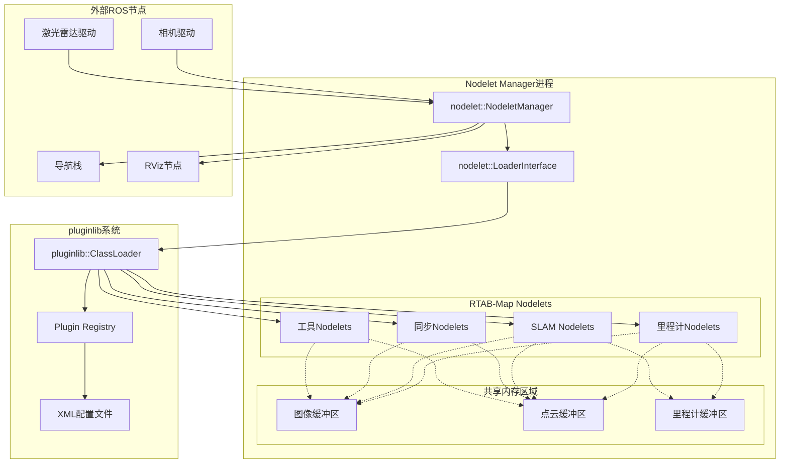

### 插件类层次结构

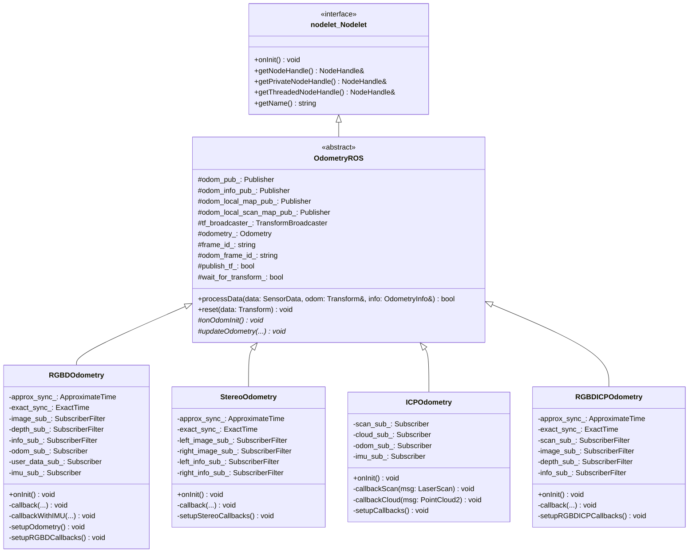

## 插件生命周期详细流程

### 1. 插件加载序列

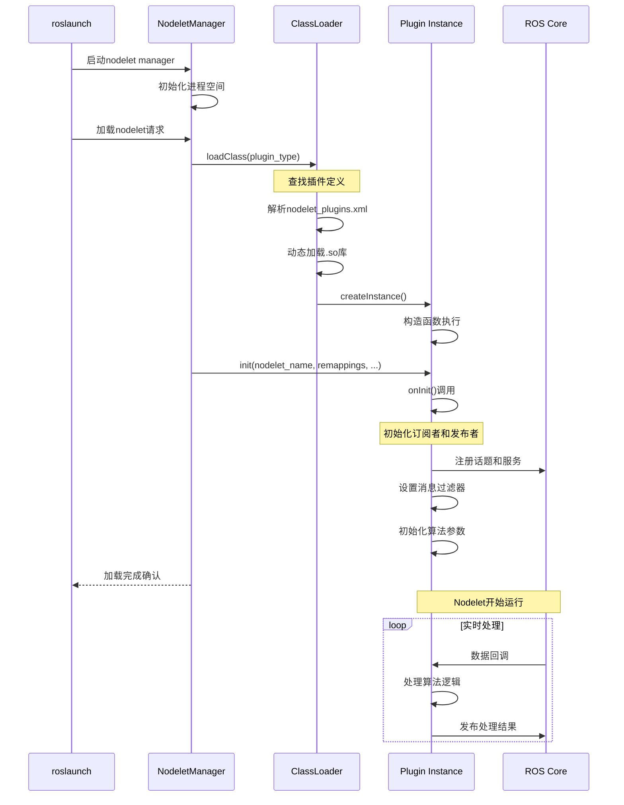

### 2. 数据处理流程

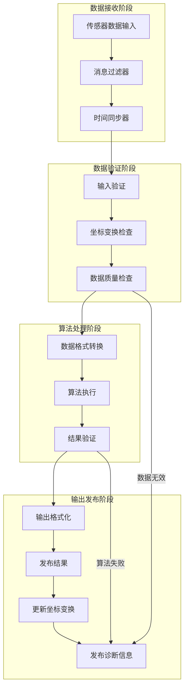

## 主要插件模块详细分析

### 1. rtabmap_odom 里程计插件

#### 1.1 RGB-D里程计插件

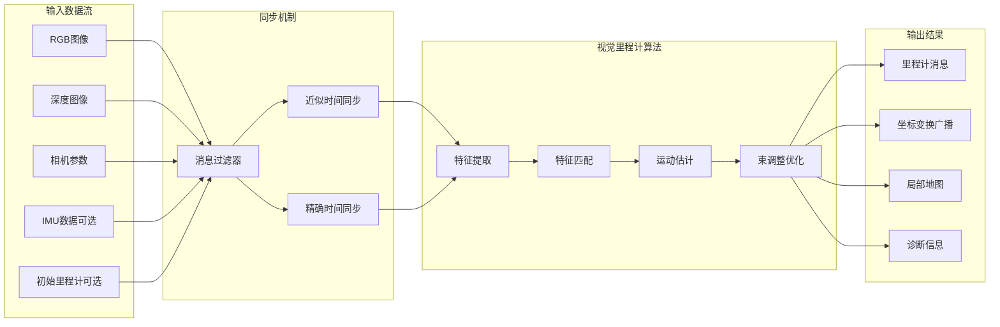

#### 1.2 立体视觉里程计插件

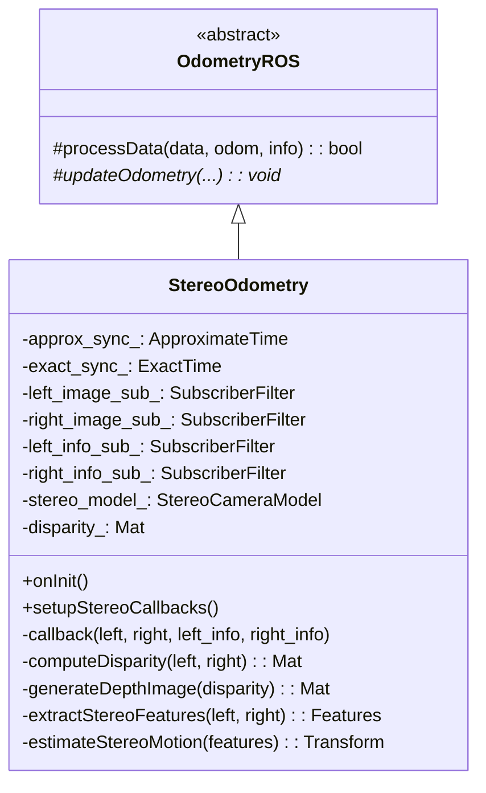

### 2. rtabmap_slam SLAM插件

#### 2.1 核心包装器架构

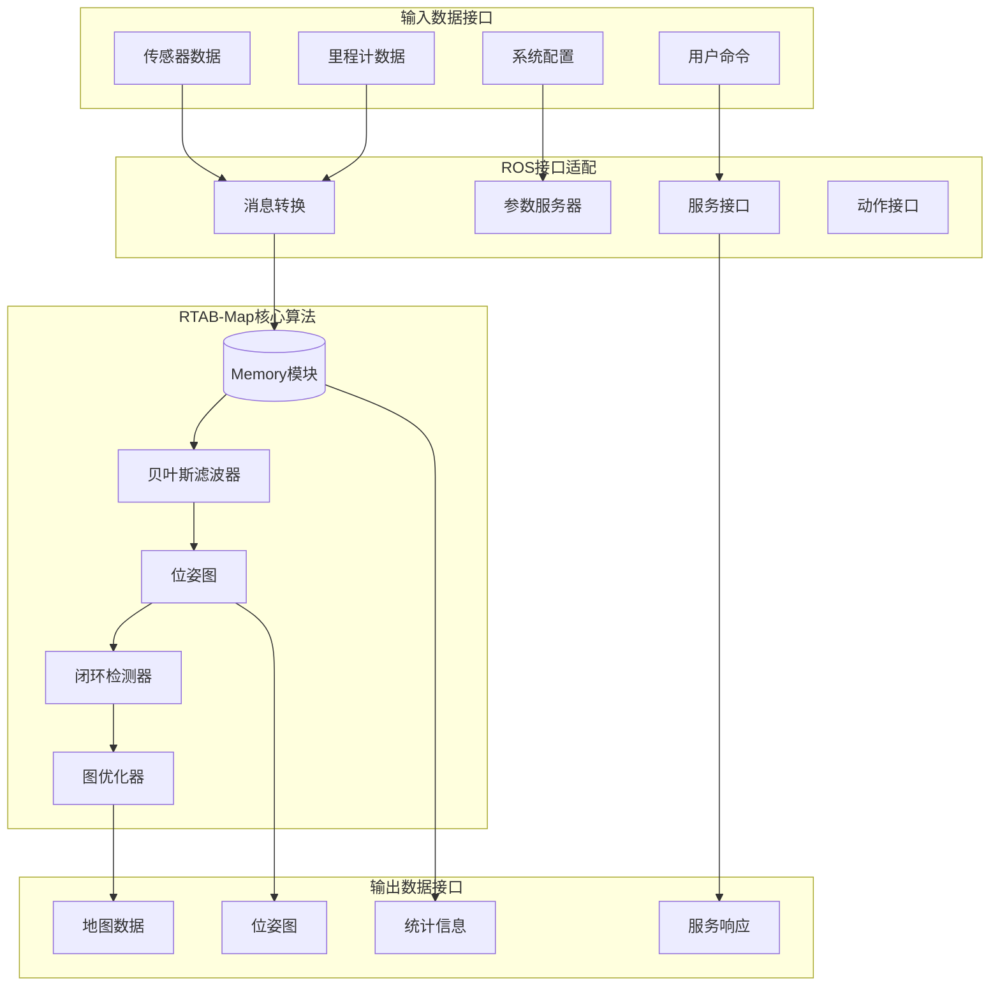

#### 2.2 SLAM处理流程

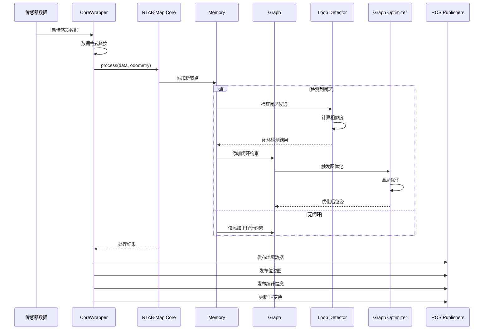

### 3. rtabmap_sync 同步插件

#### 3.1 多传感器同步架构

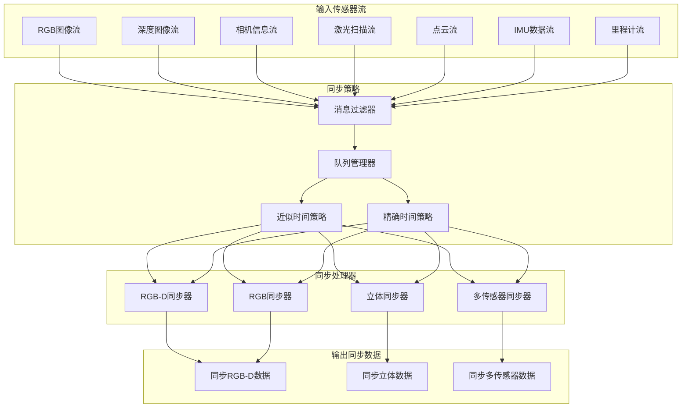

#### 3.2 时间同步算法

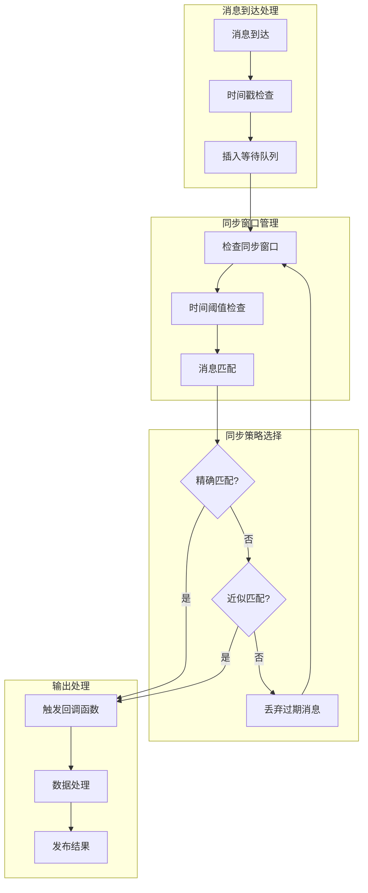

## 性能优化技术

### 1. 内存管理优化

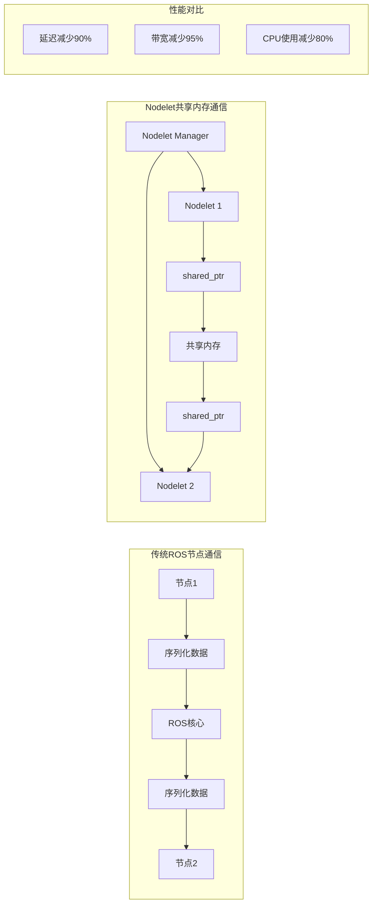

### 2. 并行处理优化

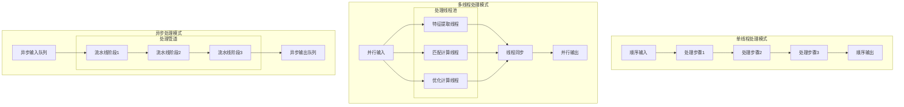

## 调试与监控

### 1. 插件状态监控

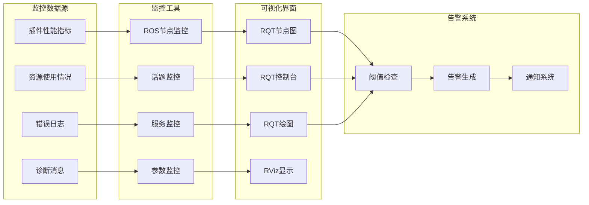

### 2. 调试工具链

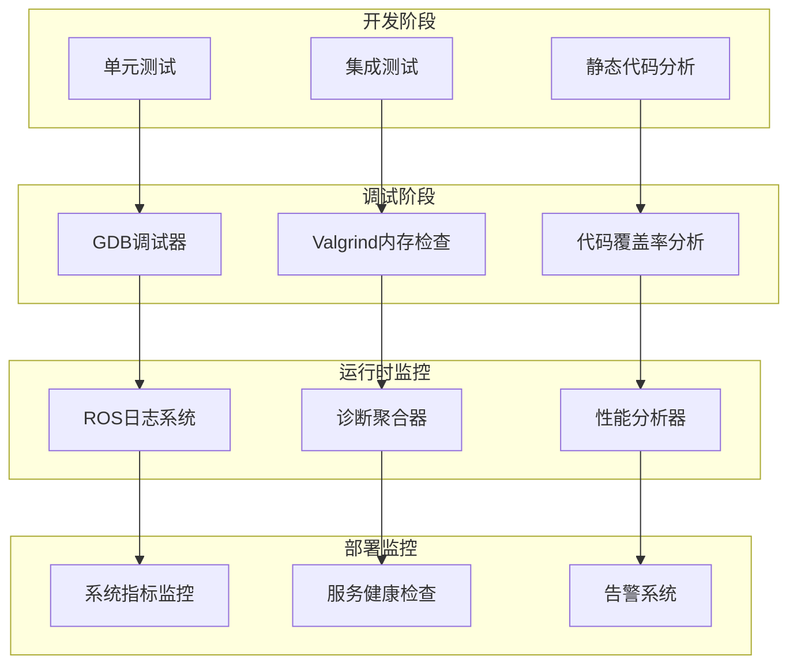

## 总结

RTAB-Map ROS的Nodelet插件系统通过以下关键特性实现了高性能的模块化架构：

1. **零拷贝通信**: 通过共享内存避免数据序列化开销
2. **动态加载**: 运行时动态加载插件，支持灵活配置
3. **统一接口**: 基于nodelet::Nodelet的标准化接口
4. **生命周期管理**: 完善的插件生命周期管理机制
5. **性能优化**: 多线程处理和异步执行模式
6. **调试支持**: 丰富的调试和监控工具

这种设计使得RTAB-Map能够在保持高性能的同时，提供极大的灵活性和可扩展性，满足各种复杂的机器人SLAM应用需求。