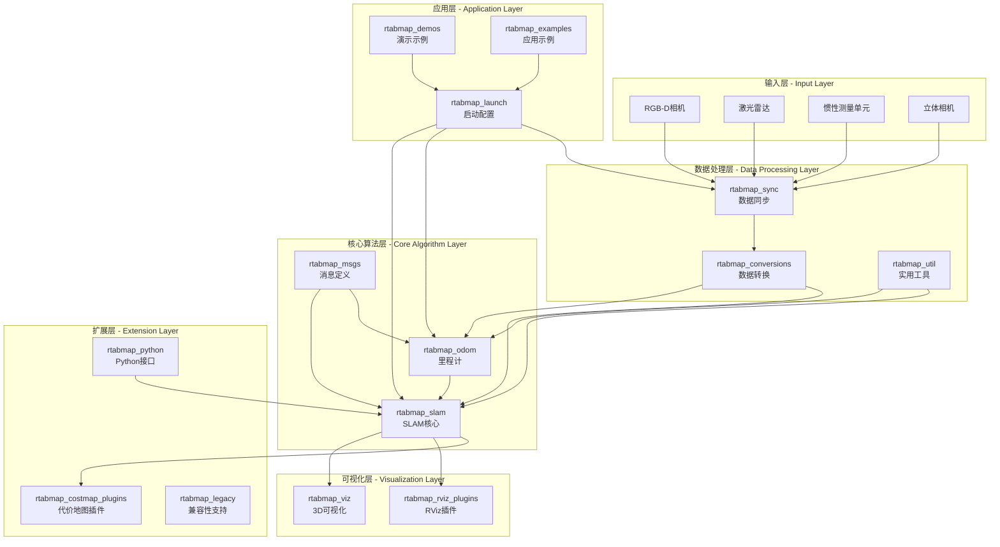
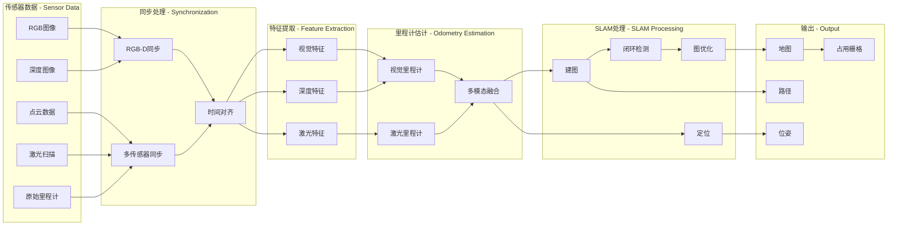
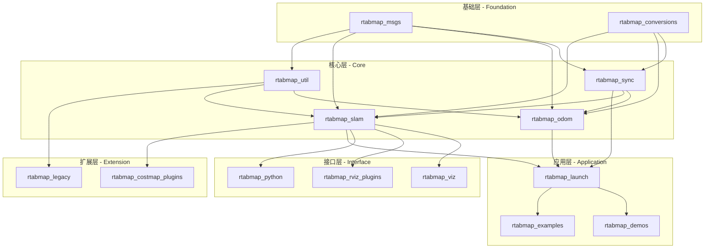
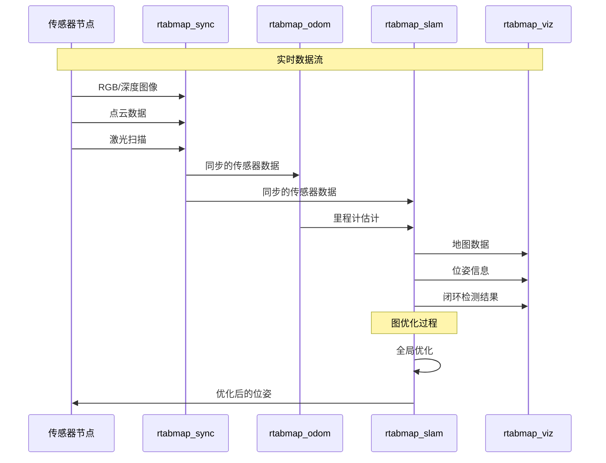
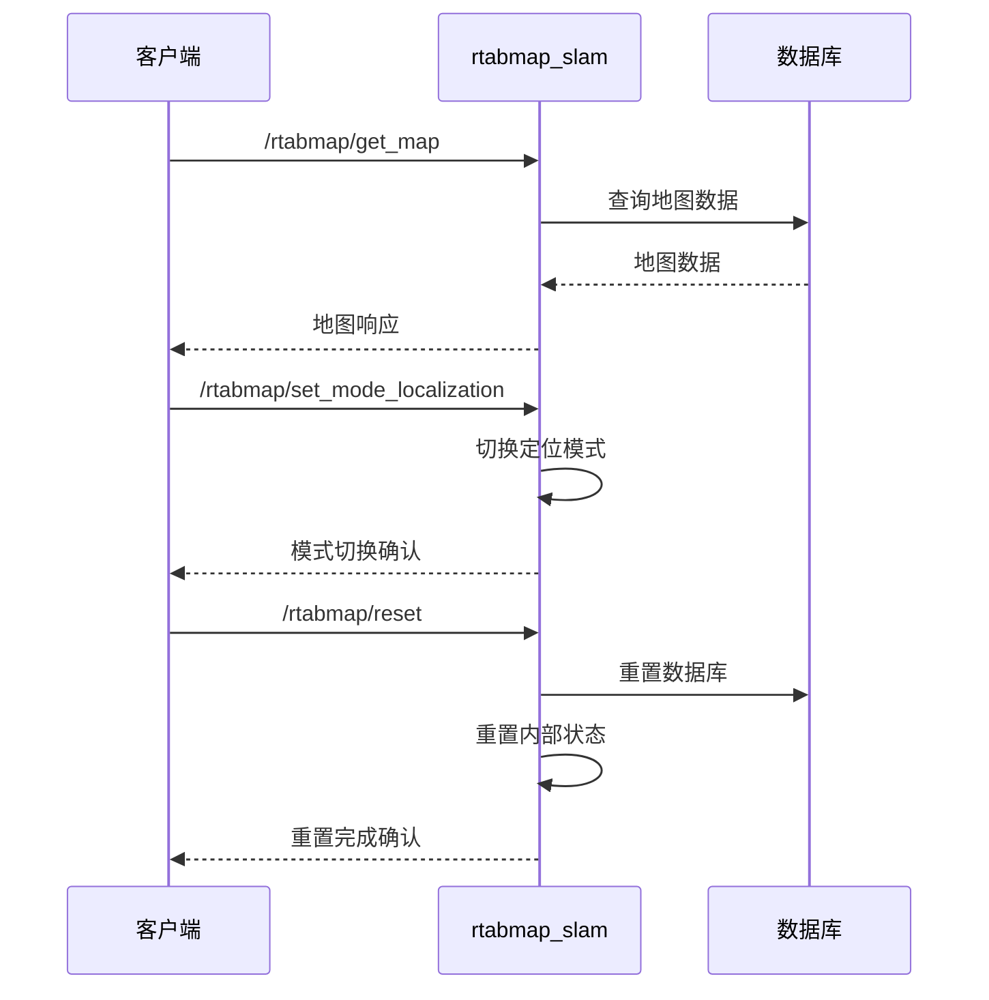
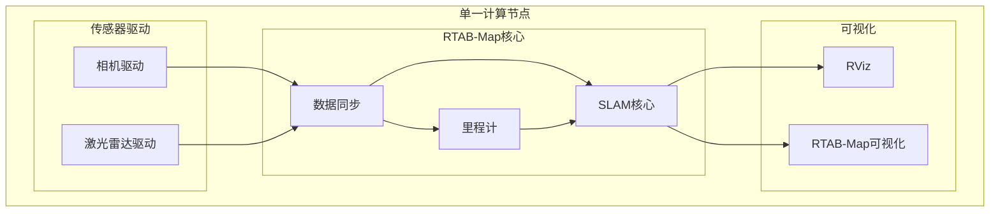
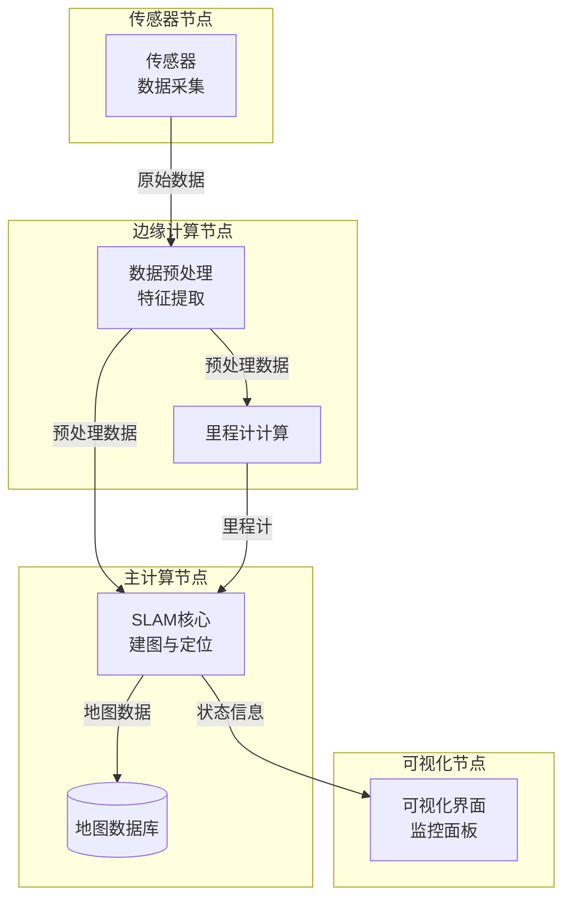
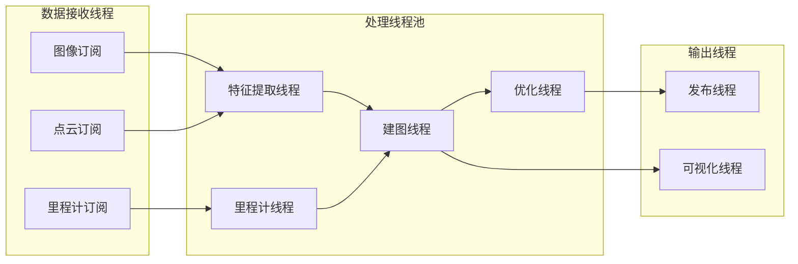

# RTAB-Map ROS项目整体架构

## 系统架构概览

RTAB-Map ROS项目采用模块化架构设计，由多个专业化的ROS包组成，每个包负责特定的功能领域。

## 数据流架构

## 模块间依赖关系

## 通信架构

### ROS话题通信模式

### 服务调用模式

## 部署架构模式

### 单机部署模式

### 分布式部署模式

## 性能优化架构

### 多线程处理模式

## 关键设计原则

1. **模块化设计**: 每个ROS包专注于特定功能，便于维护和扩展
2. **松耦合架构**: 通过ROS话题和服务进行通信，降低模块间依赖
3. **可扩展性**: 支持插件式架构，易于添加新的传感器和算法
4. **实时性能**: 优化的数据流和并行处理确保实时性能
5. **配置灵活性**: 丰富的参数配置支持不同应用场景
6. **错误恢复**: 健壮的错误处理和恢复机制
7. **跨平台兼容**: 支持多种操作系统和ROS版本

## 技术栈总结

- **编程语言**: C++, Python
- **中间件**: ROS (Robot Operating System)
- **计算机视觉**: OpenCV
- **点云处理**: PCL (Point Cloud Library)
- **图优化**: g2o, GTSAM
- **可视化**: Qt, RViz, PCL Visualizer
- **数据格式**: ROS消息, PCD, PLY
- **数据库**: SQLite (通过RTAB-Map核心库)