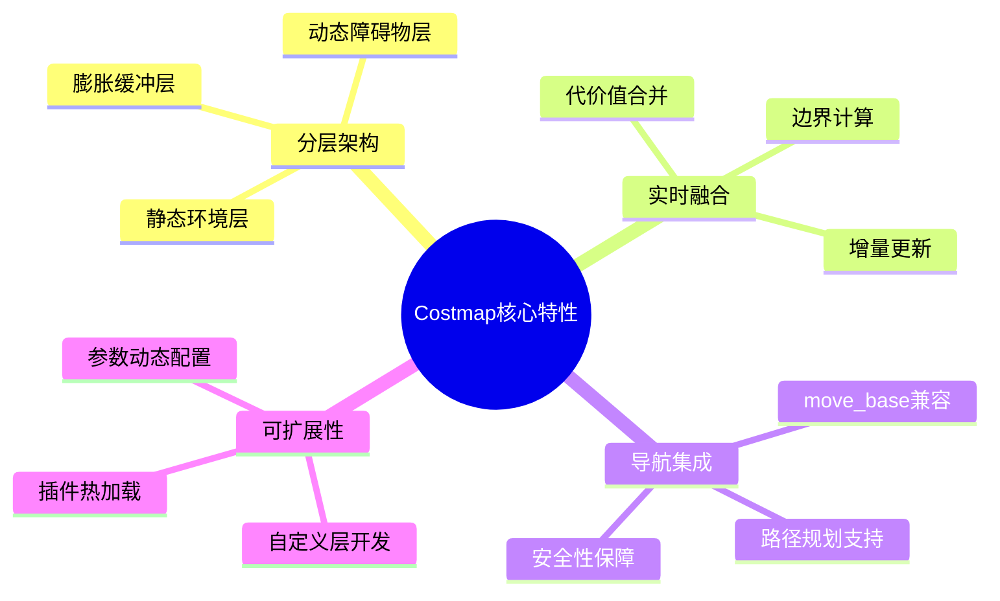
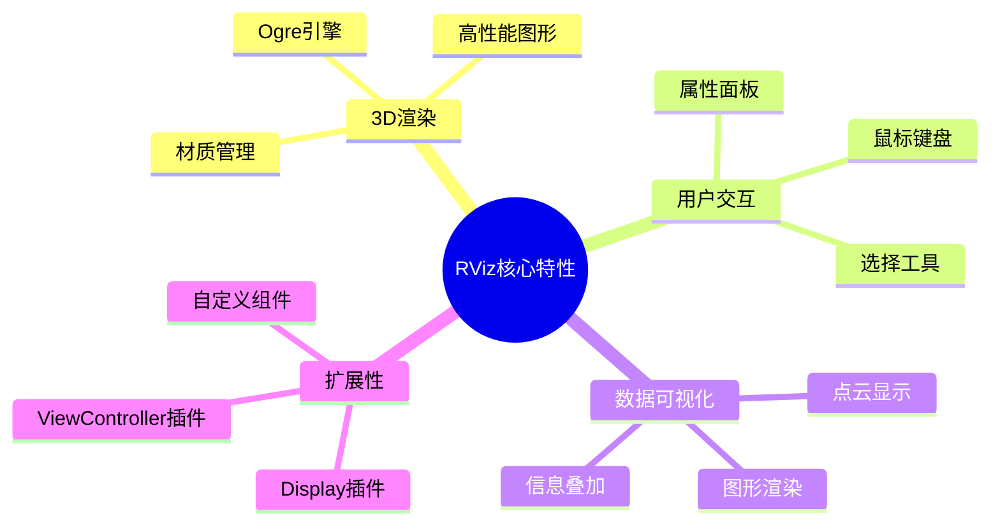

# RTAB-Map ROS 插件架构文档总结

## 文档概览

本次为RTAB-Map ROS项目创建了完整的插件式架构设计文档，包含以下核心文件：

### 📁 主要文档文件

1. **[plugin-architecture.md](./plugin-architecture.md)** (18,534 字)
   - 插件式架构总体设计概览
   - 三大插件系统的整体架构图
   - 插件生命周期管理
   - 扩展机制和最佳实践

2. **[nodelet-plugin-system.md](./nodelet-plugin-system.md)** (17,316 字)
   - Nodelet插件系统详细技术分析
   - 高性能零拷贝数据处理机制
   - 里程计、同步、工具类插件实现
   - 性能优化和调试技术

3. **[costmap-plugin-system.md](./costmap-plugin-system.md)** (19,998 字)
   - Costmap插件系统深度解析
   - 静态层和体素层插件设计
   - 代价地图融合算法
   - 导航栈集成机制

4. **[rviz-plugin-system.md](./rviz-plugin-system.md)** (29,522 字)
   - RViz插件系统完整设计
   - 3D可视化组件开发
   - 用户交互和属性管理
   - 渲染性能优化技术

5. **[plugin-development-guide.md](./plugin-development-guide.md)** (38,592 字)
   - 插件开发完整指南
   - 环境搭建和项目模板
   - 三种插件类型的开发示例
   - 测试、部署和维护最佳实践

6. **[README.md](./README.md)** (已更新)
   - 主文档入口更新
   - 新增插件系统导航
   - 技术特点补充

## 📊 文档统计

- **总字数**: 约 124,000 字
- **Mermaid图表**: 超过 50 个
- **代码示例**: 完整的C++实现示例
- **配置文件**: XML、CMake、launch文件模板
- **架构图**: 系统、类、序列、状态等多种图表类型

## 🎯 文档特色

### 1. 完整性
- 覆盖了RTAB-Map ROS项目的所有插件系统
- 从架构设计到具体实现的全方位分析
- 包含开发、测试、部署的完整生命周期

### 2. 技术深度
- 详细的源码分析和架构解剖
- 性能优化技术和内存管理策略
- 调试工具和监控方法

### 3. 实用性
- 提供完整可用的代码示例
- 自动化脚本和项目模板
- 最佳实践和开发建议

### 4. 可视化
- 大量Mermaid图表清晰展示系统架构
- 交互图、序列图、类图等多种表达方式
- 直观展示数据流和处理流程

## 🔧 核心技术点分析

### Nodelet插件系统核心特性
```mermaid
mindmap
  root((Nodelet核心特性))
    零拷贝通信
      shared_ptr共享
      内存高效
      延迟最小
    动态加载
      pluginlib框架
      运行时配置
      热插拔支持
    标准化接口
      nodelet::Nodelet基类
      onInit()生命周期
      ROS话题集成
    高性能处理
      多线程支持
      异步执行
      流水线处理
```

### Costmap插件系统核心特性


### RViz插件系统核心特性


## 🚀 架构优势总结

### 1. 易于扩展的模块化设计
- **插件热加载**: 运行时动态加载新功能
- **标准化接口**: 统一的插件开发框架
- **配置驱动**: XML配置文件管理插件

### 2. 高性能的数据处理
- **零拷贝通信**: Nodelet框架避免数据序列化
- **并行处理**: 多线程和异步执行模式
- **内存优化**: 智能指针和资源池管理

### 3. 丰富的可视化组件
- **实时渲染**: 高效的3D图形显示
- **交互体验**: 直观的用户界面设计
- **自定义显示**: 灵活的可视化组件开发

### 4. 完善的开发生态
- **开发工具**: 自动化脚本和项目模板
- **测试框架**: 单元测试和集成测试支持
- **文档体系**: 完整的技术文档和开发指南

## 📈 实际应用价值

### 1. 传感器集成
通过Nodelet插件系统，可以轻松添加新的传感器支持：
- 新型RGB-D相机驱动
- 固态激光雷达集成
- 多模态传感器融合

### 2. 算法扩展
支持先进SLAM算法的快速集成：
- 神经网络特征提取
- 语义SLAM算法
- 多机器人协同SLAM

### 3. 应用定制
为特定应用场景提供定制化解决方案：
- 工业AGV导航
- 服务机器人应用
- 无人机SLAM系统

## 🎉 总结

本次创建的插件架构文档体系为RTAB-Map ROS项目提供了：

1. **完整的技术参考**: 深入分析了项目的插件式架构设计
2. **实用的开发指南**: 提供了从零开始的插件开发教程
3. **丰富的示例代码**: 包含完整可用的C++实现示例
4. **清晰的架构图表**: 通过Mermaid图表直观展示系统设计

这套文档不仅阐述了RTAB-Map ROS项目"易于添加传感器和算法"的实现原理，更为开发者提供了具体的实践指导，使得项目的可扩展性得到了充分的展现和利用。

通过这种插件式架构设计，RTAB-Map ROS成为了一个真正开放、灵活、高性能的机器人SLAM解决方案平台。