# RTAB-Map ROS 插件式架构详细设计文档

## 概述

RTAB-Map ROS项目采用了高度模块化的插件式架构设计，通过多种插件系统实现了优秀的可扩展性。该架构使得添加新的传感器支持、算法实现和可视化组件变得简单而高效。

## 插件系统架构总览

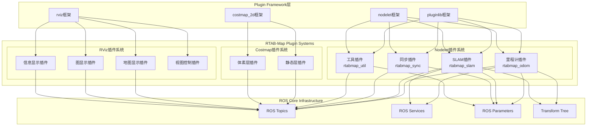

## 1. Nodelet插件系统

### 1.1 系统架构

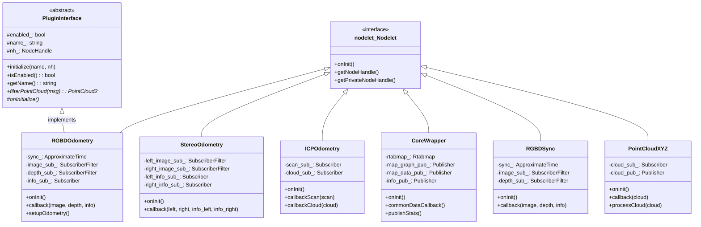

### 1.2 插件注册机制

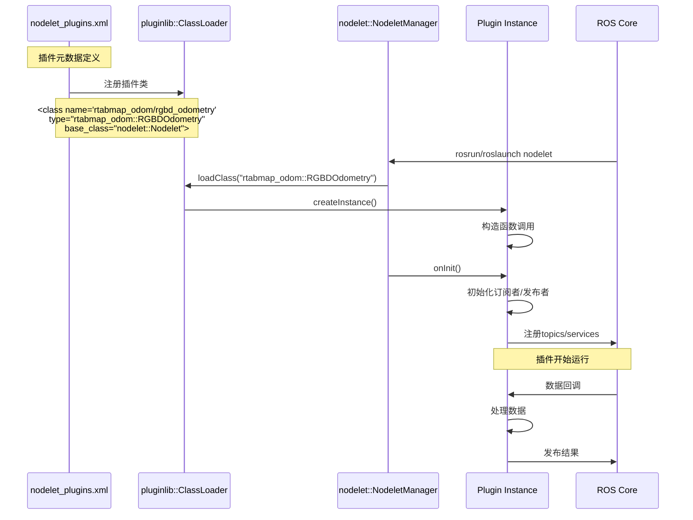

### 1.3 数据流处理模式

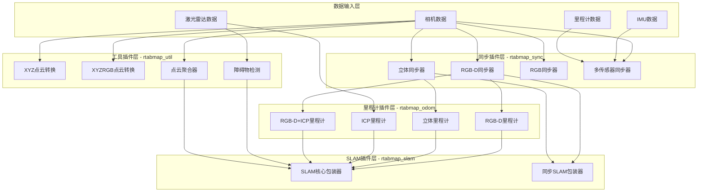

## 2. Costmap插件系统

### 2.1 系统架构

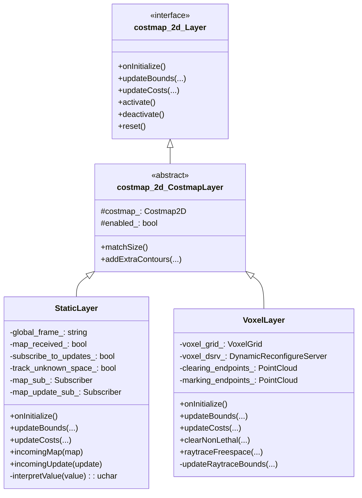

### 2.2 插件加载时序

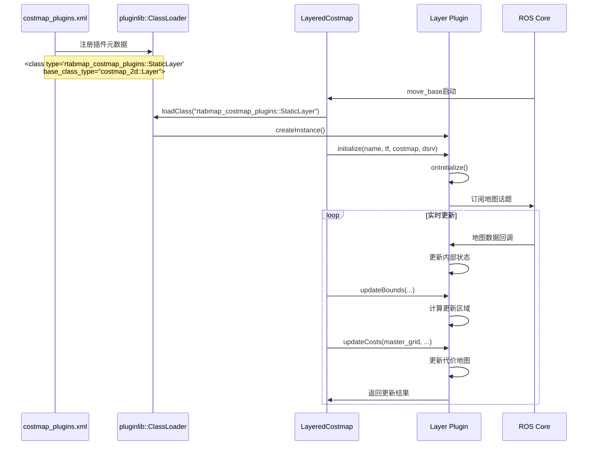

### 2.3 代价地图更新流程

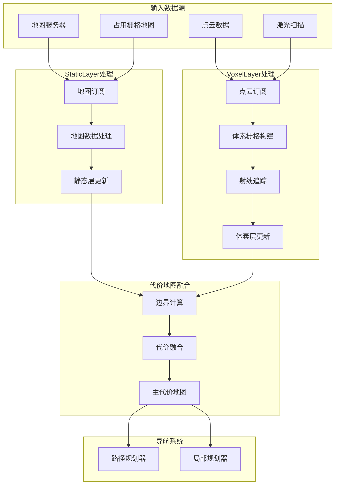

## 3. RViz插件系统

### 3.1 系统架构

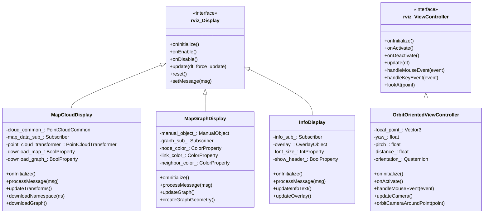

### 3.2 RViz插件加载与交互流程

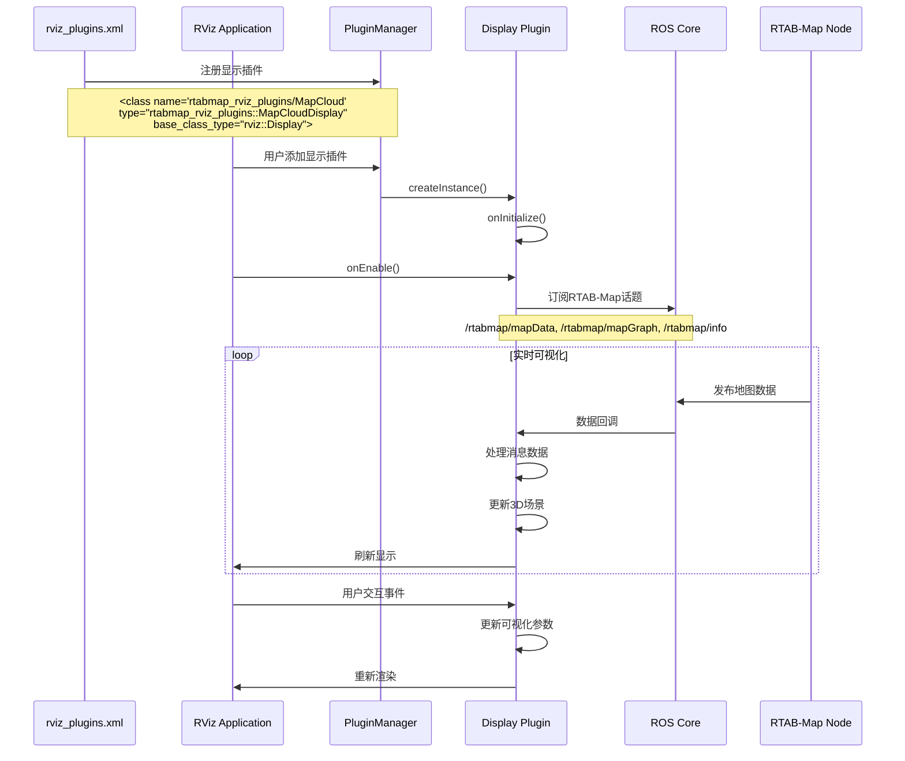

### 3.3 可视化数据流

```mermaid
flowchart LR
    subgraph "RTAB-Map数据源"
        MapData[/rtabmap/mapData<br/>点云地图数据]
        MapGraph[/rtabmap/mapGraph<br/>位姿图数据]
        InfoMsg[/rtabmap/info<br/>统计信息]
        Grid[/rtabmap/grid_map<br/>栅格地图]
    end
    
    subgraph "RViz显示插件"
        MapCloudDisp[MapCloud Display<br/>点云地图显示]
        MapGraphDisp[MapGraph Display<br/>位姿图显示]
        InfoDisp[Info Display<br/>信息显示]
    end
    
    subgraph "RViz可视化引擎"
        PointCloudRender[点云渲染]
        LineRender[线段渲染]
        TextRender[文本渲染]
        OverlayRender[覆盖层渲染]
    end
    
    subgraph "3D场景"
        Scene3D[三维场景]
        UI2D[二维界面]
    end
    
    MapData --> MapCloudDisp
    MapGraph --> MapGraphDisp
    InfoMsg --> InfoDisp
    
    MapCloudDisp --> PointCloudRender
    MapGraphDisp --> LineRender
    InfoDisp --> TextRender
    InfoDisp --> OverlayRender
    
    PointCloudRender --> Scene3D
    LineRender --> Scene3D
    TextRender --> UI2D
    OverlayRender --> UI2D
```

## 4. 插件扩展机制

### 4.1 添加新Nodelet插件的步骤

```mermaid
flowchart TD
    Start([开始开发新插件]) --> DefineInterface[定义插件接口]
    DefineInterface --> ImplClass[实现插件类]
    ImplClass --> RegPlugin[注册插件]
    RegPlugin --> UpdateXML[更新XML配置]
    UpdateXML --> UpdateCMake[更新CMakeLists.txt]
    UpdateCMake --> UpdatePackage[更新package.xml]
    UpdatePackage --> BuildTest[编译测试]
    BuildTest --> Deploy[部署使用]
    
    DefineInterface --> |继承基类| BaseClass[继承nodelet::Nodelet]
    ImplClass --> |实现方法| Methods[实现onInit()和回调函数]
    RegPlugin --> |导出宏| Export[PLUGINLIB_EXPORT_CLASS]
    UpdateXML --> |插件元数据| Metadata[nodelet_plugins.xml]
    UpdateCMake --> |编译目标| Target[add_library]
    UpdatePackage --> |依赖声明| Deps[pluginlib依赖]
```

### 4.2 插件开发模板

以下是创建新里程计插件的完整示例：

#### 4.2.1 头文件定义
```cpp
// include/rtabmap_odom/my_custom_odometry.h
#ifndef MY_CUSTOM_ODOMETRY_H_
#define MY_CUSTOM_ODOMETRY_H_

#include <rtabmap_odom/OdometryROS.h>
#include <nodelet/nodelet.h>

namespace rtabmap_odom
{
class MyCustomOdometry : public OdometryROS
{
public:
    MyCustomOdometry() : OdometryROS(false, true, true) {}
    virtual ~MyCustomOdometry() {}

private:
    virtual void onOdomInit();
    virtual void updateOdometry(
        const sensor_msgs::ImageConstPtr& image,
        const sensor_msgs::CameraInfoConstPtr& info,
        const std::string& odomFrameId);
};
}
#endif
```

#### 4.2.2 实现文件
```cpp
// src/nodelets/my_custom_odometry.cpp
#include "rtabmap_odom/my_custom_odometry.h"
#include <pluginlib/class_list_macros.hpp>

namespace rtabmap_odom
{
void MyCustomOdometry::onOdomInit()
{
    // 自定义初始化逻辑
    ROS_INFO("MyCustomOdometry: Initializing custom odometry");
}

void MyCustomOdometry::updateOdometry(
    const sensor_msgs::ImageConstPtr& image,
    const sensor_msgs::CameraInfoConstPtr& info,
    const std::string& odomFrameId)
{
    // 自定义里程计算法实现
    // ...
}

PLUGINLIB_EXPORT_CLASS(rtabmap_odom::MyCustomOdometry, nodelet::Nodelet);
}
```

#### 4.2.3 XML配置更新
```xml
<!-- nodelet_plugins.xml -->
<library path="lib/librtabmap_odom_plugins">
  <!-- 现有插件... -->
  
  <class name="rtabmap_odom/my_custom_odometry" 
         type="rtabmap_odom::MyCustomOdometry" 
         base_class_type="nodelet::Nodelet">
    <description>
      Custom odometry implementation for specific sensors.
    </description>
  </class>
</library>
```

### 4.3 插件生命周期管理

```mermaid
stateDiagram-v2
    [*] --> Unloaded : 系统启动
    Unloaded --> Loading : pluginlib::loadClass()
    Loading --> Loaded : 插件加载成功
    Loading --> Failed : 加载失败
    Failed --> [*] : 错误处理
    
    Loaded --> Initializing : onInit()调用
    Initializing --> Initialized : 初始化完成
    Initializing --> Failed : 初始化失败
    
    Initialized --> Active : 开始处理数据
    Active --> Processing : 数据回调执行
    Processing --> Active : 处理完成
    
    Active --> Paused : 暂停请求
    Paused --> Active : 恢复请求
    
    Active --> Shutdown : 关闭请求
    Paused --> Shutdown : 关闭请求
    Shutdown --> [*] : 插件卸载
    
    state Processing {
        [*] --> ValidateInput : 输入数据验证
        ValidateInput --> Execute : 验证通过
        ValidateInput --> Error : 验证失败
        Execute --> PublishOutput : 算法执行
        PublishOutput --> [*] : 发布结果
        Error --> [*] : 错误处理
    }
```

## 5. 性能优化与最佳实践

### 5.1 Nodelet性能优化

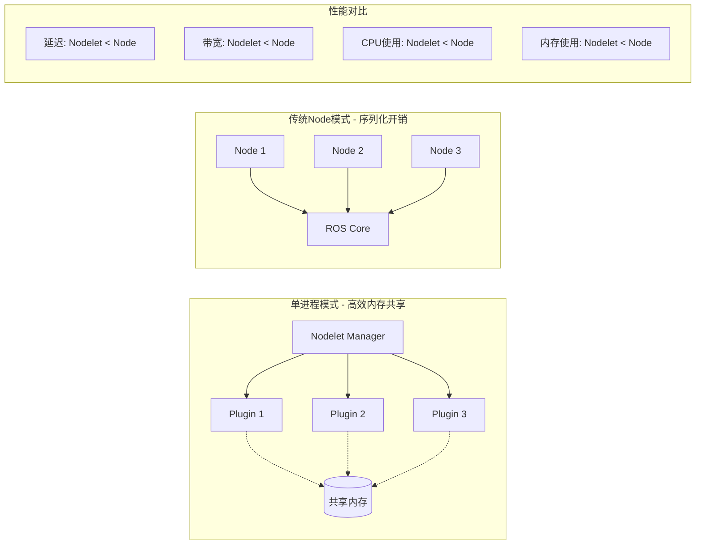

### 5.2 插件系统最佳实践

#### 5.2.1 设计原则
1. **单一职责**: 每个插件专注于单一功能
2. **松耦合**: 通过标准接口通信
3. **可配置**: 支持参数化配置
4. **错误处理**: 完善的异常处理机制
5. **性能优化**: 内存和计算资源的高效使用

#### 5.2.2 开发建议
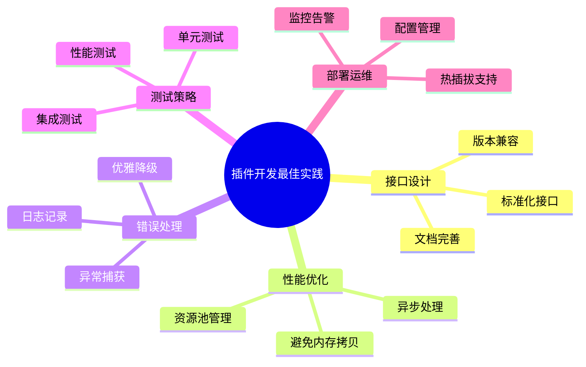

## 6. 总结

RTAB-Map ROS的插件式架构通过以下关键技术实现了优秀的可扩展性：

1. **多层插件系统**: Nodelet、Costmap、RViz三套插件系统覆盖不同应用场景
2. **标准化接口**: 基于ROS标准的插件接口，确保互操作性
3. **动态加载**: 运行时动态加载插件，支持灵活配置
4. **性能优化**: Nodelet框架的零拷贝内存共享机制
5. **完善的元数据**: XML配置文件提供丰富的插件描述信息

这种架构设计使得RTAB-Map ROS能够轻松适应不同的传感器配置、算法需求和可视化要求，为机器人SLAM应用提供了强大而灵活的解决方案。