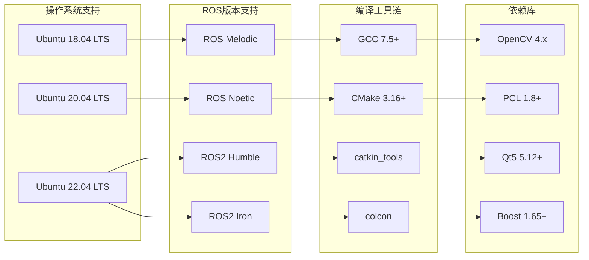
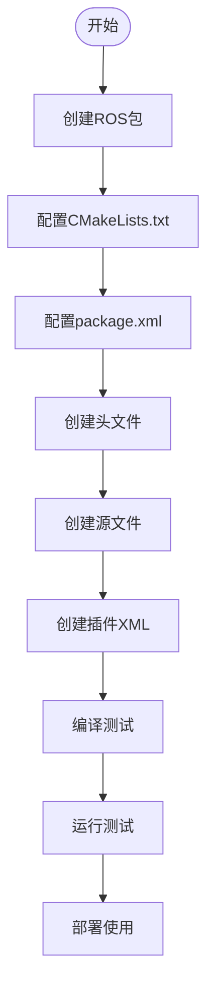
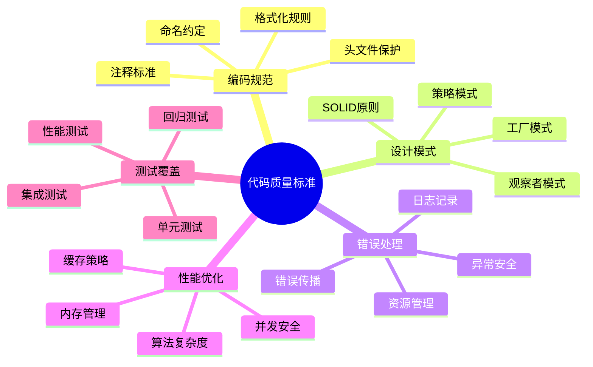
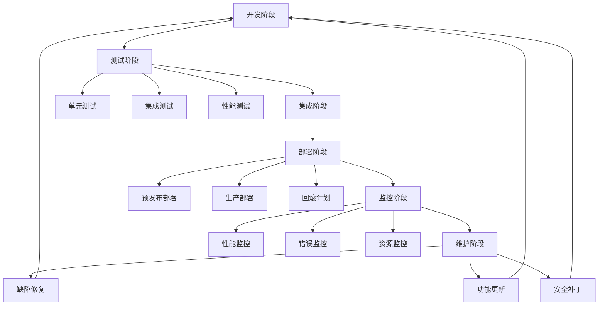

# RTAB-Map ROS 插件扩展开发指南

## 概述

本指南详细介绍如何为RTAB-Map ROS项目开发各种类型的插件，包括Nodelet插件、Costmap插件和RViz插件。通过遵循本指南，开发者可以轻松扩展RTAB-Map的功能，添加新的传感器支持、算法实现和可视化组件。

## 开发环境准备

### 1. 系统要求



### 2. 开发环境配置

```bash
# 安装ROS和依赖项
sudo apt update
sudo apt install ros-noetic-desktop-full
sudo apt install ros-noetic-rtabmap-ros
sudo apt install ros-noetic-pluginlib
sudo apt install ros-noetic-nodelet
sudo apt install ros-noetic-rviz

# 安装开发工具
sudo apt install build-essential
sudo apt install cmake
sudo apt install git
sudo apt install catkin-tools
sudo apt install python3-vcstool

# 创建工作空间
mkdir -p ~/rtabmap_plugins_ws/src
cd ~/rtabmap_plugins_ws
catkin init
```

## Nodelet插件开发详细指南

### 1. 创建Nodelet插件项目



#### 1.1 项目结构

```
my_rtabmap_plugin/
├── CMakeLists.txt
├── package.xml
├── nodelet_plugins.xml
├── include/
│   └── my_rtabmap_plugin/
│       └── my_custom_odometry.h
├── src/
│   └── nodelets/
│       └── my_custom_odometry.cpp
├── launch/
│   └── my_custom_odometry.launch
├── config/
│   └── my_custom_params.yaml
└── README.md
```

#### 1.2 CMakeLists.txt配置

```cmake
cmake_minimum_required(VERSION 3.0.2)
project(my_rtabmap_plugin)

# 设置C++标准
set(CMAKE_CXX_STANDARD 14)
set(CMAKE_CXX_STANDARD_REQUIRED ON)

# 查找依赖包
find_package(catkin REQUIRED COMPONENTS
  roscpp
  nodelet
  pluginlib
  rtabmap_odom
  rtabmap_msgs
  rtabmap_conversions
  sensor_msgs
  geometry_msgs
  nav_msgs
  tf2
  tf2_ros
  message_filters
  cv_bridge
  pcl_ros
  dynamic_reconfigure
)

# 查找其他依赖
find_package(OpenCV REQUIRED)
find_package(PCL REQUIRED)
find_package(rtabmap REQUIRED)

# 动态重配置生成
generate_dynamic_reconfigure_options(
  cfg/MyCustomOdometry.cfg
)

# catkin包配置
catkin_package(
  INCLUDE_DIRS include
  LIBRARIES ${PROJECT_NAME}_nodelets
  CATKIN_DEPENDS 
    roscpp 
    nodelet 
    pluginlib 
    rtabmap_odom
    rtabmap_msgs
    sensor_msgs
    geometry_msgs
    nav_msgs
    tf2
    tf2_ros
  DEPENDS OpenCV PCL rtabmap
)

# 包含目录
include_directories(
  include
  ${catkin_INCLUDE_DIRS}
  ${OpenCV_INCLUDE_DIRS}
  ${PCL_INCLUDE_DIRS}
  ${rtabmap_INCLUDE_DIRS}
)

# 编译nodelet库
add_library(${PROJECT_NAME}_nodelets
  src/nodelets/my_custom_odometry.cpp
)

# 链接库
target_link_libraries(${PROJECT_NAME}_nodelets
  ${catkin_LIBRARIES}
  ${OpenCV_LIBRARIES}
  ${PCL_LIBRARIES}
  ${rtabmap_LIBRARIES}
)

# 添加依赖
add_dependencies(${PROJECT_NAME}_nodelets
  ${${PROJECT_NAME}_EXPORTED_TARGETS}
  ${catkin_EXPORTED_TARGETS}
  ${PROJECT_NAME}_gencfg
)

# 安装规则
install(TARGETS ${PROJECT_NAME}_nodelets
  ARCHIVE DESTINATION ${CATKIN_PACKAGE_LIB_DESTINATION}
  LIBRARY DESTINATION ${CATKIN_PACKAGE_LIB_DESTINATION}
  RUNTIME DESTINATION ${CATKIN_PACKAGE_BIN_DESTINATION}
)

install(FILES nodelet_plugins.xml
  DESTINATION ${CATKIN_PACKAGE_SHARE_DESTINATION}
)

install(DIRECTORY include/${PROJECT_NAME}/
  DESTINATION ${CATKIN_PACKAGE_INCLUDE_DESTINATION}
)

install(DIRECTORY launch/
  DESTINATION ${CATKIN_PACKAGE_SHARE_DESTINATION}/launch
)

install(DIRECTORY config/
  DESTINATION ${CATKIN_PACKAGE_SHARE_DESTINATION}/config
)
```

#### 1.3 package.xml配置

```xml
<?xml version="1.0"?>
<package format="2">
  <name>my_rtabmap_plugin</name>
  <version>1.0.0</version>
  <description>Custom RTAB-Map plugin package</description>

  <maintainer email="developer@example.com">Developer Name</maintainer>
  <license>BSD</license>
  <url type="website">http://example.com</url>
  <url type="bugtracker">http://example.com/issues</url>
  <url type="repository">http://example.com/repo</url>

  <buildtool_depend>catkin</buildtool_depend>

  <!-- 核心依赖 -->
  <depend>roscpp</depend>
  <depend>nodelet</depend>
  <depend>pluginlib</depend>
  
  <!-- RTAB-Map依赖 -->
  <depend>rtabmap_odom</depend>
  <depend>rtabmap_msgs</depend>
  <depend>rtabmap_conversions</depend>
  
  <!-- 传感器和几何消息 -->
  <depend>sensor_msgs</depend>
  <depend>geometry_msgs</depend>
  <depend>nav_msgs</depend>
  
  <!-- 坐标变换 -->
  <depend>tf2</depend>
  <depend>tf2_ros</depend>
  
  <!-- 其他工具 -->
  <depend>message_filters</depend>
  <depend>cv_bridge</depend>
  <depend>pcl_ros</depend>
  <depend>dynamic_reconfigure</depend>

  <!-- 插件导出 -->
  <export>
    <nodelet plugin="${prefix}/nodelet_plugins.xml" />
  </export>
</package>
```

### 2. 实现自定义里程计插件

#### 2.1 头文件定义

```cpp
// include/my_rtabmap_plugin/my_custom_odometry.h
#ifndef MY_CUSTOM_ODOMETRY_H_
#define MY_CUSTOM_ODOMETRY_H_

#include <rtabmap_odom/OdometryROS.h>
#include <nodelet/nodelet.h>

// 消息类型
#include <sensor_msgs/Image.h>
#include <sensor_msgs/CameraInfo.h>
#include <sensor_msgs/PointCloud2.h>
#include <geometry_msgs/PoseWithCovarianceStamped.h>

// 同步器
#include <message_filters/subscriber.h>
#include <message_filters/time_synchronizer.h>
#include <message_filters/sync_policies/approximate_time.h>

// 动态重配置
#include <dynamic_reconfigure/server.h>
#include <my_rtabmap_plugin/MyCustomOdometryConfig.h>

// 图像处理
#include <cv_bridge/cv_bridge.h>
#include <opencv2/opencv.hpp>

// 点云处理
#include <pcl/point_cloud.h>
#include <pcl/point_types.h>
#include <pcl_conversions/pcl_conversions.h>

namespace my_rtabmap_plugin
{

class MyCustomOdometry : public rtabmap_odom::OdometryROS
{
public:
    MyCustomOdometry();
    virtual ~MyCustomOdometry();

protected:
    // 基类虚函数重写
    virtual void onOdomInit();
    virtual void updateOdometry(
        const sensor_msgs::ImageConstPtr& image,
        const sensor_msgs::CameraInfoConstPtr& info,
        const std::string& odomFrameId);

private:
    // 回调函数
    void setupCallbacks();
    void rgbdCallback(
        const sensor_msgs::ImageConstPtr& image,
        const sensor_msgs::ImageConstPtr& depth,
        const sensor_msgs::CameraInfoConstPtr& info);
    void pointCloudCallback(
        const sensor_msgs::PointCloud2ConstPtr& cloud);
    
    // 动态重配置回调
    void configCallback(
        my_rtabmap_plugin::MyCustomOdometryConfig& config,
        uint32_t level);
    
    // 核心算法函数
    bool processRGBDData(
        const cv::Mat& rgb,
        const cv::Mat& depth,
        const sensor_msgs::CameraInfo& info);
    bool processPointCloudData(
        const pcl::PointCloud<pcl::PointXYZRGB>& cloud);
    
    // 特征提取和匹配
    std::vector<cv::KeyPoint> extractFeatures(const cv::Mat& image);
    std::vector<cv::DMatch> matchFeatures(
        const std::vector<cv::KeyPoint>& kpts1,
        const std::vector<cv::KeyPoint>& kpts2,
        const cv::Mat& desc1,
        const cv::Mat& desc2);
    
    // 运动估计
    bool estimateMotion(
        const std::vector<cv::KeyPoint>& kpts1,
        const std::vector<cv::KeyPoint>& kpts2,
        const std::vector<cv::DMatch>& matches,
        rtabmap::Transform& motion);

private:
    // 订阅器和同步器
    typedef message_filters::sync_policies::ApproximateTime<
        sensor_msgs::Image, 
        sensor_msgs::Image, 
        sensor_msgs::CameraInfo> SyncPolicy;
    
    message_filters::Subscriber<sensor_msgs::Image> image_sub_;
    message_filters::Subscriber<sensor_msgs::Image> depth_sub_;
    message_filters::Subscriber<sensor_msgs::CameraInfo> info_sub_;
    message_filters::Synchronizer<SyncPolicy>* sync_;
    
    ros::Subscriber pointcloud_sub_;
    
    // 动态重配置
    dynamic_reconfigure::Server<my_rtabmap_plugin::MyCustomOdometryConfig>* config_server_;
    my_rtabmap_plugin::MyCustomOdometryConfig config_;
    
    // 算法参数
    bool use_rgb_features_;
    bool use_depth_features_;
    int max_features_;
    double feature_threshold_;
    
    // 特征检测器和描述子
    cv::Ptr<cv::FeatureDetector> detector_;
    cv::Ptr<cv::DescriptorExtractor> extractor_;
    cv::Ptr<cv::DescriptorMatcher> matcher_;
    
    // 状态变量
    bool initialized_;
    cv::Mat prev_image_;
    std::vector<cv::KeyPoint> prev_keypoints_;
    cv::Mat prev_descriptors_;
    
    // 统计信息
    int frame_count_;
    int successful_matches_;
    double avg_processing_time_;
};

} // namespace my_rtabmap_plugin

#endif // MY_CUSTOM_ODOMETRY_H_
```

#### 2.2 源文件实现

```cpp
// src/nodelets/my_custom_odometry.cpp
#include "my_rtabmap_plugin/my_custom_odometry.h"
#include <pluginlib/class_list_macros.hpp>

// RTAB-Map包含
#include <rtabmap/core/Odometry.h>
#include <rtabmap/core/util3d.h>
#include <rtabmap/core/util2d.h>
#include <rtabmap/utilite/ULogger.h>
#include <rtabmap/utilite/UTimer.h>

namespace my_rtabmap_plugin
{

MyCustomOdometry::MyCustomOdometry() :
    rtabmap_odom::OdometryROS(false, true, true),
    sync_(nullptr),
    config_server_(nullptr),
    use_rgb_features_(true),
    use_depth_features_(false),
    max_features_(1000),
    feature_threshold_(0.01),
    initialized_(false),
    frame_count_(0),
    successful_matches_(0),
    avg_processing_time_(0.0)
{
}

MyCustomOdometry::~MyCustomOdometry()
{
    if(sync_)
        delete sync_;
    if(config_server_)
        delete config_server_;
}

void MyCustomOdometry::onOdomInit()
{
    ros::NodeHandle& nh = getNodeHandle();
    ros::NodeHandle& pnh = getPrivateNodeHandle();
    
    // 读取参数
    pnh.param("use_rgb_features", use_rgb_features_, use_rgb_features_);
    pnh.param("use_depth_features", use_depth_features_, use_depth_features_);
    pnh.param("max_features", max_features_, max_features_);
    pnh.param("feature_threshold", feature_threshold_, feature_threshold_);
    
    // 初始化特征检测器
    detector_ = cv::ORB::create(max_features_);
    extractor_ = cv::ORB::create();
    matcher_ = cv::BFMatcher::create(cv::NORM_HAMMING);
    
    // 设置订阅器和同步器
    setupCallbacks();
    
    // 设置动态重配置
    config_server_ = new dynamic_reconfigure::Server<MyCustomOdometryConfig>(pnh);
    config_server_->setCallback(
        boost::bind(&MyCustomOdometry::configCallback, this, _1, _2));
    
    NODELET_INFO("MyCustomOdometry: Initialization completed");
}

void MyCustomOdometry::setupCallbacks()
{
    ros::NodeHandle& nh = getNodeHandle();
    ros::NodeHandle& pnh = getPrivateNodeHandle();
    
    int queueSize = 10;
    pnh.param("queue_size", queueSize, queueSize);
    
    // RGB-D同步订阅
    image_sub_.subscribe(nh, "rgb/image_rect_color", queueSize);
    depth_sub_.subscribe(nh, "depth_registered/image_raw", queueSize);
    info_sub_.subscribe(nh, "rgb/camera_info", queueSize);
    
    sync_ = new message_filters::Synchronizer<SyncPolicy>(
        SyncPolicy(queueSize), image_sub_, depth_sub_, info_sub_);
    sync_->registerCallback(
        boost::bind(&MyCustomOdometry::rgbdCallback, this, _1, _2, _3));
    
    // 点云订阅（可选）
    if(use_depth_features_)
    {
        pointcloud_sub_ = nh.subscribe("points", queueSize,
            &MyCustomOdometry::pointCloudCallback, this);
    }
}

void MyCustomOdometry::rgbdCallback(
    const sensor_msgs::ImageConstPtr& image,
    const sensor_msgs::ImageConstPtr& depth,
    const sensor_msgs::CameraInfoConstPtr& info)
{
    rtabmap::UTimer timer;
    
    // 转换图像格式
    cv_bridge::CvImageConstPtr cv_image, cv_depth;
    try
    {
        cv_image = cv_bridge::toCvShare(image, "bgr8");
        cv_depth = cv_bridge::toCvShare(depth, sensor_msgs::image_encodings::TYPE_16UC1);
    }
    catch(cv_bridge::Exception& e)
    {
        NODELET_ERROR("cv_bridge exception: %s", e.what());
        return;
    }
    
    // 处理RGB-D数据
    if(processRGBDData(cv_image->image, cv_depth->image, *info))
    {
        successful_matches_++;
    }
    
    frame_count_++;
    double processing_time = timer.ticks();
    avg_processing_time_ = (avg_processing_time_ * (frame_count_ - 1) + processing_time) / frame_count_;
    
    // 发布统计信息
    if(frame_count_ % 30 == 0) // 每30帧打印一次
    {
        NODELET_INFO("MyCustomOdometry: Frame %d, Success rate: %.1f%%, Avg time: %.1fms",
            frame_count_, 
            100.0 * successful_matches_ / frame_count_,
            avg_processing_time_ * 1000.0);
    }
}

bool MyCustomOdometry::processRGBDData(
    const cv::Mat& rgb,
    const cv::Mat& depth,
    const sensor_msgs::CameraInfo& info)
{
    if(!initialized_)
    {
        // 第一帧初始化
        cv::cvtColor(rgb, prev_image_, cv::COLOR_BGR2GRAY);
        prev_keypoints_ = extractFeatures(prev_image_);
        extractor_->compute(prev_image_, prev_keypoints_, prev_descriptors_);
        initialized_ = true;
        return false;
    }
    
    // 当前帧处理
    cv::Mat current_image;
    cv::cvtColor(rgb, current_image, cv::COLOR_BGR2GRAY);
    
    std::vector<cv::KeyPoint> current_keypoints = extractFeatures(current_image);
    cv::Mat current_descriptors;
    extractor_->compute(current_image, current_keypoints, current_descriptors);
    
    if(current_descriptors.empty() || prev_descriptors_.empty())
    {
        NODELET_WARN("No descriptors found in current or previous frame");
        return false;
    }
    
    // 特征匹配
    std::vector<cv::DMatch> matches = matchFeatures(
        prev_keypoints_, current_keypoints,
        prev_descriptors_, current_descriptors);
    
    if(matches.size() < 10)
    {
        NODELET_WARN("Insufficient matches: %zu", matches.size());
        return false;
    }
    
    // 运动估计
    rtabmap::Transform motion;
    bool success = estimateMotion(
        prev_keypoints_, current_keypoints, matches, motion);
    
    if(success)
    {
        // 更新里程计
        this->updateOdometry(motion, info.header.stamp);
    }
    
    // 更新前一帧数据
    prev_image_ = current_image.clone();
    prev_keypoints_ = current_keypoints;
    prev_descriptors_ = current_descriptors.clone();
    
    return success;
}

std::vector<cv::KeyPoint> MyCustomOdometry::extractFeatures(const cv::Mat& image)
{
    std::vector<cv::KeyPoint> keypoints;
    detector_->detect(image, keypoints);
    
    // 可以添加额外的特征过滤逻辑
    if(keypoints.size() > max_features_)
    {
        std::sort(keypoints.begin(), keypoints.end(),
            [](const cv::KeyPoint& a, const cv::KeyPoint& b) {
                return a.response > b.response;
            });
        keypoints.resize(max_features_);
    }
    
    return keypoints;
}

std::vector<cv::DMatch> MyCustomOdometry::matchFeatures(
    const std::vector<cv::KeyPoint>& kpts1,
    const std::vector<cv::KeyPoint>& kpts2,
    const cv::Mat& desc1,
    const cv::Mat& desc2)
{
    std::vector<std::vector<cv::DMatch>> knn_matches;
    matcher_->knnMatch(desc1, desc2, knn_matches, 2);
    
    // Lowe's ratio test
    std::vector<cv::DMatch> good_matches;
    const float ratio_thresh = 0.7f;
    for(size_t i = 0; i < knn_matches.size(); i++)
    {
        if(knn_matches[i].size() >= 2 &&
           knn_matches[i][0].distance < ratio_thresh * knn_matches[i][1].distance)
        {
            good_matches.push_back(knn_matches[i][0]);
        }
    }
    
    return good_matches;
}

bool MyCustomOdometry::estimateMotion(
    const std::vector<cv::KeyPoint>& kpts1,
    const std::vector<cv::KeyPoint>& kpts2,
    const std::vector<cv::DMatch>& matches,
    rtabmap::Transform& motion)
{
    if(matches.size() < 8)
        return false;
    
    // 提取匹配点
    std::vector<cv::Point2f> pts1, pts2;
    for(const auto& match : matches)
    {
        pts1.push_back(kpts1[match.queryIdx].pt);
        pts2.push_back(kpts2[match.trainIdx].pt);
    }
    
    // 使用Essential Matrix估计运动
    cv::Mat inliers;
    cv::Mat E = cv::findEssentialMat(pts1, pts2, 
        getCameraMatrix(), cv::RANSAC, 0.999, 1.0, inliers);
    
    if(E.empty())
        return false;
    
    // 恢复位姿
    cv::Mat R, t;
    int num_inliers = cv::recoverPose(E, pts1, pts2, 
        getCameraMatrix(), R, t, inliers);
    
    if(num_inliers < 10)
        return false;
    
    // 转换为RTAB-Map的Transform格式
    rtabmap::Transform transform = rtabmap::Transform(
        R.at<double>(0,0), R.at<double>(0,1), R.at<double>(0,2), t.at<double>(0),
        R.at<double>(1,0), R.at<double>(1,1), R.at<double>(1,2), t.at<double>(1),
        R.at<double>(2,0), R.at<double>(2,1), R.at<double>(2,2), t.at<double>(2));
    
    motion = transform;
    return true;
}

void MyCustomOdometry::configCallback(
    MyCustomOdometryConfig& config,
    uint32_t level)
{
    if(level & 0x1) // 特征参数变更
    {
        max_features_ = config.max_features;
        feature_threshold_ = config.feature_threshold;
        
        // 重新创建检测器
        detector_ = cv::ORB::create(max_features_);
    }
    
    if(level & 0x2) // 算法参数变更
    {
        use_rgb_features_ = config.use_rgb_features;
        use_depth_features_ = config.use_depth_features;
    }
    
    config_ = config;
}

void MyCustomOdometry::pointCloudCallback(
    const sensor_msgs::PointCloud2ConstPtr& cloud_msg)
{
    // 点云处理实现
    pcl::PointCloud<pcl::PointXYZRGB> cloud;
    pcl::fromROSMsg(*cloud_msg, cloud);
    
    processPointCloudData(cloud);
}

bool MyCustomOdometry::processPointCloudData(
    const pcl::PointCloud<pcl::PointXYZRGB>& cloud)
{
    // 实现点云特征提取和匹配算法
    // 这里可以添加基于点云的里程计算法
    return true;
}

// 插件导出宏
PLUGINLIB_EXPORT_CLASS(my_rtabmap_plugin::MyCustomOdometry, nodelet::Nodelet);

} // namespace my_rtabmap_plugin
```

#### 2.3 插件XML配置

```xml
<!-- nodelet_plugins.xml -->
<library path="lib/libmy_rtabmap_plugin_nodelets">
  <class name="my_rtabmap_plugin/my_custom_odometry"
         type="my_rtabmap_plugin::MyCustomOdometry"
         base_class_type="nodelet::Nodelet">
    <description>
      Custom odometry implementation using advanced feature matching algorithms.
      Supports both RGB-D and point cloud input data.
    </description>
  </class>
</library>
```

## Costmap插件开发详细指南

### 1. 自定义Costmap层插件

#### 1.1 动态障碍物层实现

```cpp
// include/my_rtabmap_plugin/dynamic_obstacle_layer.h
#ifndef DYNAMIC_OBSTACLE_LAYER_H_
#define DYNAMIC_OBSTACLE_LAYER_H_

#include <costmap_2d/costmap_layer.h>
#include <costmap_2d/layered_costmap.h>
#include <costmap_2d/observation_buffer.h>
#include <dynamic_reconfigure/server.h>
#include <my_rtabmap_plugin/DynamicObstacleLayerConfig.h>

#include <sensor_msgs/PointCloud2.h>
#include <sensor_msgs/LaserScan.h>
#include <geometry_msgs/PoseStamped.h>

namespace my_rtabmap_plugin
{

class DynamicObstacleLayer : public costmap_2d::CostmapLayer
{
public:
    DynamicObstacleLayer();
    virtual ~DynamicObstacleLayer();

    virtual void onInitialize();
    virtual void updateBounds(double robot_x, double robot_y, double robot_yaw,
                             double* min_x, double* min_y, double* max_x, double* max_y);
    virtual void updateCosts(costmap_2d::Costmap2D& master_grid, 
                            int min_i, int min_j, int max_i, int max_j);
    virtual void activate();
    virtual void deactivate();
    virtual void reset();

    virtual void matchSize();

private:
    void reconfigureCB(DynamicObstacleLayerConfig& config, uint32_t level);
    
    void laserScanCallback(const sensor_msgs::LaserScan::ConstPtr& message);
    void pointCloudCallback(const sensor_msgs::PointCloud2::ConstPtr& message);
    void robotPoseCallback(const geometry_msgs::PoseStamped::ConstPtr& pose);
    
    void addObservation(costmap_2d::Observation& obs);
    void clearObservations();
    void updateObservations();
    
    bool getMarkingObservations(std::vector<costmap_2d::Observation>& marking_observations) const;
    bool getClearingObservations(std::vector<costmap_2d::Observation>& clearing_observations) const;
    
    void raytraceFreespace(const costmap_2d::Observation& clearing_observation,
                          double* min_x, double* min_y, double* max_x, double* max_y);
    
    void updateRaytraceBounds(double ox, double oy, double wx, double wy,
                             double max_range, double* min_x, double* min_y,
                             double* max_x, double* max_y);

private:
    // 动态重配置
    dynamic_reconfigure::Server<DynamicObstacleLayerConfig>* dsrv_;
    
    // 订阅器
    ros::Subscriber laser_scan_sub_;
    ros::Subscriber point_cloud_sub_;
    ros::Subscriber robot_pose_sub_;
    
    // 观测缓冲区
    std::vector<boost::shared_ptr<costmap_2d::ObservationBuffer>> observation_buffers_;
    std::vector<boost::shared_ptr<costmap_2d::ObservationBuffer>> marking_buffers_;
    std::vector<boost::shared_ptr<costmap_2d::ObservationBuffer>> clearing_buffers_;
    
    // 配置参数
    bool rolling_window_;
    bool track_unknown_space_;
    bool footprint_clearing_enabled_;
    double max_obstacle_height_;
    double max_obstacle_range_;
    double raytrace_range_;
    double obstacle_range_;
    double min_obstacle_height_;
    double combination_method_;
    
    // 机器人状态
    geometry_msgs::PoseStamped robot_pose_;
    bool robot_pose_received_;
    
    // 线程安全
    boost::recursive_mutex lock_;
    
    // 统计信息
    int observation_count_;
    double last_update_time_;
};

} // namespace my_rtabmap_plugin

#endif // DYNAMIC_OBSTACLE_LAYER_H_
```

#### 1.2 源文件实现

```cpp
// src/dynamic_obstacle_layer.cpp
#include "my_rtabmap_plugin/dynamic_obstacle_layer.h"
#include <pluginlib/class_list_macros.hpp>

PLUGINLIB_EXPORT_CLASS(my_rtabmap_plugin::DynamicObstacleLayer, costmap_2d::Layer)

namespace my_rtabmap_plugin
{

DynamicObstacleLayer::DynamicObstacleLayer() :
    dsrv_(nullptr),
    rolling_window_(false),
    track_unknown_space_(false),
    footprint_clearing_enabled_(true),
    max_obstacle_height_(2.0),
    max_obstacle_range_(2.5),
    raytrace_range_(3.0),
    obstacle_range_(2.5),
    min_obstacle_height_(0.0),
    combination_method_(1),
    robot_pose_received_(false),
    observation_count_(0),
    last_update_time_(0.0)
{
    costmap_ = nullptr;
}

DynamicObstacleLayer::~DynamicObstacleLayer()
{
    if(dsrv_)
        delete dsrv_;
}

void DynamicObstacleLayer::onInitialize()
{
    ros::NodeHandle nh("~/" + name_);
    current_ = true;
    
    // 读取参数
    nh.param("enabled", enabled_, true);
    nh.param("track_unknown_space", track_unknown_space_, track_unknown_space_);
    nh.param("footprint_clearing_enabled", footprint_clearing_enabled_, footprint_clearing_enabled_);
    nh.param("max_obstacle_height", max_obstacle_height_, max_obstacle_height_);
    nh.param("max_obstacle_range", max_obstacle_range_, max_obstacle_range_);
    nh.param("raytrace_range", raytrace_range_, raytrace_range_);
    nh.param("obstacle_range", obstacle_range_, obstacle_range_);
    nh.param("min_obstacle_height", min_obstacle_height_, min_obstacle_height_);
    nh.param("combination_method", combination_method_, combination_method_);
    
    // 初始化观测缓冲区
    std::string topics_string;
    nh.param("observation_sources", topics_string, std::string(""));
    
    std::stringstream ss(topics_string);
    std::string source;
    while(ss >> source)
    {
        ros::NodeHandle source_nh(nh, source);
        
        // 创建观测缓冲区
        double observation_keep_time, expected_update_rate, min_obstacle_height, max_obstacle_height;
        double min_range, max_range;
        std::string topic, sensor_frame, data_type;
        bool inf_is_valid, clearing, marking;
        
        source_nh.param("topic", topic, source);
        source_nh.param("sensor_frame", sensor_frame, std::string(""));
        source_nh.param("observation_persistence", observation_keep_time, 0.0);
        source_nh.param("expected_update_rate", expected_update_rate, 0.0);
        source_nh.param("data_type", data_type, std::string("LaserScan"));
        source_nh.param("min_obstacle_height", min_obstacle_height, 0.0);
        source_nh.param("max_obstacle_height", max_obstacle_height, 2.0);
        source_nh.param("min_range", min_range, 0.0);
        source_nh.param("max_range", max_range, 2.5);
        source_nh.param("inf_is_valid", inf_is_valid, false);
        source_nh.param("clearing", clearing, false);
        source_nh.param("marking", marking, true);
        
        // 创建观测缓冲区
        boost::shared_ptr<costmap_2d::ObservationBuffer> buffer(
            new costmap_2d::ObservationBuffer(topic, observation_keep_time, 
                expected_update_rate, min_obstacle_height, max_obstacle_height,
                obstacle_range_, raytrace_range_, *tf_, global_frame_, 
                sensor_frame, transform_tolerance_));
        
        observation_buffers_.push_back(buffer);
        
        if(marking)
            marking_buffers_.push_back(buffer);
        if(clearing)
            clearing_buffers_.push_back(buffer);
        
        // 创建订阅器
        if(data_type == "LaserScan")
        {
            boost::shared_ptr<message_filters::Subscriber<sensor_msgs::LaserScan>> sub(
                new message_filters::Subscriber<sensor_msgs::LaserScan>(g_nh, topic, 50));
            
            sub->registerCallback(boost::bind(&DynamicObstacleLayer::laserScanCallback, this, _1));
        }
        else if(data_type == "PointCloud2")
        {
            boost::shared_ptr<message_filters::Subscriber<sensor_msgs::PointCloud2>> sub(
                new message_filters::Subscriber<sensor_msgs::PointCloud2>(g_nh, topic, 50));
            
            sub->registerCallback(boost::bind(&DynamicObstacleLayer::pointCloudCallback, this, _1));
        }
    }
    
    // 机器人位姿订阅
    robot_pose_sub_ = nh.subscribe("robot_pose", 1, &DynamicObstacleLayer::robotPoseCallback, this);
    
    // 动态重配置
    dsrv_ = new dynamic_reconfigure::Server<DynamicObstacleLayerConfig>(nh);
    dynamic_reconfigure::Server<DynamicObstacleLayerConfig>::CallbackType cb = 
        boost::bind(&DynamicObstacleLayer::reconfigureCB, this, _1, _2);
    dsrv_->setCallback(cb);
}

void DynamicObstacleLayer::updateBounds(double robot_x, double robot_y, double robot_yaw,
                                       double* min_x, double* min_y, double* max_x, double* max_y)
{
    boost::recursive_mutex::scoped_lock lock(lock_);
    
    if(rolling_window_)
        updateOrigin(robot_x - getSizeInMetersX() / 2, robot_y - getSizeInMetersY() / 2);
    
    if(!enabled_)
        return;
    
    useExtraBounds(min_x, min_y, max_x, max_y);
    
    bool current = true;
    std::vector<costmap_2d::Observation> observations, clearing_observations;
    
    // 获取观测数据
    current = current && getMarkingObservations(observations);
    current = current && getClearingObservations(clearing_observations);
    current_ = current;
    
    // 处理清理观测
    for(unsigned int i = 0; i < clearing_observations.size(); ++i)
    {
        raytraceFreespace(clearing_observations[i], min_x, min_y, max_x, max_y);
    }
    
    // 处理标记观测
    for(std::vector<costmap_2d::Observation>::const_iterator it = observations.begin();
        it != observations.end(); ++it)
    {
        const costmap_2d::Observation& obs = *it;
        
        const sensor_msgs::PointCloud2& cloud = *(obs.cloud_);
        double ox = obs.origin_.x;
        double oy = obs.origin_.y;
        
        // 处理点云中的每个点
        sensor_msgs::PointCloud2ConstIterator<float> iter_x(cloud, "x");
        sensor_msgs::PointCloud2ConstIterator<float> iter_y(cloud, "y");
        sensor_msgs::PointCloud2ConstIterator<float> iter_z(cloud, "z");
        
        for(; iter_x != iter_x.end(); ++iter_x, ++iter_y, ++iter_z)
        {
            double px = *iter_x, py = *iter_y, pz = *iter_z;
            
            // 高度过滤
            if(pz < min_obstacle_height_ || pz > max_obstacle_height_)
                continue;
            
            // 距离过滤
            double sq_dist = (px - ox) * (px - ox) + (py - oy) * (py - oy);
            if(sq_dist >= obstacle_range_ * obstacle_range_)
                continue;
            
            // 更新边界
            *min_x = std::min(*min_x, px);
            *min_y = std::min(*min_y, py);
            *max_x = std::max(*max_x, px);
            *max_y = std::max(*max_y, py);
        }
    }
}

void DynamicObstacleLayer::updateCosts(costmap_2d::Costmap2D& master_grid,
                                      int min_i, int min_j, int max_i, int max_j)
{
    boost::recursive_mutex::scoped_lock lock(lock_);
    
    if(!enabled_)
        return;
    
    if(footprint_clearing_enabled_)
    {
        setConvexPolygonCost(transformed_footprint_, costmap_2d::FREE_SPACE);
    }
    
    switch(combination_method_)
    {
        case 0: // Overwrite
            updateWithOverwrite(master_grid, min_i, min_j, max_i, max_j);
            break;
        case 1: // Maximum
            updateWithMax(master_grid, min_i, min_j, max_i, max_j);
            break;
        default: // Nothing
            break;
    }
}

void DynamicObstacleLayer::activate()
{
    // 激活所有观测缓冲区
    for(unsigned int i = 0; i < observation_buffers_.size(); ++i)
    {
        if(observation_buffers_[i])
            observation_buffers_[i]->resetLastUpdated();
    }
}

void DynamicObstacleLayer::deactivate()
{
    // 停用层
}

void DynamicObstacleLayer::reset()
{
    boost::recursive_mutex::scoped_lock lock(lock_);
    Costmap2D::resetMap(0, 0, getSizeInCellsX(), getSizeInCellsY());
}

void DynamicObstacleLayer::laserScanCallback(const sensor_msgs::LaserScan::ConstPtr& message)
{
    // 将激光扫描转换为点云并添加到观测缓冲区
    for(unsigned int i = 0; i < observation_buffers_.size(); ++i)
    {
        if(observation_buffers_[i])
            observation_buffers_[i]->bufferCloud(*message);
    }
    
    observation_count_++;
}

void DynamicObstacleLayer::pointCloudCallback(const sensor_msgs::PointCloud2::ConstPtr& message)
{
    // 添加点云到观测缓冲区
    for(unsigned int i = 0; i < observation_buffers_.size(); ++i)
    {
        if(observation_buffers_[i])
            observation_buffers_[i]->bufferCloud(*message);
    }
    
    observation_count_++;
}

void DynamicObstacleLayer::robotPoseCallback(const geometry_msgs::PoseStamped::ConstPtr& pose)
{
    robot_pose_ = *pose;
    robot_pose_received_ = true;
}

bool DynamicObstacleLayer::getMarkingObservations(std::vector<costmap_2d::Observation>& marking_observations) const
{
    bool current = true;
    
    for(unsigned int i = 0; i < marking_buffers_.size(); ++i)
    {
        marking_buffers_[i]->lock();
        marking_buffers_[i]->getObservations(marking_observations);
        current = marking_buffers_[i]->isCurrent() && current;
        marking_buffers_[i]->unlock();
    }
    
    return current;
}

bool DynamicObstacleLayer::getClearingObservations(std::vector<costmap_2d::Observation>& clearing_observations) const
{
    bool current = true;
    
    for(unsigned int i = 0; i < clearing_buffers_.size(); ++i)
    {
        clearing_buffers_[i]->lock();
        clearing_buffers_[i]->getObservations(clearing_observations);
        current = clearing_buffers_[i]->isCurrent() && current;
        clearing_buffers_[i]->unlock();
    }
    
    return current;
}

void DynamicObstacleLayer::reconfigureCB(DynamicObstacleLayerConfig& config, uint32_t level)
{
    enabled_ = config.enabled;
    max_obstacle_height_ = config.max_obstacle_height;
    min_obstacle_height_ = config.min_obstacle_height;
    obstacle_range_ = config.obstacle_range;
    raytrace_range_ = config.raytrace_range;
    track_unknown_space_ = config.track_unknown_space;
    footprint_clearing_enabled_ = config.footprint_clearing_enabled;
    combination_method_ = config.combination_method;
}

} // namespace my_rtabmap_plugin
```

## RViz插件开发详细指南

### 1. 自定义显示插件实现

```cpp
// include/my_rtabmap_plugin/trajectory_display.h
#ifndef TRAJECTORY_DISPLAY_H_
#define TRAJECTORY_DISPLAY_H_

#include <rviz/display.h>
#include <rviz/properties/color_property.h>
#include <rviz/properties/float_property.h>
#include <rviz/properties/int_property.h>
#include <rviz/properties/bool_property.h>
#include <rviz/properties/enum_property.h>

#include <nav_msgs/Path.h>
#include <geometry_msgs/PoseStamped.h>

#include <OGRE/OgreSceneNode.h>
#include <OGRE/OgreManualObject.h>

namespace my_rtabmap_plugin
{

class TrajectoryDisplay : public rviz::Display
{
Q_OBJECT
public:
    TrajectoryDisplay();
    virtual ~TrajectoryDisplay();

    // Display接口
    virtual void onInitialize();
    virtual void onEnable();
    virtual void onDisable();
    virtual void update(float dt, float force_update);
    virtual void reset();

protected slots:
    void updateColorAndAlpha();
    void updateLineWidth();
    void updateStyle();
    void updateBuffer();

protected:
    virtual void subscribe();
    virtual void unsubscribe();
    void processMessage(const nav_msgs::Path::ConstPtr& msg);

private:
    void updateTrajectory();
    void createTrajectoryGeometry();
    void updateTrajectoryColors();
    
    // ROS订阅
    ros::Subscriber trajectory_sub_;
    
    // 属性
    rviz::ColorProperty* color_property_;
    rviz::FloatProperty* alpha_property_;
    rviz::FloatProperty* line_width_property_;
    rviz::IntProperty* buffer_length_property_;
    rviz::BoolProperty* show_arrows_property_;
    rviz::EnumProperty* style_property_;
    
    // 3D对象
    Ogre::SceneNode* scene_node_;
    Ogre::ManualObject* manual_object_;
    Ogre::ManualObject* arrow_object_;
    
    // 数据
    std::vector<geometry_msgs::PoseStamped> trajectory_points_;
    nav_msgs::Path::ConstPtr current_message_;
    
    // 状态
    bool has_new_message_;
    int max_buffer_length_;
    
    // 样式
    enum Style
    {
        LINES,
        BILLBOARDS,
        SPHERES
    };
};

} // namespace my_rtabmap_plugin

#endif // TRAJECTORY_DISPLAY_H_
```

## 完整的开发工作流

### 1. 项目模板生成器

为了简化插件开发，可以创建一个自动化脚本来生成插件项目模板：

```bash
#!/bin/bash
# create_rtabmap_plugin.sh

PLUGIN_NAME=$1
PLUGIN_TYPE=$2
AUTHOR_NAME=$3
AUTHOR_EMAIL=$4

if [ $# -lt 4 ]; then
    echo "Usage: $0 <plugin_name> <plugin_type> <author_name> <author_email>"
    echo "Plugin types: nodelet, costmap, rviz"
    exit 1
fi

# 创建项目目录结构
mkdir -p ${PLUGIN_NAME}
cd ${PLUGIN_NAME}

mkdir -p include/${PLUGIN_NAME}
mkdir -p src/nodelets
mkdir -p launch
mkdir -p config
mkdir -p cfg

# 生成基础文件
cat > CMakeLists.txt << EOF
cmake_minimum_required(VERSION 3.0.2)
project(${PLUGIN_NAME})

set(CMAKE_CXX_STANDARD 14)
set(CMAKE_CXX_STANDARD_REQUIRED ON)

find_package(catkin REQUIRED COMPONENTS
  roscpp
  pluginlib
  # Add your dependencies here
)

catkin_package(
  INCLUDE_DIRS include
  LIBRARIES \${PROJECT_NAME}
  CATKIN_DEPENDS roscpp pluginlib
)

include_directories(include \${catkin_INCLUDE_DIRS})

add_library(\${PROJECT_NAME} src/nodelets/\${PROJECT_NAME}.cpp)
target_link_libraries(\${PROJECT_NAME} \${catkin_LIBRARIES})

install(TARGETS \${PROJECT_NAME}
  LIBRARY DESTINATION \${CATKIN_PACKAGE_LIB_DESTINATION}
)

install(FILES plugin.xml
  DESTINATION \${CATKIN_PACKAGE_SHARE_DESTINATION}
)
EOF

cat > package.xml << EOF
<?xml version="1.0"?>
<package format="2">
  <name>${PLUGIN_NAME}</name>
  <version>1.0.0</version>
  <description>Custom RTAB-Map plugin: ${PLUGIN_NAME}</description>
  <maintainer email="${AUTHOR_EMAIL}">${AUTHOR_NAME}</maintainer>
  <license>BSD</license>

  <buildtool_depend>catkin</buildtool_depend>
  <depend>roscpp</depend>
  <depend>pluginlib</depend>

  <export>
    <${PLUGIN_TYPE} plugin="\${prefix}/plugin.xml" />
  </export>
</package>
EOF

echo "Plugin project '${PLUGIN_NAME}' created successfully!"
echo "Edit the generated files to implement your custom functionality."
```

### 2. 自动化测试框架

```cpp
// test/test_my_custom_plugin.cpp
#include <gtest/gtest.h>
#include <ros/ros.h>
#include <pluginlib/class_loader.h>

#include "my_rtabmap_plugin/my_custom_odometry.h"

class MyCustomPluginTest : public ::testing::Test
{
protected:
    virtual void SetUp()
    {
        ros::NodeHandle nh;
        // 初始化测试环境
    }
    
    virtual void TearDown()
    {
        // 清理测试环境
    }
};

TEST_F(MyCustomPluginTest, PluginLoading)
{
    pluginlib::ClassLoader<nodelet::Nodelet> loader("nodelet", "nodelet::Nodelet");
    
    try
    {
        boost::shared_ptr<nodelet::Nodelet> plugin = 
            loader.createInstance("my_rtabmap_plugin/my_custom_odometry");
        ASSERT_TRUE(plugin);
    }
    catch(pluginlib::PluginlibException& ex)
    {
        FAIL() << "Failed to load plugin: " << ex.what();
    }
}

TEST_F(MyCustomPluginTest, ParameterValidation)
{
    // 测试参数验证逻辑
    EXPECT_TRUE(true); // 替换为实际测试
}

TEST_F(MyCustomPluginTest, AlgorithmPerformance)
{
    // 测试算法性能
    EXPECT_TRUE(true); // 替换为实际测试
}

int main(int argc, char** argv)
{
    ros::init(argc, argv, "test_my_custom_plugin");
    testing::InitGoogleTest(&argc, argv);
    return RUN_ALL_TESTS();
}
```

## 最佳实践与建议

### 1. 代码质量标准



### 2. 部署与维护



## 总结

本指南详细介绍了RTAB-Map ROS项目中三种主要插件系统的开发方法：

1. **Nodelet插件**: 用于高性能数据处理和算法实现
2. **Costmap插件**: 用于扩展导航栈的环境感知能力
3. **RViz插件**: 用于自定义3D可视化组件

通过遵循本指南的最佳实践，开发者可以：
- 创建高质量、可维护的插件代码
- 实现高性能的实时算法
- 提供丰富的用户交互体验
- 确保插件的稳定性和可靠性

插件式架构的设计使得RTAB-Map ROS具有出色的可扩展性，为机器人SLAM应用提供了强大而灵活的解决方案框架。