# RViz插件系统详细设计

## 概述

RViz插件系统是RTAB-Map ROS项目中负责三维可视化的关键组件。该系统基于RViz的插件框架，提供了专门用于SLAM数据可视化的显示插件和交互控制器。通过这些插件，用户可以实时观察SLAM过程中的地图构建、位姿估计、闭环检测等关键信息。

## 系统架构详细分析

### 核心架构组件

```mermaid
graph TB
    subgraph "RViz Core Framework"
        RVizApp[RViz应用程序]
        DisplayManager[显示管理器]
        ViewManager[视图管理器]
        PropertyManager[属性管理器]
        PluginManager[插件管理器]
    end
    
    subgraph "RTAB-Map RViz Plugins"
        subgraph "Display Plugins"
            MapCloudDisplay[地图点云显示]
            MapGraphDisplay[位姿图显示]
            InfoDisplay[信息显示]
        end
        
        subgraph "View Controller Plugins"
            OrbitOrientedView[轨道定向视图]
        end
    end
    
    subgraph "RTAB-Map Data Sources"
        RTABMapNode[RTAB-Map节点]
        MapDataTopic[/rtabmap/mapData]
        MapGraphTopic[/rtabmap/mapGraph]
        InfoTopic[/rtabmap/info]
        GridMapTopic[/rtabmap/grid_map]
    end
    
    subgraph "Visualization Engine"
        OgreEngine[Ogre 3D引擎]
        SceneManager[场景管理器]
        MaterialManager[材质管理器]
        TextureManager[纹理管理器]
    end
    
    subgraph "User Interface"
        PropertyPanels[属性面板]
        ToolBars[工具栏]
        MenuSystem[菜单系统]
        StatusBar[状态栏]
    end
    
    RVizApp --> DisplayManager
    RVizApp --> ViewManager
    RVizApp --> PropertyManager
    RVizApp --> PluginManager
    
    PluginManager --> MapCloudDisplay
    PluginManager --> MapGraphDisplay
    PluginManager --> InfoDisplay
    PluginManager --> OrbitOrientedView
    
    RTABMapNode --> MapDataTopic
    RTABMapNode --> MapGraphTopic
    RTABMapNode --> InfoTopic
    RTABMapNode --> GridMapTopic
    
    MapDataTopic --> MapCloudDisplay
    MapGraphTopic --> MapGraphDisplay
    InfoTopic --> InfoDisplay
    GridMapTopic --> MapCloudDisplay
    
    MapCloudDisplay --> OgreEngine
    MapGraphDisplay --> OgreEngine
    InfoDisplay --> OgreEngine
    OrbitOrientedView --> OgreEngine
    
    OgreEngine --> SceneManager
    SceneManager --> MaterialManager
    SceneManager --> TextureManager
    
    DisplayManager --> PropertyPanels
    ViewManager --> ToolBars
    PropertyManager --> MenuSystem
    PluginManager --> StatusBar
```

### 插件类层次结构

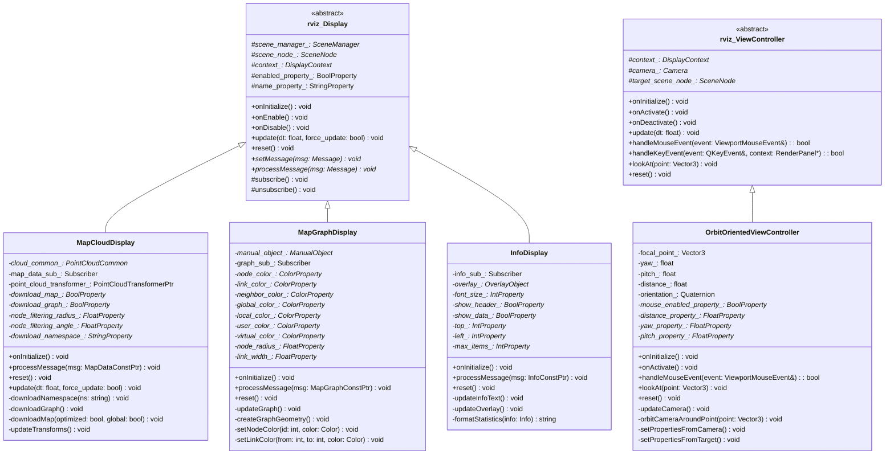
```mermaid
classDiagram
    class rviz_Display {
        <<abstract>>
        #scene_manager_: SceneManager*
        #scene_node_: SceneNode*
        #context_: DisplayContext*
        #enabled_property_: BoolProperty
        #name_property_: StringProperty
        +onInitialize() void
        +onEnable() void
        +onDisable() void  
        +update(dt: float, force_update: bool) void
        +reset() void
        +setMessage(msg: Message) void*
        +processMessage(msg: Message) void*
        #subscribe() void
        #unsubscribe() void
    }
    
    class rviz_ViewController {
        <<abstract>>
        #context_: DisplayContext*
        #camera_: Camera*
        #target_scene_node_: SceneNode*
        +onInitialize() void
        +onActivate() void
        +onDeactivate() void
        +update(dt: float) void
        +handleMouseEvent(event: ViewportMouseEvent&): bool
        +handleKeyEvent(event: QKeyEvent&, context: RenderPanel*): bool
        +lookAt(point: Vector3) void
        +reset() void
    }
    
    class MapCloudDisplay {
        -cloud_common_: PointCloudCommon*
        -map_data_sub_: Subscriber
        -point_cloud_transformer_: PointCloudTransformerPtr
        -download_map_: BoolProperty*
        -download_graph_: BoolProperty*
        -node_filtering_radius_: FloatProperty*
        -node_filtering_angle_: FloatProperty*
        -download_namespace_: StringProperty*
        +onInitialize() void
        +processMessage(msg: MapDataConstPtr) void
        +reset() void
        +update(dt: float, force_update: bool) void
        -downloadNamespace(ns: string) void
        -downloadGraph() void
        -downloadMap(optimized: bool, global: bool) void
        -updateTransforms() void
    }
    
    class MapGraphDisplay {
        -manual_object_: ManualObject*
        -graph_sub_: Subscriber
        -node_color_: ColorProperty*
        -link_color_: ColorProperty*
        -neighbor_color_: ColorProperty*
        -global_color_: ColorProperty*
        -local_color_: ColorProperty*
        -user_color_: ColorProperty*
        -virtual_color_: ColorProperty*
        -node_radius_: FloatProperty*
        -link_width_: FloatProperty*
        +onInitialize() void
        +processMessage(msg: MapGraphConstPtr) void
        +reset() void
        -updateGraph() void
        -createGraphGeometry() void
        -setNodeColor(id: int, color: Color) void
        -setLinkColor(from: int, to: int, color: Color) void
    }
    
    class InfoDisplay {
        -info_sub_: Subscriber
        -overlay_: OverlayObject*
        -font_size_: IntProperty*
        -show_header_: BoolProperty*
        -show_data_: BoolProperty*
        -top_: IntProperty*
        -left_: IntProperty*
        -max_items_: IntProperty*
        +onInitialize() void
        +processMessage(msg: InfoConstPtr) void
        +reset() void
        -updateInfoText() void
        -updateOverlay() void
        -formatStatistics(info: Info) string
    }
    
    class OrbitOrientedViewController {
        -focal_point_: Vector3
        -yaw_: float
        -pitch_: float
        -distance_: float
        -orientation_: Quaternion
        -mouse_enabled_property_: BoolProperty*
        -distance_property_: FloatProperty*
        -yaw_property_: FloatProperty*
        -pitch_property_: FloatProperty*
        +onInitialize() void
        +onActivate() void
        +handleMouseEvent(event: ViewportMouseEvent&): bool
        +lookAt(point: Vector3) void
        +reset() void
        -updateCamera() void
        -orbitCameraAroundPoint(point: Vector3) void
        -setPropertiesFromCamera() void
        -setPropertiesFromTarget() void
    }
    
    rviz_Display <|-- MapCloudDisplay
    rviz_Display <|-- MapGraphDisplay
    rviz_Display <|-- InfoDisplay
    rviz_ViewController <|-- OrbitOrientedViewController
```

## 插件注册与加载机制

### 1. 插件注册流程

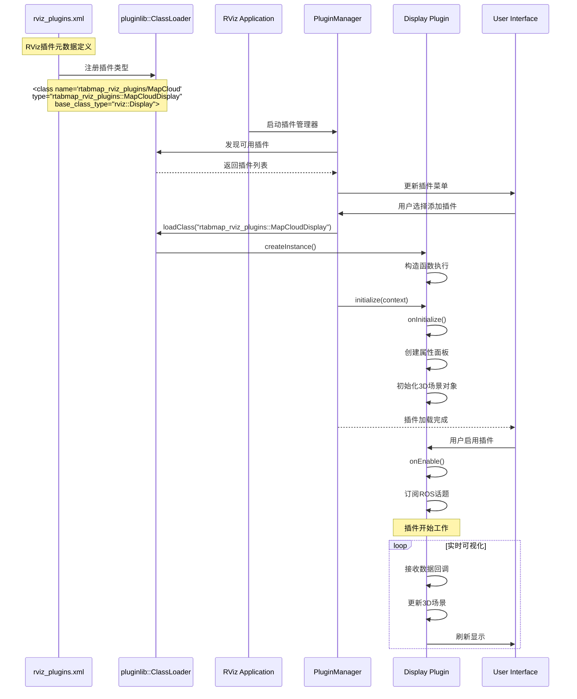
```mermaid
sequenceDiagram
    participant XML as rviz_plugins.xml
    participant PluginLib as pluginlib::ClassLoader
    participant RViz as RViz Application
    participant PluginMgr as PluginManager
    participant Display as Display Plugin
    participant UI as User Interface
    
    Note over XML: RViz插件元数据定义
    XML->>PluginLib: 注册插件类型
    Note over XML,PluginLib: <class name="rtabmap_rviz_plugins/MapCloud"<br/>type="rtabmap_rviz_plugins::MapCloudDisplay"<br/>base_class_type="rviz::Display">
    
    RViz->>PluginMgr: 启动插件管理器
    PluginMgr->>PluginLib: 发现可用插件
    PluginLib-->>PluginMgr: 返回插件列表
    
    PluginMgr->>UI: 更新插件菜单
    UI->>PluginMgr: 用户选择添加插件
    
    PluginMgr->>PluginLib: loadClass("rtabmap_rviz_plugins::MapCloudDisplay")
    PluginLib->>Display: createInstance()
    Display->>Display: 构造函数执行
    
    PluginMgr->>Display: initialize(context)
    Display->>Display: onInitialize()
    Display->>Display: 创建属性面板
    Display->>Display: 初始化3D场景对象
    
    PluginMgr-->>UI: 插件加载完成
    UI->>Display: 用户启用插件
    Display->>Display: onEnable()
    Display->>Display: 订阅ROS话题
    
    Note over Display: 插件开始工作
    loop 实时可视化
        Display->>Display: 接收数据回调
        Display->>Display: 更新3D场景
        Display->>UI: 刷新显示
    end
```

### 2. 属性系统管理

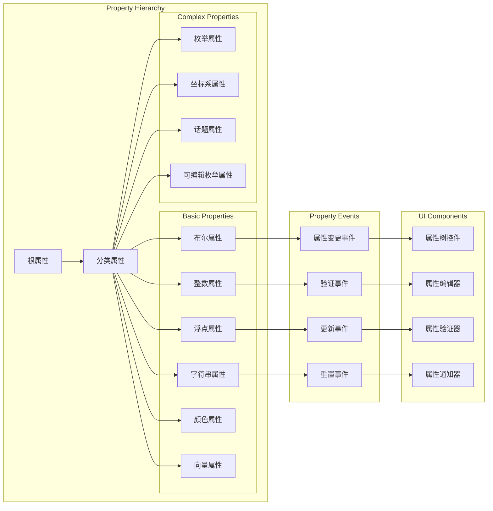
```mermaid
graph LR
    subgraph "Property Hierarchy"
        RootProperty[根属性]
        CategoryProperty[分类属性]
        
        subgraph "Basic Properties"
            BoolProperty[布尔属性]
            IntProperty[整数属性]
            FloatProperty[浮点属性]
            StringProperty[字符串属性]
            ColorProperty[颜色属性]
            VectorProperty[向量属性]
        end
        
        subgraph "Complex Properties"
            EnumProperty[枚举属性]
            TfFrameProperty[坐标系属性]
            TopicProperty[话题属性]
            EditableEnumProperty[可编辑枚举属性]
        end
    end
    
    subgraph "Property Events"
        PropertyChanged[属性变更事件]
        ValidationEvent[验证事件]
        UpdateEvent[更新事件]
        ResetEvent[重置事件]
    end
    
    subgraph "UI Components"
        PropertyTree[属性树控件]
        PropertyEditor[属性编辑器]
        PropertyValidator[属性验证器]
        PropertyNotifier[属性通知器]
    end
    
    RootProperty --> CategoryProperty
    CategoryProperty --> BoolProperty
    CategoryProperty --> IntProperty
    CategoryProperty --> FloatProperty
    CategoryProperty --> StringProperty
    CategoryProperty --> ColorProperty
    CategoryProperty --> VectorProperty
    CategoryProperty --> EnumProperty
    CategoryProperty --> TfFrameProperty
    CategoryProperty --> TopicProperty
    CategoryProperty --> EditableEnumProperty
    
    BoolProperty --> PropertyChanged
    IntProperty --> ValidationEvent
    FloatProperty --> UpdateEvent
    StringProperty --> ResetEvent
    
    PropertyChanged --> PropertyTree
    ValidationEvent --> PropertyEditor
    UpdateEvent --> PropertyValidator
    ResetEvent --> PropertyNotifier
```

## MapCloud显示插件详细设计

### 1. 点云可视化架构

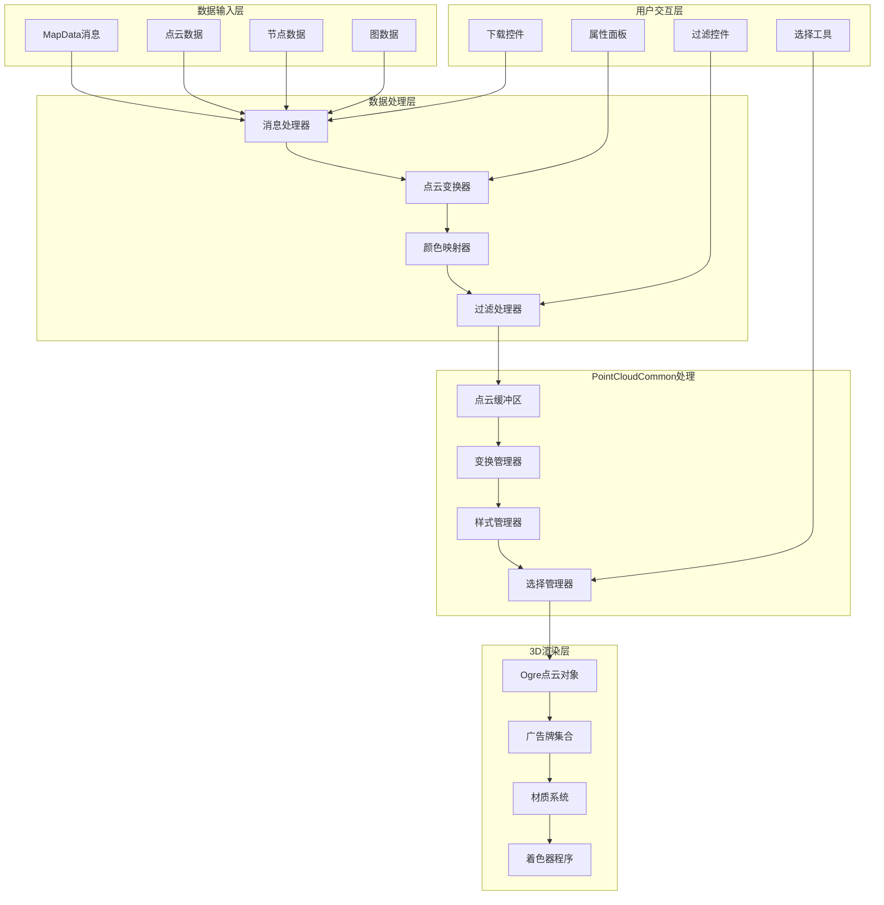
```mermaid
graph TB
    subgraph "数据输入层"
        MapDataMsg[MapData消息]
        PointCloudData[点云数据]
        NodeData[节点数据]
        GraphData[图数据]
    end
    
    subgraph "数据处理层"
        MessageProcessor[消息处理器]
        CloudTransformer[点云变换器]
        ColorMapper[颜色映射器]
        FilterProcessor[过滤处理器]
    end
    
    subgraph "PointCloudCommon处理"
        CloudBuffer[点云缓冲区]
        TransformManager[变换管理器]
        StyleManager[样式管理器]
        SelectionManager[选择管理器]
    end
    
    subgraph "3D渲染层"
        OgrePointCloud[Ogre点云对象]
        BillboardSet[广告牌集合]
        MaterialSystem[材质系统]
        ShaderProgram[着色器程序]
    end
    
    subgraph "用户交互层"
        PropertyPanel[属性面板]
        SelectionTool[选择工具]
        FilterControls[过滤控件]
        DownloadControls[下载控件]
    end
    
    MapDataMsg --> MessageProcessor
    PointCloudData --> MessageProcessor
    NodeData --> MessageProcessor
    GraphData --> MessageProcessor
    
    MessageProcessor --> CloudTransformer
    CloudTransformer --> ColorMapper
    ColorMapper --> FilterProcessor
    
    FilterProcessor --> CloudBuffer
    CloudBuffer --> TransformManager
    TransformManager --> StyleManager
    StyleManager --> SelectionManager
    
    SelectionManager --> OgrePointCloud
    OgrePointCloud --> BillboardSet
    BillboardSet --> MaterialSystem
    MaterialSystem --> ShaderProgram
    
    PropertyPanel --> CloudTransformer
    SelectionTool --> SelectionManager
    FilterControls --> FilterProcessor
    DownloadControls --> MessageProcessor
```

### 2. 点云数据处理流程

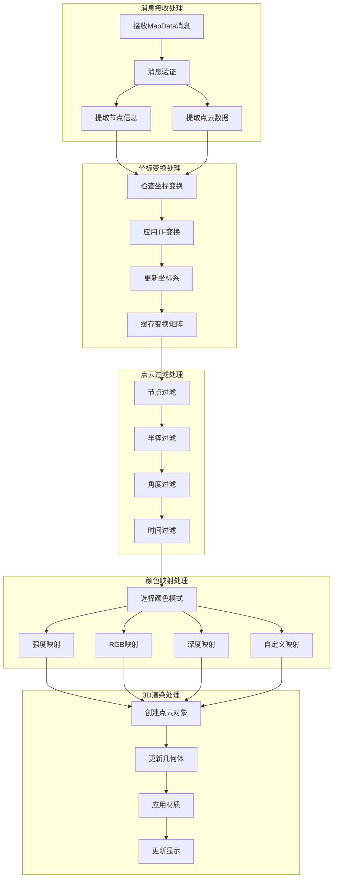
```mermaid
flowchart TD
    subgraph "消息接收处理"
        ReceiveMapData[接收MapData消息]
        ValidateMessage[消息验证]
        ExtractNodes[提取节点信息]
        ExtractClouds[提取点云数据]
    end
    
    subgraph "坐标变换处理"
        CheckTransforms[检查坐标变换]
        ApplyTF[应用TF变换]
        UpdateFrames[更新坐标系]
        CacheTransforms[缓存变换矩阵]
    end
    
    subgraph "点云过滤处理"
        NodeFiltering[节点过滤]
        RadiusFilter[半径过滤]
        AngleFilter[角度过滤]
        TimeFilter[时间过滤]
    end
    
    subgraph "颜色映射处理"
        SelectColorMode[选择颜色模式]
        IntensityMapping[强度映射]
        RGBMapping[RGB映射]
        DepthMapping[深度映射]
        CustomMapping[自定义映射]
    end
    
    subgraph "3D渲染处理"
        CreatePointCloud[创建点云对象]
        UpdateGeometry[更新几何体]
        ApplyMaterial[应用材质]
        UpdateDisplay[更新显示]
    end
    
    ReceiveMapData --> ValidateMessage
    ValidateMessage --> ExtractNodes
    ValidateMessage --> ExtractClouds
    
    ExtractNodes --> CheckTransforms
    ExtractClouds --> CheckTransforms
    CheckTransforms --> ApplyTF
    ApplyTF --> UpdateFrames
    UpdateFrames --> CacheTransforms
    
    CacheTransforms --> NodeFiltering
    NodeFiltering --> RadiusFilter
    RadiusFilter --> AngleFilter
    AngleFilter --> TimeFilter
    
    TimeFilter --> SelectColorMode
    SelectColorMode --> IntensityMapping
    SelectColorMode --> RGBMapping
    SelectColorMode --> DepthMapping
    SelectColorMode --> CustomMapping
    
    IntensityMapping --> CreatePointCloud
    RGBMapping --> CreatePointCloud
    DepthMapping --> CreatePointCloud
    CustomMapping --> CreatePointCloud
    
    CreatePointCloud --> UpdateGeometry
    UpdateGeometry --> ApplyMaterial
    ApplyMaterial --> UpdateDisplay
```

## MapGraph显示插件详细设计

### 1. 位姿图可视化架构

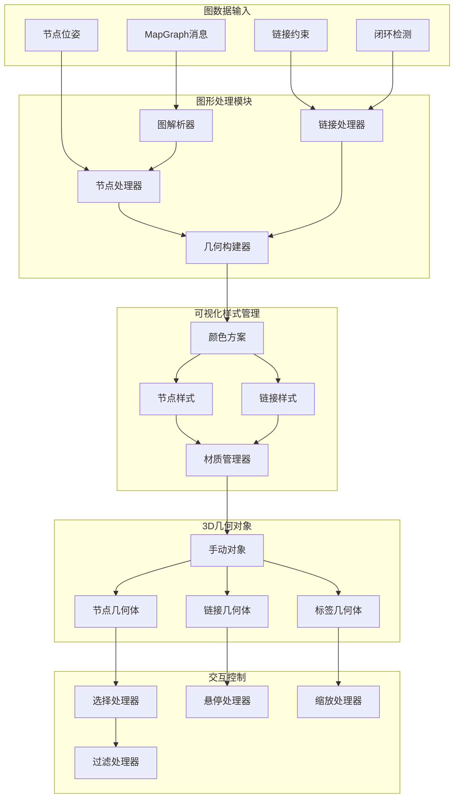
```mermaid
graph TB
    subgraph "图数据输入"
        MapGraphMsg[MapGraph消息]
        NodePoses[节点位姿]
        LinkConstraints[链接约束]
        LoopClosures[闭环检测]
    end
    
    subgraph "图形处理模块"
        GraphParser[图解析器]
        NodeProcessor[节点处理器]
        LinkProcessor[链接处理器]
        GeometryBuilder[几何构建器]
    end
    
    subgraph "可视化样式管理"
        ColorScheme[颜色方案]
        NodeStyles[节点样式]
        LinkStyles[链接样式]
        MaterialManager[材质管理器]
    end
    
    subgraph "3D几何对象"
        ManualObject[手动对象]
        NodeGeometry[节点几何体]
        LinkGeometry[链接几何体]
        LabelGeometry[标签几何体]
    end
    
    subgraph "交互控制"
        SelectionHandler[选择处理器]
        HoverHandler[悬停处理器]
        ZoomHandler[缩放处理器]
        FilterHandler[过滤处理器]
    end
    
    MapGraphMsg --> GraphParser
    NodePoses --> NodeProcessor
    LinkConstraints --> LinkProcessor
    LoopClosures --> LinkProcessor
    
    GraphParser --> NodeProcessor
    NodeProcessor --> GeometryBuilder
    LinkProcessor --> GeometryBuilder
    
    GeometryBuilder --> ColorScheme
    ColorScheme --> NodeStyles
    ColorScheme --> LinkStyles
    NodeStyles --> MaterialManager
    LinkStyles --> MaterialManager
    
    MaterialManager --> ManualObject
    ManualObject --> NodeGeometry
    ManualObject --> LinkGeometry
    ManualObject --> LabelGeometry
    
    NodeGeometry --> SelectionHandler
    LinkGeometry --> HoverHandler
    LabelGeometry --> ZoomHandler
    SelectionHandler --> FilterHandler
```

### 2. 图形渲染流程

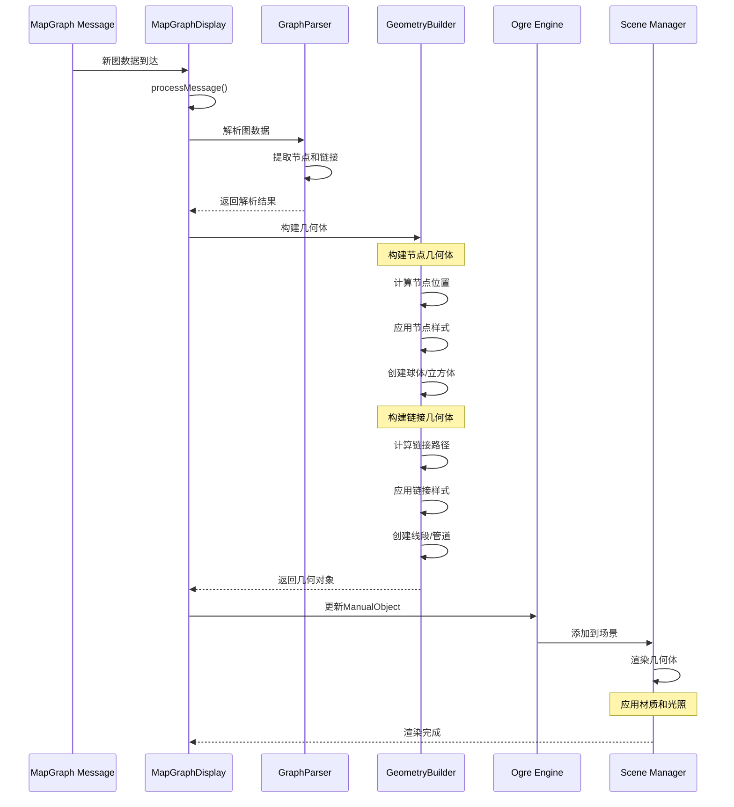
```mermaid
sequenceDiagram
    participant Graph as MapGraph Message
    participant Display as MapGraphDisplay
    participant Parser as GraphParser
    participant Builder as GeometryBuilder
    participant Ogre as Ogre Engine
    participant Scene as Scene Manager
    
    Graph->>Display: 新图数据到达
    Display->>Display: processMessage()
    
    Display->>Parser: 解析图数据
    Parser->>Parser: 提取节点和链接
    Parser-->>Display: 返回解析结果
    
    Display->>Builder: 构建几何体
    
    Note over Builder: 构建节点几何体
    Builder->>Builder: 计算节点位置
    Builder->>Builder: 应用节点样式
    Builder->>Builder: 创建球体/立方体
    
    Note over Builder: 构建链接几何体
    Builder->>Builder: 计算链接路径
    Builder->>Builder: 应用链接样式
    Builder->>Builder: 创建线段/管道
    
    Builder-->>Display: 返回几何对象
    
    Display->>Ogre: 更新ManualObject
    Ogre->>Scene: 添加到场景
    Scene->>Scene: 渲染几何体
    
    Note over Scene: 应用材质和光照
    Scene-->>Display: 渲染完成
```

## Info显示插件详细设计

### 1. 信息覆盖层架构

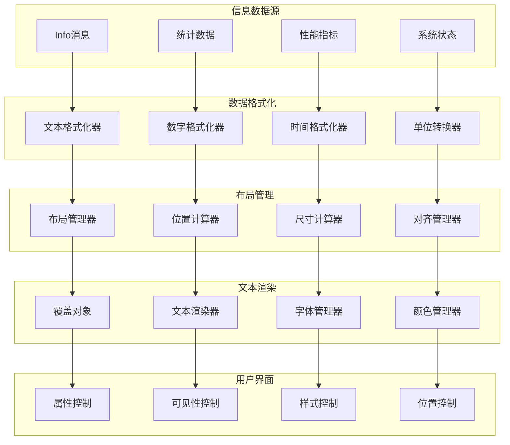
```mermaid
graph TB
    subgraph "信息数据源"
        InfoMsg[Info消息]
        StatisticsData[统计数据]
        PerformanceMetrics[性能指标]
        SystemStatus[系统状态]
    end
    
    subgraph "数据格式化"
        TextFormatter[文本格式化器]
        NumberFormatter[数字格式化器]
        TimeFormatter[时间格式化器]
        UnitConverter[单位转换器]
    end
    
    subgraph "布局管理"
        LayoutManager[布局管理器]
        PositionCalculator[位置计算器]
        SizeCalculator[尺寸计算器]
        AlignmentManager[对齐管理器]
    end
    
    subgraph "文本渲染"
        OverlayObject[覆盖对象]
        TextRenderer[文本渲染器]
        FontManager[字体管理器]
        ColorManager[颜色管理器]
    end
    
    subgraph "用户界面"
        PropertyControls[属性控制]
        VisibilityControls[可见性控制]
        StyleControls[样式控制]
        PositionControls[位置控制]
    end
    
    InfoMsg --> TextFormatter
    StatisticsData --> NumberFormatter
    PerformanceMetrics --> TimeFormatter
    SystemStatus --> UnitConverter
    
    TextFormatter --> LayoutManager
    NumberFormatter --> PositionCalculator
    TimeFormatter --> SizeCalculator
    UnitConverter --> AlignmentManager
    
    LayoutManager --> OverlayObject
    PositionCalculator --> TextRenderer
    SizeCalculator --> FontManager
    AlignmentManager --> ColorManager
    
    OverlayObject --> PropertyControls
    TextRenderer --> VisibilityControls
    FontManager --> StyleControls
    ColorManager --> PositionControls
```

### 2. 信息更新处理流程

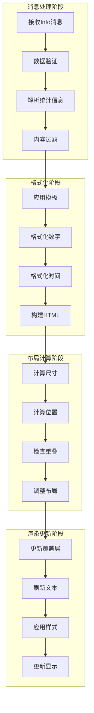
```mermaid
flowchart TD
    subgraph "消息处理阶段"
        ReceiveInfo[接收Info消息]
        ValidateData[数据验证]
        ParseStatistics[解析统计信息]
        FilterContent[内容过滤]
    end
    
    subgraph "格式化阶段"
        ApplyTemplate[应用模板]
        FormatNumbers[格式化数字]
        FormatTime[格式化时间]
        BuildHTML[构建HTML]
    end
    
    subgraph "布局计算阶段"
        CalculateSize[计算尺寸]
        CalculatePosition[计算位置]
        CheckOverlap[检查重叠]
        AdjustLayout[调整布局]
    end
    
    subgraph "渲染更新阶段"
        UpdateOverlay[更新覆盖层]
        RefreshText[刷新文本]
        ApplyStyles[应用样式]
        UpdateDisplay[更新显示]
    end
    
    ReceiveInfo --> ValidateData
    ValidateData --> ParseStatistics
    ParseStatistics --> FilterContent
    
    FilterContent --> ApplyTemplate
    ApplyTemplate --> FormatNumbers
    FormatNumbers --> FormatTime
    FormatTime --> BuildHTML
    
    BuildHTML --> CalculateSize
    CalculateSize --> CalculatePosition
    CalculatePosition --> CheckOverlap
    CheckOverlap --> AdjustLayout
    
    AdjustLayout --> UpdateOverlay
    UpdateOverlay --> RefreshText
    RefreshText --> ApplyStyles
    ApplyStyles --> UpdateDisplay
```

## OrbitOriented视图控制器详细设计

### 1. 视图控制架构

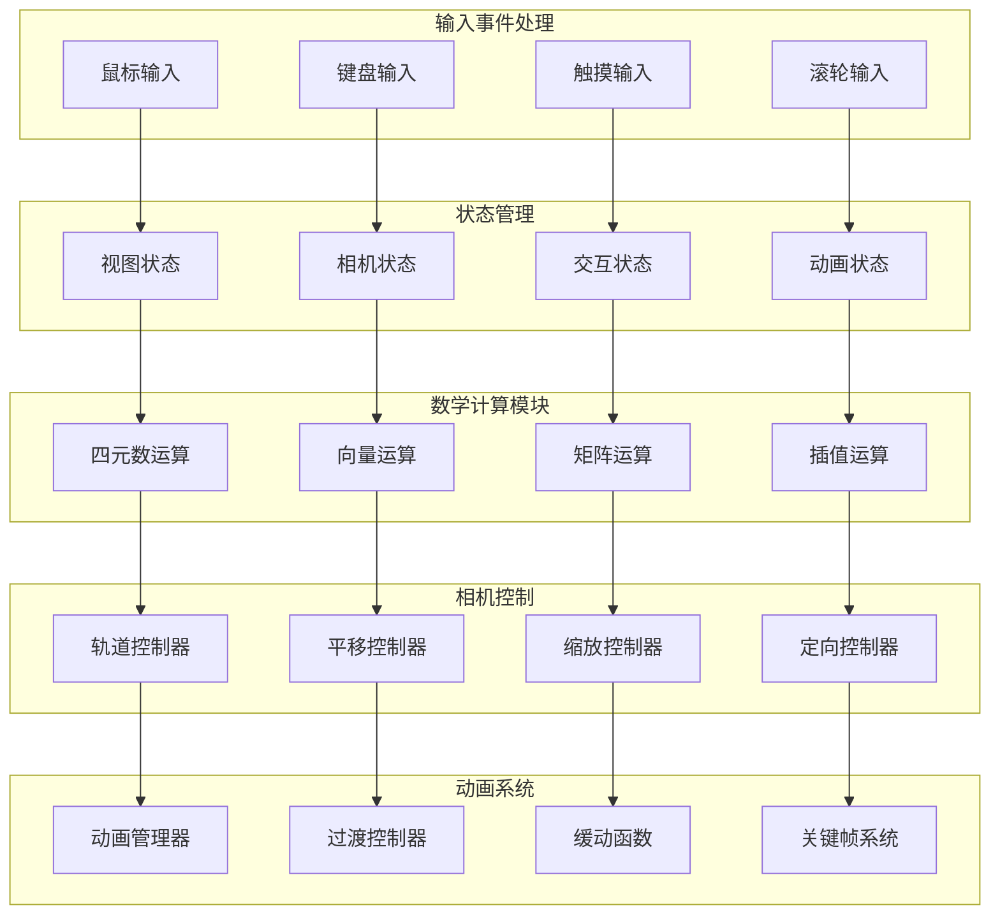
```mermaid
graph TB
    subgraph "输入事件处理"
        MouseInput[鼠标输入]
        KeyboardInput[键盘输入]
        TouchInput[触摸输入]
        WheelInput[滚轮输入]
    end
    
    subgraph "状态管理"
        ViewState[视图状态]
        CameraState[相机状态]
        InteractionState[交互状态]
        AnimationState[动画状态]
    end
    
    subgraph "数学计算模块"
        QuaternionMath[四元数运算]
        VectorMath[向量运算]
        MatrixMath[矩阵运算]
        InterpolationMath[插值运算]
    end
    
    subgraph "相机控制"
        OrbitController[轨道控制器]
        PanController[平移控制器]
        ZoomController[缩放控制器]
        OrientationController[定向控制器]
    end
    
    subgraph "动画系统"
        AnimationManager[动画管理器]
        TransitionController[过渡控制器]
        EasingFunctions[缓动函数]
        KeyframeSystem[关键帧系统]
    end
    
    MouseInput --> ViewState
    KeyboardInput --> CameraState
    TouchInput --> InteractionState
    WheelInput --> AnimationState
    
    ViewState --> QuaternionMath
    CameraState --> VectorMath
    InteractionState --> MatrixMath
    AnimationState --> InterpolationMath
    
    QuaternionMath --> OrbitController
    VectorMath --> PanController
    MatrixMath --> ZoomController
    InterpolationMath --> OrientationController
    
    OrbitController --> AnimationManager
    PanController --> TransitionController
    ZoomController --> EasingFunctions
    OrientationController --> KeyframeSystem
```

### 2. 相机更新流程

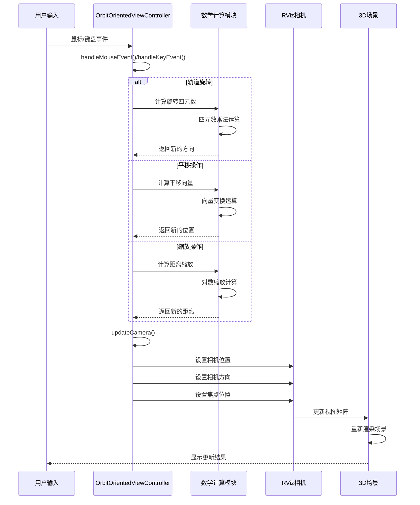
```mermaid
sequenceDiagram
    participant User as 用户输入
    participant Controller as OrbitOrientedViewController
    participant Math as 数学计算模块
    participant Camera as RViz相机
    participant Scene as 3D场景
    
    User->>Controller: 鼠标/键盘事件
    Controller->>Controller: handleMouseEvent()/handleKeyEvent()
    
    alt 轨道旋转
        Controller->>Math: 计算旋转四元数
        Math->>Math: 四元数乘法运算
        Math-->>Controller: 返回新的方向
    else 平移操作
        Controller->>Math: 计算平移向量
        Math->>Math: 向量变换运算
        Math-->>Controller: 返回新的位置
    else 缩放操作
        Controller->>Math: 计算距离缩放
        Math->>Math: 对数缩放计算
        Math-->>Controller: 返回新的距离
    end
    
    Controller->>Controller: updateCamera()
    Controller->>Camera: 设置相机位置
    Controller->>Camera: 设置相机方向
    Controller->>Camera: 设置焦点位置
    
    Camera->>Scene: 更新视图矩阵
    Scene->>Scene: 重新渲染场景
    Scene-->>User: 显示更新结果
```

## 性能优化技术

### 1. 渲染性能优化

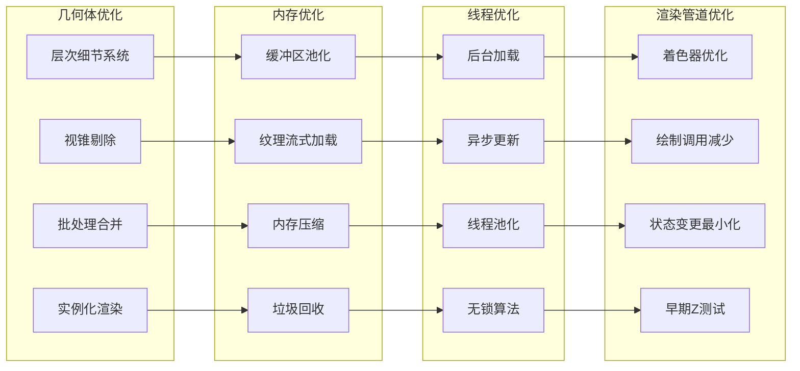
```mermaid
graph LR
    subgraph "几何体优化"
        LODSystem[层次细节系统]
        Culling[视锥剔除]
        Batching[批处理合并]
        Instancing[实例化渲染]
    end
    
    subgraph "内存优化"
        BufferPooling[缓冲区池化]
        TextureStreaming[纹理流式加载]
        MemoryCompression[内存压缩]
        GarbageCollection[垃圾回收]
    end
    
    subgraph "线程优化"
        BackgroundLoading[后台加载]
        AsyncUpdate[异步更新]
        ThreadPooling[线程池化]
        LockFreeAlgorithms[无锁算法]
    end
    
    subgraph "渲染管道优化"
        ShaderOptimization[着色器优化]
        DrawCallReduction[绘制调用减少]
        StateChangeMini[状态变更最小化]
        EarlyZTesting[早期Z测试]
    end
    
    LODSystem --> BufferPooling
    Culling --> TextureStreaming
    Batching --> MemoryCompression
    Instancing --> GarbageCollection
    
    BufferPooling --> BackgroundLoading
    TextureStreaming --> AsyncUpdate
    MemoryCompression --> ThreadPooling
    GarbageCollection --> LockFreeAlgorithms
    
    BackgroundLoading --> ShaderOptimization
    AsyncUpdate --> DrawCallReduction
    ThreadPooling --> StateChangeMini
    LockFreeAlgorithms --> EarlyZTesting
```

### 2. 数据流优化

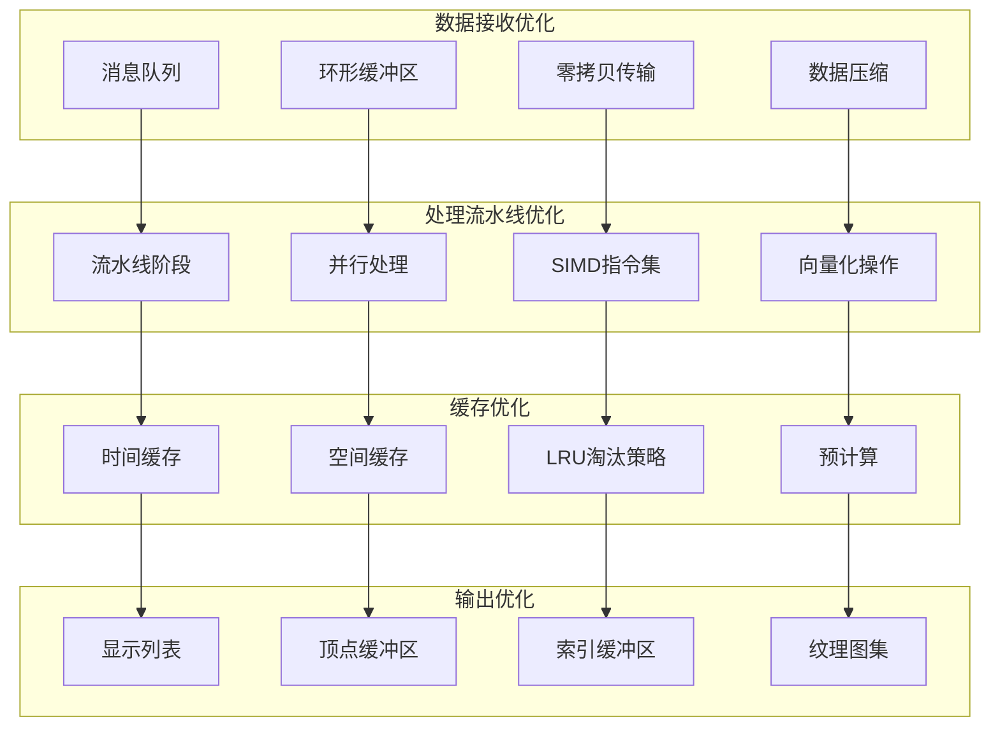
```mermaid
flowchart TD
    subgraph "数据接收优化"
        MessageQueue[消息队列]
        RingBuffer[环形缓冲区]
        ZeroCopy[零拷贝传输]
        Compression[数据压缩]
    end
    
    subgraph "处理流水线优化"
        PipelineStages[流水线阶段]
        ParallelProcessing[并行处理]
        SIMD[SIMD指令集]
        VectorizedOps[向量化操作]
    end
    
    subgraph "缓存优化"
        TemporalCache[时间缓存]
        SpatialCache[空间缓存]
        LRUEviction[LRU淘汰策略]
        PreComputation[预计算]
    end
    
    subgraph "输出优化"
        DisplayLists[显示列表]
        VertexBuffers[顶点缓冲区]
        IndexBuffers[索引缓冲区]
        TextureAtlas[纹理图集]
    end
    
    MessageQueue --> PipelineStages
    RingBuffer --> ParallelProcessing
    ZeroCopy --> SIMD
    Compression --> VectorizedOps
    
    PipelineStages --> TemporalCache
    ParallelProcessing --> SpatialCache
    SIMD --> LRUEviction
    VectorizedOps --> PreComputation
    
    TemporalCache --> DisplayLists
    SpatialCache --> VertexBuffers
    LRUEviction --> IndexBuffers
    PreComputation --> TextureAtlas
```

## 用户交互与体验设计

### 1. 交互模式设计

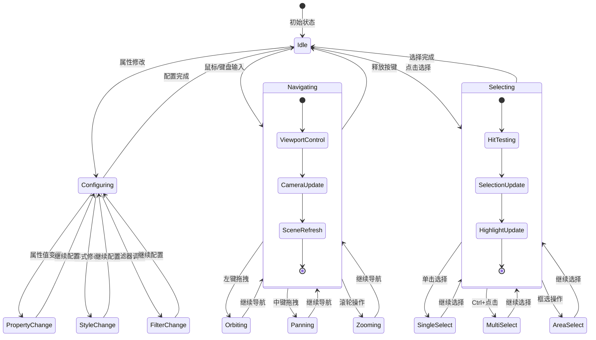
```mermaid
stateDiagram-v2
    [*] --> Idle : 初始状态
    
    Idle --> Navigating : 鼠标/键盘输入
    Idle --> Selecting : 点击选择
    Idle --> Configuring : 属性修改
    
    Navigating --> Orbiting : 左键拖拽
    Navigating --> Panning : 中键拖拽  
    Navigating --> Zooming : 滚轮操作
    Navigating --> Idle : 释放按键
    
    Selecting --> SingleSelect : 单击选择
    Selecting --> MultiSelect : Ctrl+点击
    Selecting --> AreaSelect : 框选操作
    Selecting --> Idle : 选择完成
    
    Configuring --> PropertyChange : 属性值变更
    Configuring --> StyleChange : 样式修改
    Configuring --> FilterChange : 过滤器调整
    Configuring --> Idle : 配置完成
    
    Orbiting --> Navigating : 继续导航
    Panning --> Navigating : 继续导航
    Zooming --> Navigating : 继续导航
    
    SingleSelect --> Selecting : 继续选择
    MultiSelect --> Selecting : 继续选择
    AreaSelect --> Selecting : 继续选择
    
    PropertyChange --> Configuring : 继续配置
    StyleChange --> Configuring : 继续配置
    FilterChange --> Configuring : 继续配置
    
    state Navigating {
        [*] --> ViewportControl
        ViewportControl --> CameraUpdate
        CameraUpdate --> SceneRefresh
        SceneRefresh --> [*]
    }
    
    state Selecting {
        [*] --> HitTesting
        HitTesting --> SelectionUpdate  
        SelectionUpdate --> HighlightUpdate
        HighlightUpdate --> [*]
    }
```

### 2. 属性面板设计

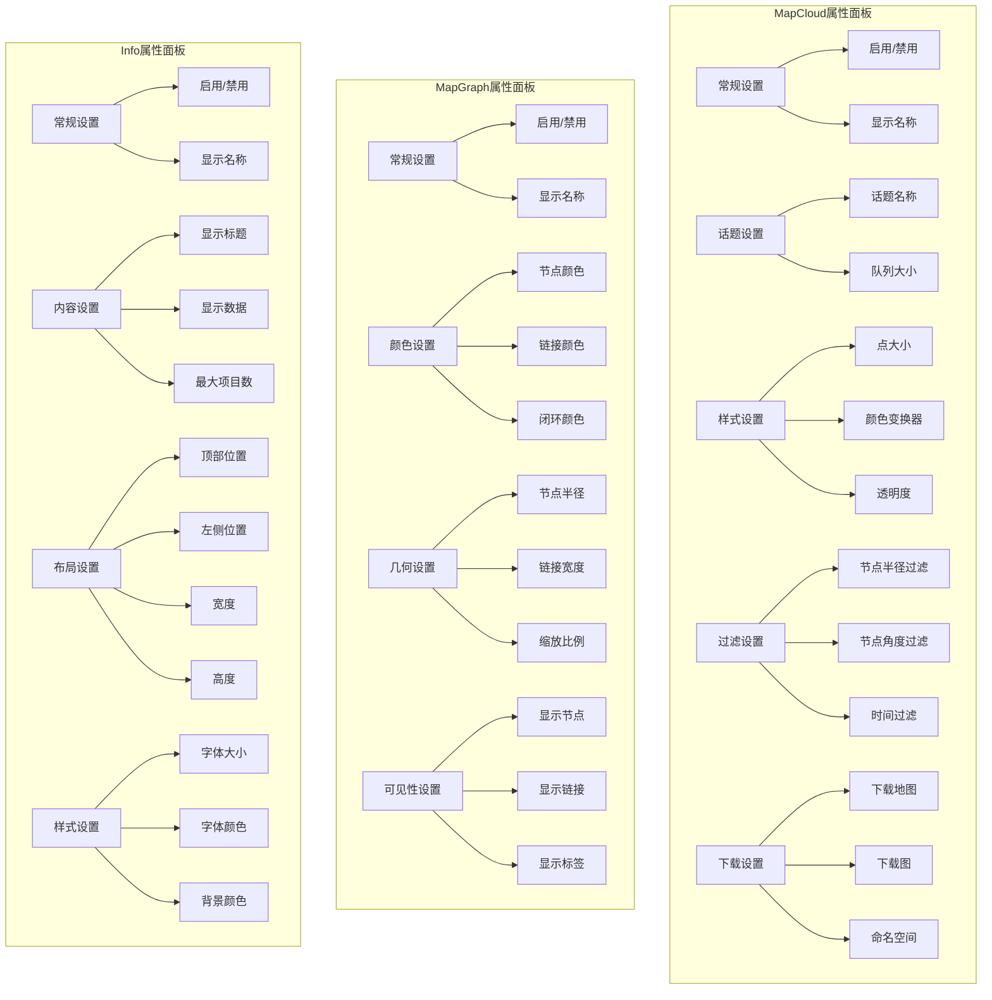
```mermaid
graph TB
    subgraph "MapCloud属性面板"
        MCGeneral[常规设置]
        MCTopic[话题设置]
        MCStyle[样式设置]
        MCFiltering[过滤设置]
        MCDownload[下载设置]
        
        MCGeneral --> MCEnabled[启用/禁用]
        MCGeneral --> MCName[显示名称]
        
        MCTopic --> MCTopicName[话题名称]
        MCTopic --> MCQueueSize[队列大小]
        
        MCStyle --> MCPointSize[点大小]
        MCStyle --> MCColorTransformer[颜色变换器]
        MCStyle --> MCAlpha[透明度]
        
        MCFiltering --> MCNodeRadius[节点半径过滤]
        MCFiltering --> MCNodeAngle[节点角度过滤]
        MCFiltering --> MCTimeFilter[时间过滤]
        
        MCDownload --> MCDownloadMap[下载地图]
        MCDownload --> MCDownloadGraph[下载图]
        MCDownload --> MCNamespace[命名空间]
    end
    
    subgraph "MapGraph属性面板"
        MGGeneral[常规设置]
        MGColors[颜色设置]
        MGGeometry[几何设置]
        MGVisibility[可见性设置]
        
        MGGeneral --> MGEnabled[启用/禁用]
        MGGeneral --> MGName[显示名称]
        
        MGColors --> MGNodeColor[节点颜色]
        MGColors --> MGLinkColor[链接颜色]
        MGColors --> MGLoopColor[闭环颜色]
        
        MGGeometry --> MGNodeRadius[节点半径]
        MGGeometry --> MGLinkWidth[链接宽度]
        MGGeometry --> MGScale[缩放比例]
        
        MGVisibility --> MGShowNodes[显示节点]
        MGVisibility --> MGShowLinks[显示链接]
        MGVisibility --> MGShowLabels[显示标签]
    end
    
    subgraph "Info属性面板"
        InfoGeneral[常规设置]
        InfoContent[内容设置]
        InfoLayout[布局设置]
        InfoStyle[样式设置]
        
        InfoGeneral --> InfoEnabled[启用/禁用]
        InfoGeneral --> InfoName[显示名称]
        
        InfoContent --> InfoShowHeader[显示标题]
        InfoContent --> InfoShowData[显示数据]
        InfoContent --> InfoMaxItems[最大项目数]
        
        InfoLayout --> InfoTop[顶部位置]
        InfoLayout --> InfoLeft[左侧位置]
        InfoLayout --> InfoWidth[宽度]
        InfoLayout --> InfoHeight[高度]
        
        InfoStyle --> InfoFontSize[字体大小]
        InfoStyle --> InfoFontColor[字体颜色]
        InfoStyle --> InfoBackground[背景颜色]
    end
```

## 调试与开发工具

### 1. 调试可视化工具

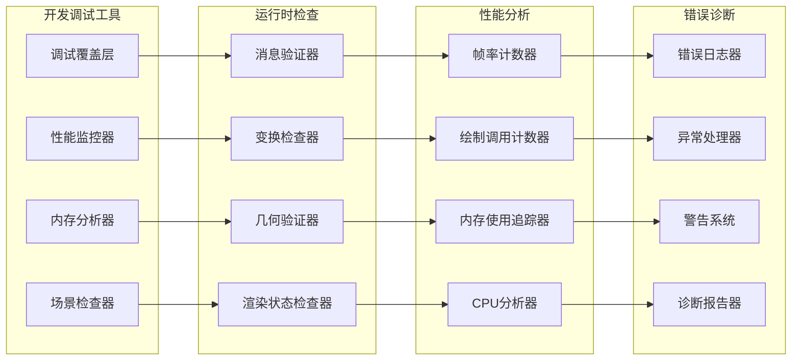
```mermaid
graph LR
    subgraph "开发调试工具"
        DebugOverlay[调试覆盖层]
        PerformanceMonitor[性能监控器]
        MemoryProfiler[内存分析器]
        SceneInspector[场景检查器]
    end
    
    subgraph "运行时检查"
        MessageValidator[消息验证器]
        TransformChecker[变换检查器]
        GeometryValidator[几何验证器]
        RenderStateChecker[渲染状态检查器]
    end
    
    subgraph "性能分析"
        FrameRateCounter[帧率计数器]
        DrawCallCounter[绘制调用计数器]
        MemoryUsageTracker[内存使用追踪器]
        CPUProfiler[CPU分析器]
    end
    
    subgraph "错误诊断"
        ErrorLogger[错误日志器]
        ExceptionHandler[异常处理器]
        WarningSystem[警告系统]
        DiagnosticReporter[诊断报告器]
    end
    
    DebugOverlay --> MessageValidator
    PerformanceMonitor --> TransformChecker
    MemoryProfiler --> GeometryValidator
    SceneInspector --> RenderStateChecker
    
    MessageValidator --> FrameRateCounter
    TransformChecker --> DrawCallCounter
    GeometryValidator --> MemoryUsageTracker
    RenderStateChecker --> CPUProfiler
    
    FrameRateCounter --> ErrorLogger
    DrawCallCounter --> ExceptionHandler
    MemoryUsageTracker --> WarningSystem
    CPUProfiler --> DiagnosticReporter
```

### 2. 插件开发工作流

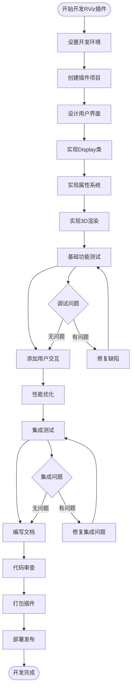
```mermaid
flowchart TD
    Start([开始开发RViz插件]) --> SetupEnv[设置开发环境]
    SetupEnv --> CreateProject[创建插件项目]
    CreateProject --> DesignInterface[设计用户界面]
    
    DesignInterface --> ImplementDisplay[实现Display类]
    ImplementDisplay --> ImplementProperties[实现属性系统]
    ImplementProperties --> Implement3D[实现3D渲染]
    
    Implement3D --> TestBasic[基础功能测试]
    TestBasic --> AddInteraction[添加用户交互]
    AddInteraction --> OptimizePerf[性能优化]
    
    OptimizePerf --> TestIntegration[集成测试]
    TestIntegration --> Documentation[编写文档]
    Documentation --> CodeReview[代码审查]
    
    CodeReview --> PackagePlugin[打包插件]
    PackagePlugin --> Deploy[部署发布]
    Deploy --> End([开发完成])
    
    TestBasic --> DebugIssues{调试问题}
    DebugIssues -->|有问题| FixBugs[修复缺陷]
    DebugIssues -->|无问题| AddInteraction
    FixBugs --> TestBasic
    
    TestIntegration --> IntegrationIssues{集成问题}
    IntegrationIssues -->|有问题| FixIntegration[修复集成问题]
    IntegrationIssues -->|无问题| Documentation
    FixIntegration --> TestIntegration
```

## 扩展开发指南

### 1. 自定义Display插件开发

```cpp
// 头文件示例: my_custom_display.h
#ifndef MY_CUSTOM_DISPLAY_H
#define MY_CUSTOM_DISPLAY_H

#include <rviz/display.h>
#include <rviz/properties/color_property.h>
#include <rviz/properties/float_property.h>
#include <rviz/properties/bool_property.h>

namespace my_namespace
{

class MyCustomDisplay : public rviz::Display
{
Q_OBJECT
public:
    MyCustomDisplay();
    virtual ~MyCustomDisplay();

protected:
    virtual void onInitialize();
    virtual void onEnable();
    virtual void onDisable();
    virtual void update(float dt, float force_update);
    virtual void reset();

private Q_SLOTS:
    void updateColorAndAlpha();
    void updateSize();

private:
    void processMessage(const my_msgs::MyMessage::ConstPtr& msg);
    void subscribe();
    void unsubscribe();

    ros::Subscriber subscriber_;
    
    rviz::ColorProperty* color_property_;
    rviz::FloatProperty* size_property_;
    rviz::BoolProperty* show_labels_property_;
    
    Ogre::SceneNode* scene_node_;
    Ogre::ManualObject* manual_object_;
};

} // namespace my_namespace

#endif // MY_CUSTOM_DISPLAY_H
```

### 2. 插件配置文件示例

```xml
<!-- my_rviz_plugins.xml -->
<library path="lib/libmy_rviz_plugins">
  <class name="my_namespace/MyCustomDisplay"
         type="my_namespace::MyCustomDisplay"
         base_class_type="rviz::Display">
    <description>
      Custom display for visualizing my specific data format.
    </description>
    <message_type>my_msgs/MyMessage</message_type>
  </class>
  
  <class name="my_namespace/MyViewController"
         type="my_namespace::MyViewController"
         base_class_type="rviz::ViewController">
    <description>
      Custom view controller with specific navigation behavior.
    </description>
  </class>
</library>
```

## 总结

RTAB-Map ROS的RViz插件系统通过以下关键特性实现了强大的3D可视化功能：

1. **模块化设计**: 清晰的插件架构支持功能扩展和定制
2. **高性能渲染**: 基于Ogre 3D引擎的高效图形渲染
3. **丰富交互**: 完善的用户交互和属性配置系统
4. **实时更新**: 高效的数据流处理和实时可视化更新
5. **易于扩展**: 标准化的插件接口便于功能扩展
6. **调试支持**: 完善的调试工具和性能分析功能

这种设计使得RTAB-Map能够为机器人SLAM应用提供直观、实时、交互式的三维可视化体验，大大提升了开发和调试效率。