# SLAM建图流程详细说明

## 概述

SLAM建图流程是RTAB-Map系统的核心工作流程，包含数据采集、处理、建图、优化等多个阶段。本文档详细描述了从传感器数据输入到最终地图输出的完整流程。

## 完整SLAM建图序列图

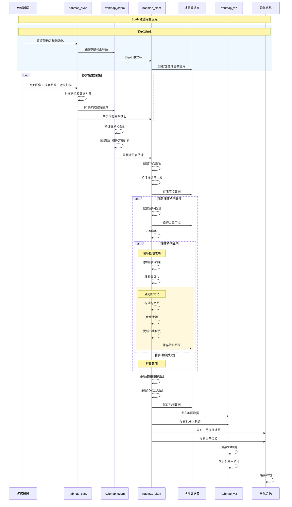

## 建图流程状态机

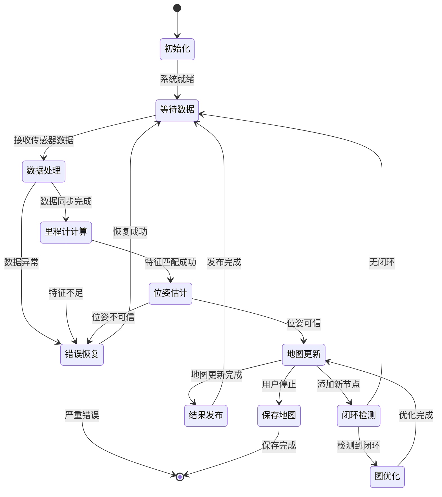

## 详细处理阶段

### 1. 数据采集和同步阶段

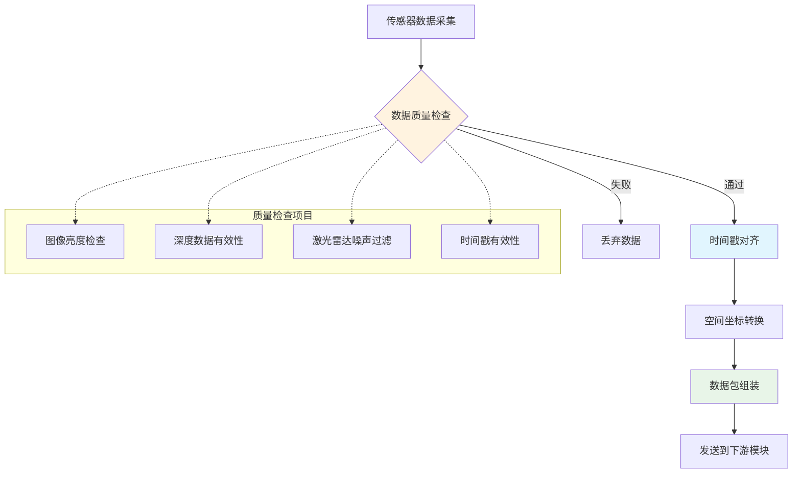

### 2. 特征提取和里程计计算

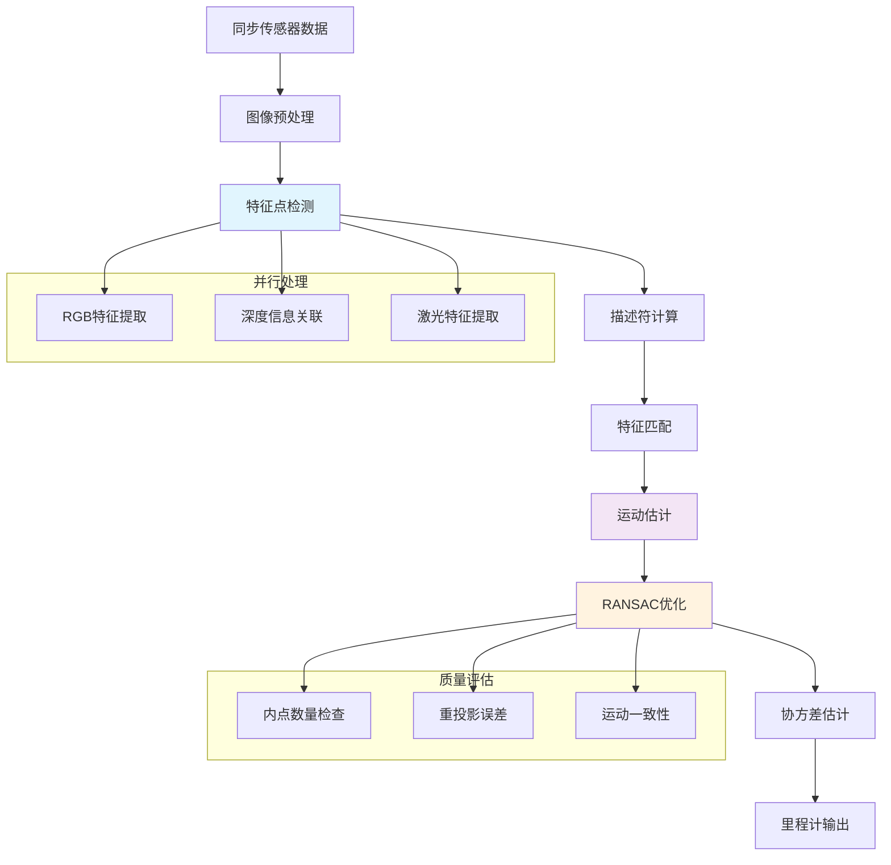

### 3. SLAM节点创建和管理

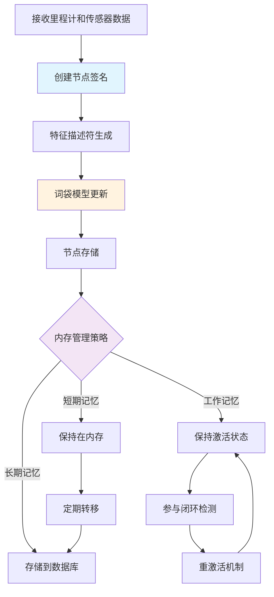

### 4. 闭环检测流程

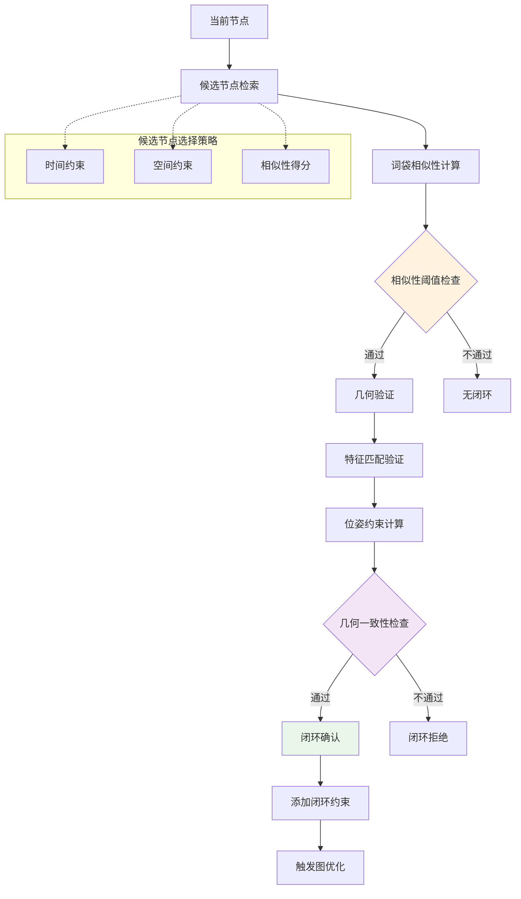

### 5. 图优化过程

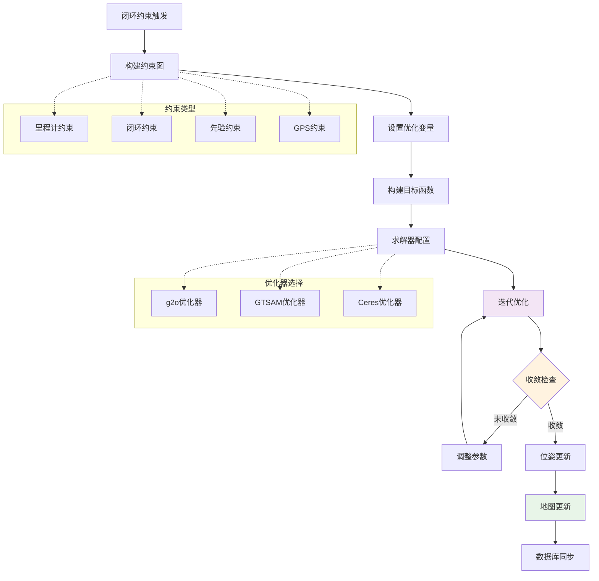

## 地图表示和更新

### 1. 多层次地图结构

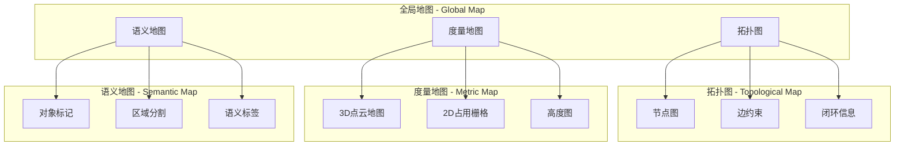

### 2. 地图更新策略

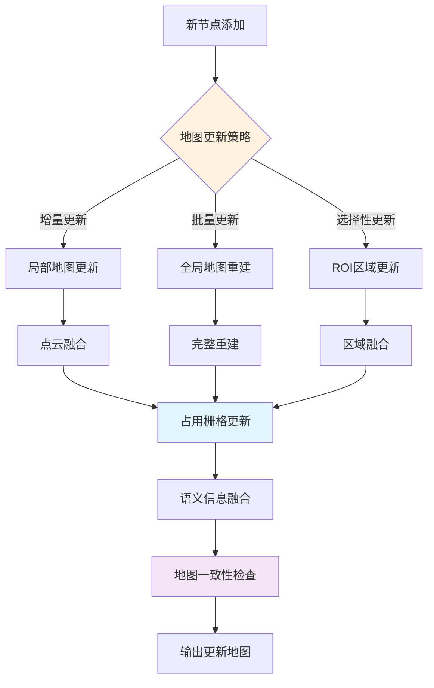

## 性能监控和质量控制

### 1. 实时性能监控

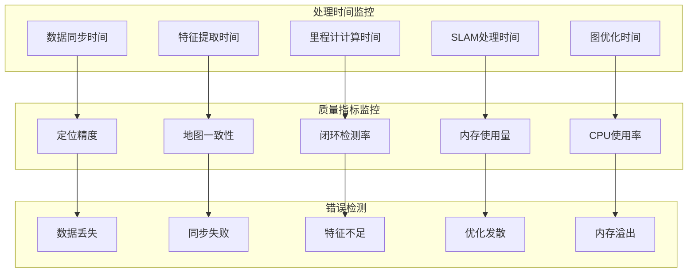

### 2. 自适应参数调整

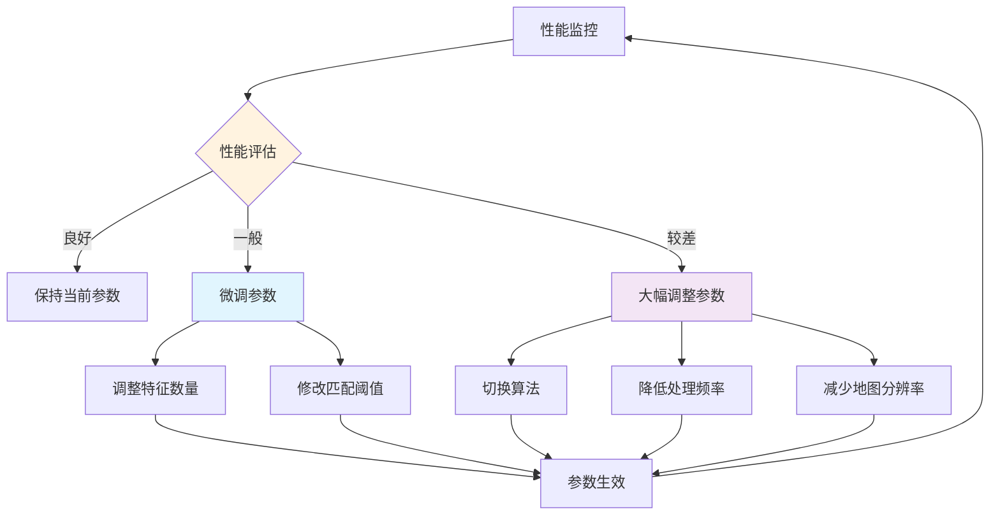

## 错误处理和恢复机制

### 1. 错误类型和处理策略

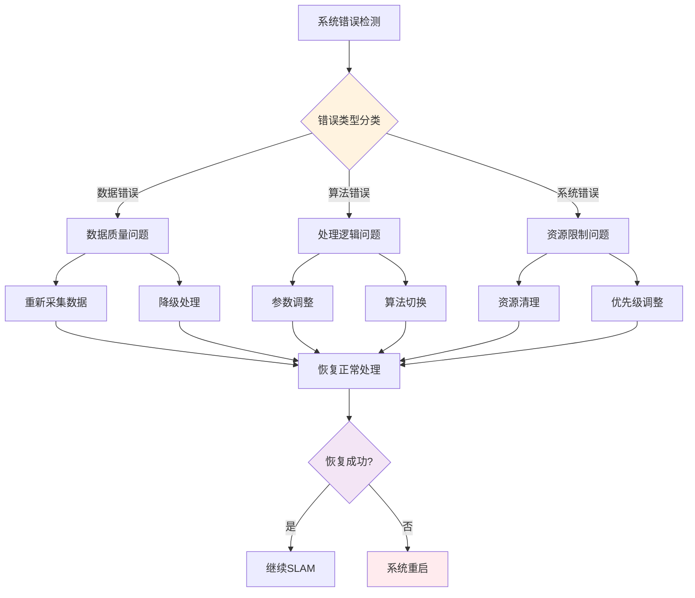

### 2. 故障恢复流程

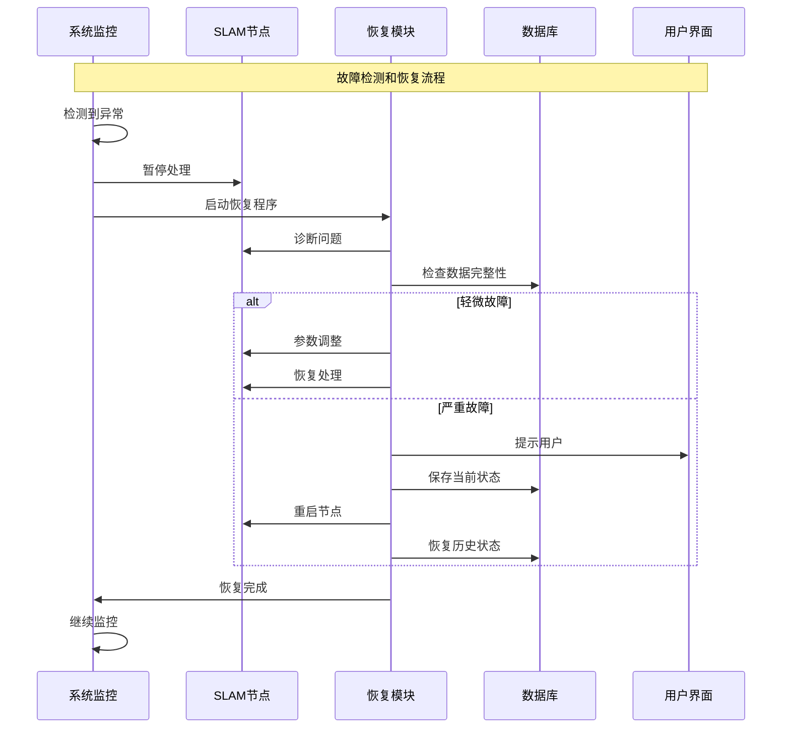

## 配置和调优建议

### 1. 不同环境的参数配置

| 环境类型 | 特征参数 | 闭环参数 | 优化参数 |
|---------|----------|----------|----------|
| 室内环境 | 特征数量: 400 检测阈值: 0.001 | 相似性阈值: 0.15 时间间隔: 30s | 迭代次数: 20 收敛阈值: 1e-6 |
| 室外环境 | 特征数量: 600 检测阈值: 0.002 | 相似性阈值: 0.12 时间间隔: 60s | 迭代次数: 30 收敛阈值: 1e-5 |
| 动态环境 | 特征数量: 800 检测阈值: 0.003 | 相似性阈值: 0.18 时间间隔: 20s | 迭代次数: 15 收敛阈值: 1e-4 |

### 2. 性能调优检查清单

- [ ] **传感器标定**: 确保相机和激光雷达标定精确
- [ ] **时间同步**: 验证所有传感器时间戳同步
- [ ] **网络延迟**: 最小化数据传输延迟
- [ ] **计算资源**: 分配足够的CPU和内存资源
- [ ] **参数调优**: 根据环境特点调整算法参数
- [ ] **质量监控**: 设置合适的质量监控阈值
- [ ] **错误处理**: 配置完善的错误处理机制
- [ ] **数据存储**: 确保足够的存储空间

## 总结

SLAM建图流程是一个复杂的多阶段过程，涉及数据采集、同步、处理、建图、优化等多个环节。通过合理的架构设计、参数配置和质量控制，可以实现高精度、高稳定性的实时SLAM建图功能。关键在于：

1. **数据质量保证**: 确保输入数据的时间同步和空间一致性
2. **算法参数调优**: 根据应用场景选择合适的算法参数
3. **性能监控**: 实时监控系统性能和地图质量
4. **错误处理**: 建立完善的错误检测和恢复机制
5. **资源管理**: 合理分配计算和存储资源